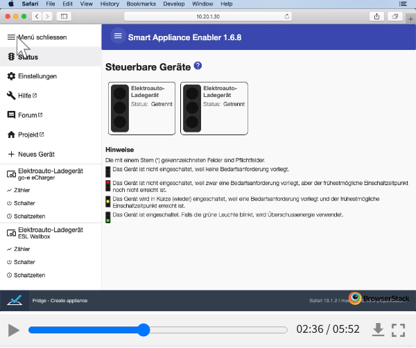

<a href="https://github.com/camueller/SmartApplianceEnabler/blob/master/README_EN.md">&nbsp;&nbsp;</a>[This documentation is available in English](README_EN.md).    

  
  <h3 align="center">Smart Appliance Enabler</h3>
  

    
    
    
  

**Seit mehreren Jahren habe ich einen Grossteil meiner Freizeit in Entwicklung, Dokumentation und Support dieses Open-Source-Projektes gesteckt. Ich habe mich bewusst dazu entschieden, diese Software kostenfrei zur Verfügung zu stellen und kontinuierlich um Features zu erweitern, die für möglichst viele Nutzer von Interesse sein könnten. Durch die Nutzung dieser Software lassen sich die Stromkosten signifikant senken, indem die Nutzung des selbst erzeugten Stroms maximiert wird. Ich würde es als Anerkennung meiner Arbeit betrachten, wenn ein Teil dieser Ersparnis als Beitrag zur Förderung dieses Projekts verwendet werden würde. Das geht ganz einfach per [Paypal](https://paypal.me/CarlAxelMueller) oder als klassische Banküberweisung (Kontoinhaber: Axel Müller, IBAN: DE83 5185 0079 1140 0764 37, BIC: HELADEF1FRI, Verwendungszweck: Förderbeitrag Smart Appliance Enabler)**
  

# Überblick
**Der *Smart Appliance Enabler* ist eine Software zur Integration beliebiger Geräte ([Wallbox](doc/EVCharger_DE.md), Wärmepumpe, Waschmaschine, Geschirrspüler, ...) mit dem [Sunny Home Manager](https://www.sma.de/produkte/monitoring-control/sunny-home-manager-20.html) von [SMA](http://www.sma.de), um eine **Maximierung des Eigenverbrauchs von Photovoltaik-Anlagen** zu ermöglichen.**

Dazu meldet der *Smart Appliance Enabler* dem *Sunny Home Manager* **Bedarfsanforderungen** dieser Geräte, um diesem eine optimale Planung des Eigenverbrauchs zu ermöglichen. Entsprechend dieser Planung empfängt der *Smart Appliance Enabler* **Schaltbefehle**, die er an die von ihm verwalteten Geräte weiterleitet. Falls für diese Geräte individuelle, **digitale Stromzähler** vorhanden sind, können diese ausgelesen und der Stromverbrauch an den *Sunny Home Manager* gemeldet werden, um diesen beim Lernen der Verbrauchscharakteristik zu unterstützen und Verbräuche im [Sunny Portal](https://www.sunnyportal.com/) zu visualisieren.

Die nachfolgende Grafik aus dem [Sunny Portal](https://www.sunnyportal.com/) zeigt einen sonnigen Herbsttag, an dem die [Wallbox](doc/EVCharger_DE.md) optimal angesteuert wurde, um das E-Auto so zu laden und so Netzbezug zu vermeiden. Gleichzeitig musste der *Sunny Home Manager* den Geschirrspüler und die Waschmaschine entsprechend der eingestellten Anforderungen laufen lassen. Zusätzlich waren auch die Wärmepumpe (Warmwasser und Heizung) und die Espressomaschine zeitweise eingeschaltet, die nicht durch den *Sunny Home Manager* gesteuert werden, aber natürlich auch Strom verbrauchen.

# Hardware

## Anforderungen

Der *Smart Appliance Enabler* wurde in **Java** implementiert und läuft grundsätzlich auf jedem Gerät, für das eine Java Virtual Machine mit Java 11 existiert. Neben dem compilierten Code werden diverse Scripts bereitgestellt, in denen von **Linux** als Betriebssystem ausgegangen wird. Falls Geräte über [GPIO](https://www.itwissen.info/GPIO-general-purpose-input-output.html) angebunden werden sollen, benötigt der *Smart Appliance Enabler* einen [**Raspberry Pi**](doc/Raspberry_DE.md) als Hardware. 

## Stromzähler

Aktuell unterstützt der *Smart Appliance Enabler* folgende Möglichkeiten, den Stromverbrauch eines Gerätes zu messen, um ihn an den *Sunny Home Manager* zu melden:

| Protokolle | Produkte                                                                                                                                                                                                                                             |
|------------|------------------------------------------------------------------------------------------------------------------------------------------------------------------------------------------------------------------------------------------------------|
| GPIO       | [S0-Zähler](doc/S0Meter_DE.md)                                                                                                                                                                                                                       |
| Modbus     | [Modbus Zähler](doc/ModbusMeter_DE.md)                                                                                                                                                                                                               |
| HTTP       | [HTTP Zähler](doc/HttpMeter_DE.md) allgemein<ul></ul>kompatible Produkte<ul><li>[Shelly Plug/3EM/4PM/Plus 1PM](doc/Shelly_DE.md)</li><li>[Edimax SP-2101W](doc/EdimaxSP2101W_DE.md)</li></ul>alle Produkte mit [Tasmota](doc/Tasmota_DE.md)-Firmware |
| MQTT       | [MQTT-Zähler](doc/MqttMeter_DE.md)                                                                                                                                                                                                                 |

[Details zu diesen Zählern und weiteren Software-basierten Zählern (z.B. Master/Slave)](doc/Meter_DE.md)

## Schalter

Zum Ein-/Ausschalten eines Gerätes unterstützt der *Smart Appliance Enabler* derzeit folgende Möglichkeiten:

| Protokolle | Produkte                                                                                                                                                                                                                                                                                                                          |
|------------|-----------------------------------------------------------------------------------------------------------------------------------------------------------------------------------------------------------------------------------------------------------------------------------------------------------------------------------|
| GPIO       | [GPIO Schalter](doc/GPIOSwitch_DE.md) [Stufenschalter](doc/LevelSwitch_DE.md) [PWM-Schalter](doc/PwmSwitch_DE.md)                                                                                                                                                                                                           |
| Modbus     | [Modbus Schalter](doc/ModbusSwitch_DE.md) [Modbus-basierte Stufenschalter](doc/LevelSwitch_DE.md)  [Wallboxen](doc/EVCharger_DE.md)                                                                                                                                                                                      |
| HTTP       | [HTTP Schalter](doc/HttpSwitch_DE.md) [HTTP-basierte Stufenschalter](doc/LevelSwitch_DE.md)<ul></ul>kompatible Produkte<ul><li>[Shelly Plug/4PM](doc/Shelly_DE.md)</li><li>[Edimax SP-2101W](doc/EdimaxSP2101W_DE.md)</li></ul>alle Produkte mit [Tasmota](doc/Tasmota_DE.md)-Firmware<ul></ul>[Wallboxen](doc/EVCharger_DE.md) |
| MQTT       | [MQTT Schalter](doc/MqttSwitch_DE.md) [MQTT-basierte Stufenschalter](doc/LevelSwitch_DE.md)                                                                                                                                                                                       |                                                                                                                                                                                                           |

[Details zu diesen Schaltern und weiteren Software-basierten Schalten (z.B. Anlaufstromerkennung, Unterstützung der SG-Ready-Funktion von Wärmepumpen )](doc/Control_DE.md)

# Montage

Falls der *Smart Appliance Enabler* auf einem Raspberry Pi betrieben werden soll, sollten dafür die [Montage-Hinweise](doc/Assembly_DE.md) beachtet werden.

# Installation / Update

Die [Standard-Installation](doc/Installation_DE.md) läuft automatisch ab und erfordert keine Linux-Kenntnisse.

Falls notwendig, kann alternativ auch die [manuelle Installation](doc/InstallationManual_DE.md) gewählt werden, bei der sämtliche Befehle der Dokumentation manuell auszuführen sind. 

Die [Installation von Updates](doc/Update_DE.md) ermöglicht die Nutzung neuer Funktionen und Fehlerbehebungen.

 Bei Bedarf lässt sich der *Smart Appliance Enabler* auch im Container mit den bereitgestellten [Docker-Images](doc/Docker_DE.md) betreiben.  

# Konfiguration und Steuerung

Die [Konfiguration](doc/Configuration_DE.md) des *Smart Appliance Enabler* erfolgt mit dem **Web-Browser**.

Der Status aller steuerbaren Geräte wird in der [Status-Anzeige](doc/Status_DE.md) übersichtlich dargestellt, wobei der Status jedes Gerätes durch eine **Ampel** visualisiert wird. Die Ampel kann auch zur **manuellen Steuerung** verwendet werden.

Zusätzlich unterstützt der *Smart Appliance Enabler* [Node-RED](doc/NodeRED_DE.md), indem er für die konfigurierten Geräte Flows exportiert, damit diese im Dashboard von Node-RED visualisiert werden. Darüber hinaus können die [MQTT-Nachrichten des *Smart Appliance Enabler*](doc/MQTT_DE.md) zur Integration mit anderen Automatisierungsplatformen verwendet werden.

In dem nachfolgenden Video kann man einen Eindruck von der Konfiguration des *Smart Appliance Enabler* gewinnen. Dieses Video wurde im Rahmen der Durchführung automatisierter Tests erstellt, welche die Qualität des *Smart Appliance Enabler* sicherstellen sollen.

# Integration in das Sunny Portal
Neben der Steuerung durch den *Sunny Home Manager* ermöglicht der *Smart Appliance Enabler* die [Integration von Geräten in das Sunny Portal](doc/SunnyPortal_DE.md).

# Häufige Fragen und Antworten
[Diese Seite führt bei Problemen hoffentlich zur Lösung](doc/QA_DE.md). Ausgehend von häufig gestellten Fragen werden Antworten sowie Verweise zu relevanten Teilen der Dokumentation gegeben.
     

# Unterstützung

Diskussionen und Fragen rund um den *Smart Appliance Enabler* sind in [Github Diskussion](https://github.com/camueller/SmartApplianceEnabler/discussions) richtig platziert.

Darüber hinaus biete ich einen [persönlichen, individuellen, kostenpflichtigen Support mit Beratung](doc/Support_DE.md) an - quasi das "Rundum-sorglos Paket".
   

# Mitmachen
Zum [Mitmachen](doc/Contribute_DE.md) muss man **kein Programmierer** sein! [Mitmachen](doc/Contribute_DE.md) kann **jeder** auf vielfältige Weise! [Eure Anwendunsszenarien für den *Smart Appliance Enabler*](doc/ApplicationScenarios_DE.md) helfen Anderen weiter!
      

# Entwicklung
Alle Informationen rund um die [Entwicklung](doc/Development_DE.md) des *Smart Appliance Enabler* einschliesslich der Dokumentation der Build- und Testumgebungen.
  

# Dank und Anerkennung
Das Projekt *Smart Appliance Enabler* wurde durch die kostenfreie Bereitstellung eines [Sunny Home Manager 2.0](https://www.sma.de/produkte/monitoring-control/sunny-home-manager) **von [SMA](http://www.sma.de) unterstützt**!

Der *Smart Appliance Enabler* würde ohne folgende Tools und Frameworks so nicht existieren, deren Entwicklern ich Dank und Anerkennung zolle:
* [Angular](https://angular.io) für das Web-Frontend
* [Angular Material](https://material.angular.io/) für die Material-Design-Komponenten des Web-Frontends
* [Browserstack](https://www.browserstack.com) für automatisierte Multi-Browser-Tests und kostenlose Lizenz für Open-Source-Projekte
* [Cling](http://4thline.org/projects/cling) für eine Implementierung des UPnP-Protokolls (Teil des SEMP-Protokolls)
* [Docker](https://www.docker.com/) für seine Container-Platform
* [Docker Hub](https://hub.docker.com/) für sein Repository zum Austausch von Docker-Images
* [GitHub](https://github.com/) für seine Plaformform für Projekt-Repositories
* [IntelliJ](https://www.jetbrains.com/de-de/idea/) für die beste IDE (vor allem auch unter Linux) und kostenlose Lizenz für Open-Source-Projekte
* [Jenkins](https://www.jenkins.io/) für den Server zur Automatisierung von Builds/Tests
* [pigpioj](https://github.com/mattjlewis/pigpioj) für eine Bibliothek für den Zugriff auf die GPIO-Ports des Raspberry Pi
* [Spring Boot](https://spring.io/projects/spring-boot) für Spring-basierte Anwendungen mit eingebettetem Web-Container
* [Testcafe](https://devexpress.github.io/testcafe/) für einfaches Testen von Web-Anwendungen
* [WebStorm](https://www.jetbrains.com/de-de/webstorm/) für die beste Web-IDE (vor allem auch unter Linux) und kostenlose Lizenz für Open-Source-Projekte
  

# Lizenz
Die Inhalte in diesem Repository sind lizensiert unter der [GNU GENERAL PUBLIC LICENSE](LICENSE.txt), falls nicht anders angegeben.
