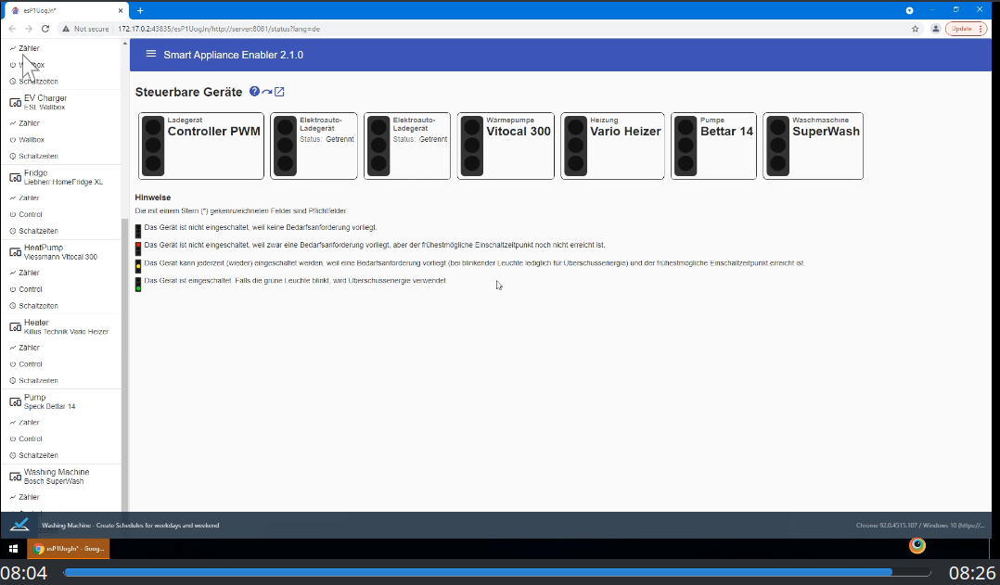

  
  <h3 align="center">Smart Appliance Enabler</h3>
  

    
    
    
    
    
    
  

**Seit mehreren Jahren habe ich einen Grossteil meiner Freizeit in Entwicklung, Dokumentation und Support dieses Open-Source-Projektes gesteckt. Ich habe mich bewusst dazu entschieden, diese Software kostenfrei zur Verfügung zu stellen und kontinuierlich um Features zu erweitern, die für möglichst viele Nutzer von Interesse sein könnten. Durch die Nutzung dieser Software lassen sich die Stromkosten signifikant senken, indem die Nutzung des selbst erzeugten Stroms maximiert wird. Ich würde es als Anerkennung meiner Arbeit betrachten, wenn ein Teil dieser Ersparnis als Beitrag zur Förderung dieses Projekts verwendet werden würde. Das geht ganz einfach per [Paypal](https://paypal.me/CarlAxelMueller) oder als klassische Banküberweisung (Kontoinhaber: Axel Müller, IBAN: DE83 5185 0079 1140 0764 37, BIC: HELADEF1FRI, Verwendungszweck: Förderbeitrag Smart Appliance Enabler)**

## Wozu?
Der *Smart Appliance Enabler* dient dazu, beliebige Geräte ([Wallbox](doc/EVCharger_DE.md), Wärmepumpe, Waschmaschine, Geschirrspüler, ...) mit dem [Sunny Home Manager (SHM)](http://www.sma.de/produkte/monitoring-control/sunny-home-manager.html) von [SMA](http://www.sma.de) zu integrieren, um eine **Maximierung des Eigenverbrauchs von Photovoltaik-Anlagen** zu ermöglichen.

Dazu meldet der *Smart Appliance Enabler* dem SHM **Bedarfsanforderungen** dieser Geräte um diesem eine optimale Planung des Eigenverbrauchs zu ermöglichen. Entsprechend dieser Planung empfängt der *Smart Appliance Enabler* **Schaltbefehle**, die er an die von ihm verwalteten Geräte weiterleitet. Falls für diese Geräte individuelle, **digitale Stromzähler** verwendet werden, können diese ausgelesen werden und der Stromverbrauch an den SHM gemeldet werden, um diesen beim Lernen der Verbrauchscharakteristik zu unterstüzen und Verbräuche zu visualieren.

Die nachfolgende Grafik des [Sunny Home Manager (SHM)](http://www.sma.de/produkte/monitoring-control/sunny-home-manager.html) zeigt einen sonnigen Herbstag, an dem die [Wallbox](doc/EVCharger_DE.md) optimal angesteuert wurde, um das E-Auto so zu laden, dass Netzbezug vermieden wird. Gleichzeitig musste der SHM den Geschirrspüler und die Waschmaschine entsprechend der eingestellten Anforderungen laufen lassen. Zusätzlich waren auch die Wärmepumpe (Warmwasser und Heizung) und die Espressomaschine zeitweise eingeschaltet, die nicht durch den SHM gesteuert werden, aber natürlich auch Strom verbrauchen.

## Hardware

### Anforderungen
Der *Smart Appliance Enabler* wurde in **Java** implementiert und läuft grundsätzlich auf jedem Gerät, für das eine Java Virtual Machine mit Java 11 existiert. Neben dem compilierten Code werden diverse Scripts bereitgestellt in denen von **Linux** als Betriebssystem ausgegangen wird. Falls Geräte über [GPIO](https://www.itwissen.info/GPIO-general-purpose-input-output.html) angebunden werden sollen, benötigt der *Smart Appliance Enabler* einen [**Raspberry Pi**](doc/Raspberry_DE.md) als Hardware. 

### Stromzähler

Aktuell unterstützt der *Smart Appliance Enabler* folgende Möglichkeiten, den Stromverbrauch eines Gerätes zu messen, um ihn an die (Smart-Home-) Steuerung zu melden:

| Protokolle    | Produkte      |
| ------------- | ------------- |
| GPIO | [S0-Zähler](doc/S0Meter_DE.md) |
| Modbus | [Modbus-basierte Zähler](doc/ModbusMeter_DE.md) |
| HTTP | [HTTP-basierte Zähler](doc/HttpMeter_DE.md) allgemein<ul></ul>kompatible Produkte<ul><li>[Shelly Plug](doc/ShellyPlug_DE.md)</li><li>[Shelly 4 Pro](doc/Shelly4Pro_DE.md)</li><li>[Edimax SP-2101W](doc/EdimaxSP2101W_DE.md)</li></ul>mit [Tasmota-Firmware](doc/Tasmota_DE.md) nutzbare Produkte<ul><li>[Gosund SP111](doc/GosundSP111_DE.md)</li><li>[Sonoff Pow](doc/SonoffPow_DE.md)</li></ul>nicht kompatible Produkte<ul><li>Shelly 3EM</li></ul>|

### Schalter

Zum Ein-/Ausschalten eines Gerätes unterstützt der *Smart Appliance Enabler* derzeit folgende Möglichkeiten:

| Protokolle    | Produkte      |
| ------------- | ------------- |
| GPIO | [GPIO-basierte Schalter](doc/GPIOSwitch_DE.md) |
| Modbus | [Modbus-basierte Schalter](doc/ModbusSwitch_DE.md)  [Wallboxen mit Modbus-Schnittstelle](doc/EVCharger_DE.md)|
| HTTP | [HTTP-basierte Schalter](doc/HttpSwitch_DE.md) allgemein<ul></ul>kompatible Produkte<ul><li>[Shelly Plug](doc/ShellyPlug_DE.md)</li><li>[Shelly 4 Pro](doc/Shelly4Pro_DE.md)</li><li>[Edimax SP-2101W](doc/EdimaxSP2101W_DE.md)</li></ul>mit [Tasmota-Firmware](doc/Tasmota_DE.md) nutzbare Produkte<ul><li>[Gosund SP111](doc/GosundSP111_DE.md)</li><li>[Sonoff Pow](doc/SonoffPow_DE.md)</li></ul>[Wallboxen mit HTTP-Schnittstelle](doc/EVCharger_DE.md)|

Alle aufgeführten Schalter (außer Wallboxen) können mit einer [Anlaufstromerkennung](doc/Anlaufstromerkennung_DE.md) verwendet werden, um die Programmierung des Gerätes zu ermöglichen.

### [Montage](doc/Montage_DE.md)
Für den reibungslosen Einsatz des *Smart Appliance Enabler* sollten die [Montage-Hinweise](doc/Montage_DE.md) beachtet werden.

## [Installation](doc/Installation_DE.md)
Der einfachste Weg zu einem lauffähigen *Smart Appliance Enabler* besteht in der [Installation](doc/Installation_DE.md) einer releasten Version.

Alternativ kann *Smart Appliance Enabler* auch als [Docker-Container](doc/Docker_DE.md) betrieben werden.

## Konfiguration über Browser
Die [Konfiguration](doc/Configuration_DE.md) des *Smart Appliance Enabler* kann über eine komfortable Web-Oberfläche erfolgen.

Der Status aller steuerbaren Geräte wird in der [Status-Anzeige](doc/Status_DE.md) übersichtlich dargestellt, wobei der Status jedes Gerätes durch eine **Ampel** visualisiert wird. Die Ampel kann auch zur **manuellen Steuerung** verwendet werden.

Durch Klick auf das folgende Bild kann man in einem Video die Konfiguration des *Smart Appliance Enabler* verfolgen. Dieses Video wurde durch automatisierte Tests erstellt.

<video src="https://drive.google.com/file/d/1QvQyfMDz514xT38WGvoujXsIrrr750C4/view?usp=sharing" controls>Video mit Konfiguration des Smart Appliance Enabler</video>

## [Integration in den Sunny Home Manager](doc/SunnyHomeMangerKonfiguration_DE.md)
Der eigentliche Zweck des *Smart Appliance Enabler* besteht in der Integration von Geräten in den [Sunny Home Manager konfiguriert](doc/SunnyHomeMangerKonfiguration_DE.md).

## [Fragen / Probleme](doc/Support_DE.md)
Durch die Vielzahl von Hard- und Softwarekomponenten können bei der Verwendung des *Smart Appliance Enabler* naturgemäß Fragen oder Probleme auftreten. In diesem Fall sollten [diese Hinweise](doc/Support_DE.md) beachtet werden.

## Mitmachen
Zum Mitmachen muss man **kein Programmierer** sein! Auch die **Dokumentation** oder **Support von anderen Anwendern** im [Forum](https://www.photovoltaikforum.com/geraete-mit-home-manager-koppeln-via-semp-ethernet-t104060.html) sind Bereiche, in denen man helfen kann, den *Smart Appliance Enabler* besser zu machen. Der *Smart Appliance Enabler* ist für einige Einsatzzwecke "Out-of-the-box" geeignet. Viel interessanter sind aber oft Ideen, an die bei der Entwicklung des *Smart Appliance Enabler* gar nicht gedacht wurde, die ihr aber damit umgesetzt habt. Es wäre doch schön, wenn andere auch **von Euren Ideen profitieren** würden oder vielleicht sogar dazu beitragen könnten, sie noch besser zu machen.

Wenn Ihr zum *Smart Appliance Enabler* inkl. Dokumenation beitragen wollt, solltet Ihr das **Smart Appliance Enabler-Repository clonen**. Ihr könnte dann in Eurer Kopie z.B. die Dokumentation erweitern oder korrigieren und mir dann einen **Pull-Request** schicken, mit dem ich Eure Änderungen direkt in das *Smart Appliance Enabler*-Repository übernehmen kann.

### [Entwicklung](doc/Development_DE.md)
Alle Informationen rund um die [Entwicklung](doc/Development_DE.md) des *Smart Appliance Enabler* einschliesslich der Dokumentation der Build- und Testumgebungen.

## Dank und Anerkennung
Der *Smart Appliance Enabler* würde so nicht existieren ohne folgende Tools und Frameworks, deren Entwicklern ich Dank und Anerkennung zolle:
* [Angular](https://angular.io) für das Web-Frontend
* [Angular Material](https://material.angular.io/) für die Material-Design-Komponenten des Web-Frontends
* [Amazon AWS](https://aws.amazon.com/de) für die Bereitstellung einer leistungsfähigen Cloud-Platform
* [Browserstack](https://www.browserstack.com) für automatisierte Multi-Browser-Tests und kostenlose Lizenz für Open-Source-Projekte
* [Cling](http://4thline.org/projects/cling) für UPnP (SEMP-Protokoll)
* [Docker](https://www.docker.com/) für die Entwicklung einer Container-Platform
* [Docker Hub](https://hub.docker.com/) für den Betrieb einer Community-Platform zum Austausch von für Docker-Images
* [GitHub](https://github.com/) für den Betrieb einer Community-Platform für Open-Source-Projekte
* [IntelliJ](https://www.jetbrains.com/de-de/idea/) für die beste IDE (vor allem auch unter Linux) und kostenlose Lizenz für Open-Source-Projekte
* [Pi4J](http://pi4j.com) für den Zugriff auf die GPIO-Ports des Raspberry
* [Spring Boot](https://spring.io/projects/spring-boot) für Spring-basierte Anwendungen mit eingebettetem Web-Container
* [Testcafe](https://devexpress.github.io/testcafe/) für einfaches Testen von Web-Anwendungen
* [Travis CI](https://www.travis-ci.com/) für den Betrieb einer Continuous Integration-Platform
* [WebStorm](https://www.jetbrains.com/de-de/webstorm/) für die beste Web-IDE (vor allem auch unter Linux) und kostenlose Lizenz für Open-Source-Projekte

## Lizenz
Die Inhalte in diesem Repository sind lizensiert unter der [GNU GENERAL PUBLIC LICENSE](LICENSE.txt), falls nicht anders angegeben.
