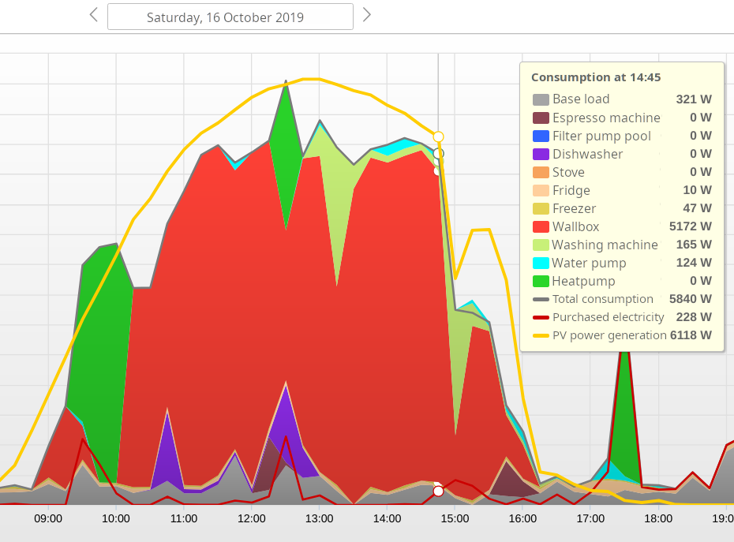
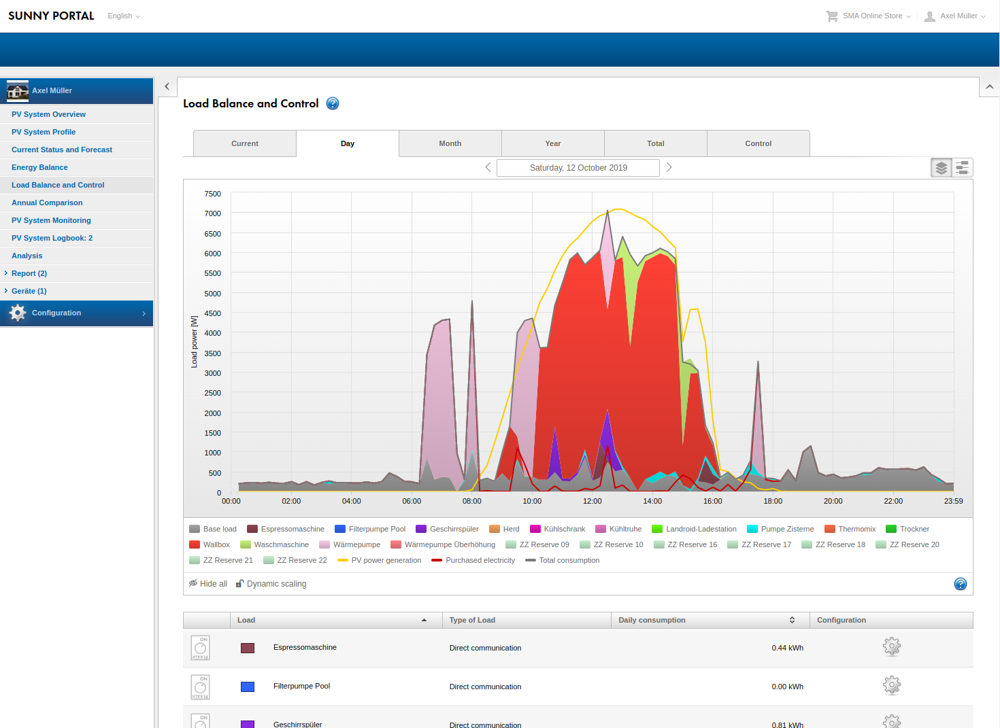

  
  <h3 align="center">Smart Appliance Enabler</h3>
  

    
    
    
    
  

**For several years I have put most of my free time into developing, documenting and supporting this open source project. I made a conscious decision to make this software available free of charge and to continuously expand it with features that could be of interest to as many users as possible. By using this software, electricity costs can be significantly reduced by maximizing the use of self-generated electricity. I would consider it an acknowledgment of my work if a portion of this saving were used to help support this project. This can easily be done using [Paypal](https://paypal.me/CarlAxelMueller) or bank transfer (account owner: Axel Mueller, IBAN: DE83 5185 0079 1140 0764 37, BIC: HELADEF1FRI, Details: support for Smart Appliance Enabler)**
  

# Overview
**The *Smart Appliance Enabler* is a software for integrating any device ([Wallbox](doc/EVCharger_EN.md), heat pump, washing machine, dishwasher, ...) with the [Sunny Home Manager](https://www.sma.de/produkte/monitoring-control/sunny-home-manager-20.html) by [SMA](http://www.sma.de) to **maximize the use of self-generated electricity obtained by photovoltaic systems**.**

For that, the *Smart Appliance Enabler* reports **demands** of these devices to the *Sunny Home Manager* in order to enable optimal planning of self-consumption. According to this planning, the *Smart Appliance Enabler* receives **switching commands**, which it forwards to the devices it manages. If individual, **digital electricity meters** are used for these devices, the power cosumption can be read and reported to the *Sunny Home Manager* to support it in learning the consumption characteristics and visualize power consumption in the [Sunny Portal](https://www.sunnyportal.com/).

The following graphic from the [Sunny Portal](https://www.sunnyportal.com/) shows a sunny autumn day on which the [Wallbox](doc/EVCharger_EN.md) was optimally controlled to charge the electric car while avoiding grid purchase. At the same time, the *Sunny Home Manager* had to run the dishwasher and washing machine according to the set requirements. In addition, the heat pump (hot water and heating) and the espresso machine were switched on at times, which are not controlled by the *Sunny Home Manager*, but of course also consume electricity.

# Hardware

## Requirements

The *Smart Appliance Enabler* was implemented in **Java** and basically runs on any device for which a Java Virtual Machine with Java 11 exists. In addition to the compiled code, various scripts are provided in which **Linux** is assumed to be the operating system. If devices are to be connected via [GPIO](https://www.itwissen.info/GPIO-general-purpose-input-output.html), the *Smart Appliance Enabler* requires a [**Raspberry Pi**]( doc/Raspberry_EN.md) as hardware.

## Electricity meter

The *Smart Appliance Enabler* currently supports the following options for measuring the power consumption of a device in order to report it to the *Sunny Home Manager*:

| Protocol | Products                                                                                                                                                                                                                                              |
|---------------|-------------------------------------------------------------------------------------------------------------------------------------------------------------------------------------------------------------------------------------------------------|
| GPIO          | [S0 meter](doc/S0Meter_EN.md)                                                                                                                                                                                                                         |
| Modbus        | [Modbus meter](doc/ModbusMeter_EN.md)                                                                                                                                                                                                                 |
| HTTP          | [HTTP meter](doc/HttpMeter_EN.md) in general<ul></ul>compatible products<ul><li>[Shelly Plug/3EM/4PM/Plus 1PM](doc/Shelly_EN.md)</li><li>[Edimax SP-2101W](doc/EdimaxSP2101W_EN.md)</li></ul>all products using [Tasmota](doc/Tasmota_EN.md) firmware |

[More details about these meters and other software based meters (e.g. master/slave meter)](doc/Meter_EN.md)

## Switches

The *Smart Appliance Enabler* currently supports the following options for switching a device on/off:

| Protocol | Products                                                                                                                                                                                                                                                                                                                                 |
| ------------- |------------------------------------------------------------------------------------------------------------------------------------------------------------------------------------------------------------------------------------------------------------------------------------------------------------------------------------------|
| GPIO | [GPIO switch](doc/GPIOSwitch_EN.md) [level switch](doc/LevelSwitch_EN.md) [PWM switch](doc/PwmSwitch_EN.md)                                                                                                                                                                                                                        |
| Modbus | [Modbus switch](doc/ModbusSwitch_EN.md) [level switch](doc/LevelSwitch_EN.md)  [wallbox](doc/EVCharger_EN.md)                                                                                                                                                                                                                   |
| HTTP | [HTTP switch](doc/HttpSwitch_EN.md) [level switch](doc/LevelSwitch_EN.md)<ul></ul>compatible products<ul><li>[Shelly Plug/4PM](doc/Shelly_EN.md)</li><li>[Edimax SP-2101W](doc/EdimaxSP2101W_EN.md)</li></ul>all products using [Tasmota](doc/Tasmota_EN.md) firmware<ul></ul>[wallbox](doc/EVCharger_EN.md) |

[More details about these switches and other software based switches (e.g. starting current detection, "smart grid ready" support of heat pumps)](doc/Control_EN.md)

# Assembly

If the *Smart Appliance Enabler* is to be operated on a Raspberry Pi, the [Assembly Instructions](doc/Assembly_EN.md) should be observed.

# Installation / Update

The [standard installation](doc/Installation_EN.md) runs automatically and requires no Linux knowledge.

If necessary, the [manual installation](doc/InstallationManual_EN.md) can also be selected as an alternative, in which all commands in the documentation must be executed manually.

[Installing updates](doc/Update_EN.md) enables the use of new functions and bug fixes.

If desired, the *Smart Appliance Enabler* can also be operated in a container with the provided [Docker-Images](doc/Docker_EN.md).  

# Configuration and Control

The [configuration](doc/Configuration_EN.md) of the *Smart Appliance Enabler* is done with the **web browser**.

The status of all controllable devices is clearly displayed in the [Status display](doc/Status_EN.md), whereby the status of each device is visualized by a **traffic light**. The traffic light can also be used for **manual control**.

In addition, the *Smart Appliance Enabler* supports [Node-RED by exporting flows for the configured devices so that they can be visualized in the Node-RED dashboard](doc/NodeRED_EN.md). In addition, the [MQTT messages of the *Smart Appliance Enabler*](doc/MQTT_EN.md) can be used to integrate with other automation platforms.

In the following video you can get an impression of the configuration of the *Smart Appliance Enabler*. This video was created as part of conducting automated tests to ensure the quality of the *Smart Appliance Enabler*.

# Integration with Sunny Portal
In addition to being controlled by the *Sunny Home Manager*, the *Smart Appliance Enabler* enables the [integration of devices into Sunny Portal](doc/SunnyPortal_EN.md).

# Frequently asked questions
[This page hopefully leads to the solution in case of problems](doc/QA_EN.md). Based on frequently asked questions, answers are given as well as references to relevant parts of the documentation.
     

# Support

Discussions and questions about the *Smart Appliance Enabler* are correctly placed in [Github Discussion](https://github.com/camueller/SmartApplianceEnabler/discussions).

In addition, I offer [personal, individual, fee-based support with advice](doc/Support_EN.md) - so to speak, the "all-round carefree package".
   

# Contribute

To [contribute](doc/Contribute_EN.md) you **don't have to be a programmer**! **Anyone** can [contribute](doc/Contribute_EN.md) in many different ways! [Your application scenarios for the *Smart Appliance Enabler*](doc/ApplicationScenarios_DE.md) help others!
      

# Development
All information about the [development](doc/Development_DE.md) of the *Smart Appliance Enabler* including the documentation of the build and test environments.
  

# Thanks and appreciation
The *Smart Appliance Enabler* project was **supported by [SMA](http://www.sma.de)** by providing a [Sunny Home Manager 2.0](https://www.sma.de/products/monitoring-control/sunny-home-manager-20.html)!

The *Smart Appliance Enabler* would not exist without the following tools and frameworks, whose developers I would like to thank and acknowledge:
* [Angular](https://angular.io) for the web frontend
* [Angular Material](https://material.angular.io/) for material design components of the web frontend
* [Browserstack](https://www.browserstack.com) for automated multi-browser tests and a free license for open source projects
* [Cling](http://4thline.org/projects/cling) for UPnP protocol implementation (part for the SEMP protocol)
* [Docker](https://www.docker.com/) for its container platform
* [Docker Hub](https://hub.docker.com/) for its repository to exchange docker images
* [GitHub](https://github.com/) for its platform for project repositories
* [IntelliJ](https://www.jetbrains.com/de-de/idea/) for the best IDE (especially with Linux) and free license for open source projects
* [Jenkins](https://www.jenkins.io/) for a build/test automation server
* [pigpioj](https://github.com/mattjlewis/pigpioj) for a library providing access to Raspberry Pi GPIO
* [Spring Boot](https://spring.io/projects/spring-boot) for Spring-based applications with embedded web container
* [Testcafe](https://devexpress.github.io/testcafe/) for easy testing of web applications
* [WebStorm](https://www.jetbrains.com/de-de/webstorm/) for the best IDE (especially with Linux) and free license for open source projects
    

# License
The contents of this repository are licensed under the [GNU GENERAL PUBLIC LICENSE](LICENSE.txt) unless otherwise noted.