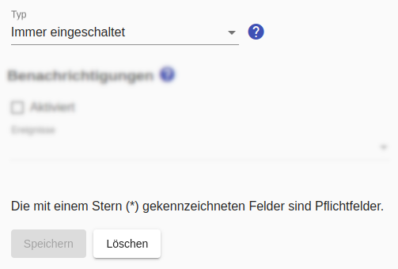

# "Immer eingeschaltet"-Schalter

Wie der Name bereits vermuten läßt, wird dieser Schalter nicht aktiv geschaltet, sondern es wird immer der Schaltzustand "eingeschaltet" gemeldet.

Dieser eignet sich für Geräte, die immer eingeschaltet sind (z.B. Kühlschrank) und bei denen lediglich der Verbrauch überwacht werden soll. Die Verwendung dieses Schalters kann erforderlich sein, weil nur Verbräuche eingeschalteter Geräte berücksichtigt werden.

