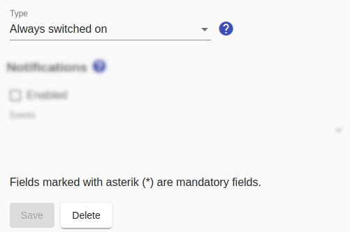

# Always-on switch

As the name already suggests, this switch is not switched actively, but the switching status "switched on" is always reported.

This is suitable for devices that are always switched on (e.g. refrigerator) and for which only the consumption should be monitored. It may be necessary to use this switch because only consumptions of switched-on devices are taken into account.

