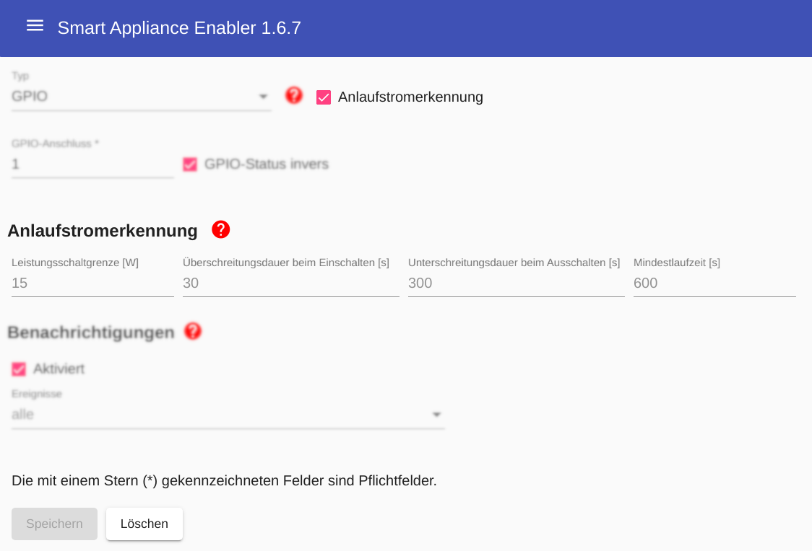

# Anlaufstromerkennung

Viele Geräte können nicht einfach eingeschaltet werden um direkt danach mit ihrer Arbeit zu beginnen, sondern müssen nach dem Einschalten zunächst programmiert werden. Dazu ist es erforderlich, dass das Gerät auch während dieser Zeit mit Strom versorgt wird. Bei Verwendung der Anlaufstromerkennung des *Smart Appliance Enabler* wird deshalb die Stromversorgung des Gerätes nur unterbrochen in der Zeit zwischen der Erkennung des Anlaufstromes und dem Empfang der Einschaltempfehlung des *Sunny Home Managers*.

Die **Anlaufstromerkennung** besteht darin, daß unterschieden wird zwischen dem eingeschaltetem Gerät im Ruhezustand und dem eingeschalteten Gerät, das gerade seine Arbeit verrichtet. Der Übergang vom erstgenannten Zustand in den letztgenannten Zustand wird erkannt, wenn der Stromverbrauch für eine konfigurierbare Zeit (Standard: 30 Sekunden) oberhalb einer konfigurierbaren Grenze (Standard: 15W) bleibt.

Genauso wird der **Abschaltstrom** als Übergang zurück erkannt, wenn der Stromverbrauch für eine konfigurierbare Zeit (Standard: 5 Minuten) unterhalb dieser konfigurierbaren Grenze bleibt. Damit der Abschaltstrom nicht fälschlicherweise kurz nach der Erkennung des Anlaufstromes erkannt wird, beginnt die Abschaltstromerkennung mit einer Verzögerung (Standard: 10 Minuten).

Nach Erkennung des Abschaltstromes wird direkt wieder die Anlaufstromerkennung aktiviert. Dadurch ist es möglich das Gerät innerhalb eines [Zeitplanes](Configuration_DE.md#Zeitpläne) mehrmals hintereinander laufen zu lassen.
