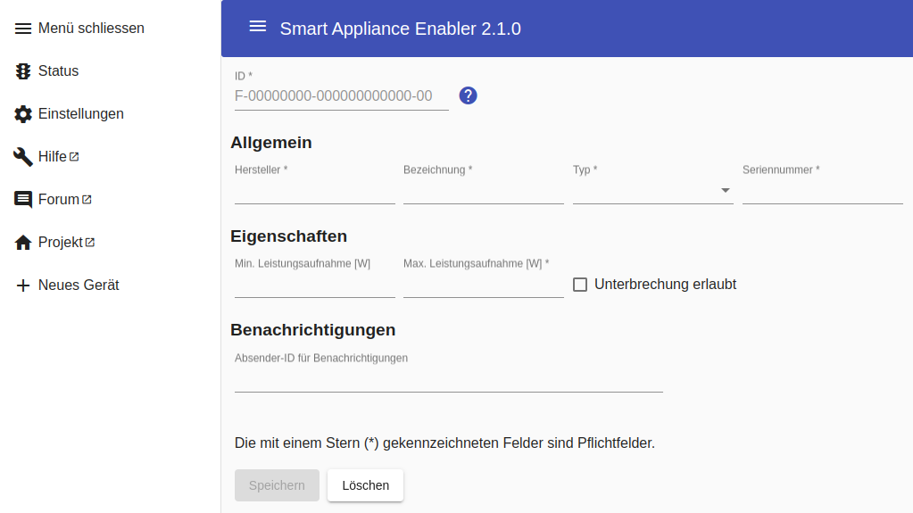
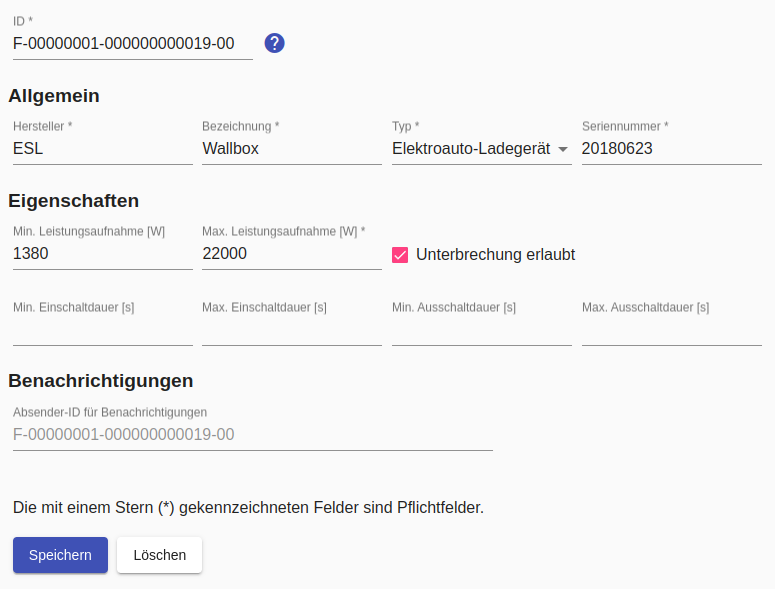
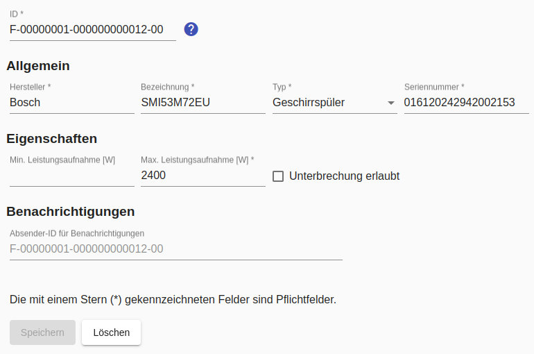

# Gerät

Durch Klick auf `Neues Gerät` wird die Konfiguration eines neuen Geräte begonnen. Dabei öffnet sich folgende Seite:

Nach dem Speichern des Gerätes erscheint im Menü ein Eintrag für das angelegte Gerät. Zusätzlich erscheinen die Unterpunkte `Zähler`, `Schalter` und `Schaltzeiten`.

Durch Klicken der `Löschen`-Schaltfläche und Bestätigung der Löschabsicht wird das Gerät gelöscht.

## Felder

### ID
Ein sehr wichtiges Attribut der Gerätekonfiguration ist die `ID`. Der Aufbau der Device-ID ist in der SEMP-Spezifikation vorgegeben und **muss über alle von SMA verwalteten *Sunny Home Manager* hinweg eindeutig sein!!** 

Für den *Smart Appliance Enabler* bedeutet das:
* F unverändert lassen ("local scope")
* 00000001 ersetzen durch einen 8-stelligen Wert, der den eigenen Bereich definiert (in der Hoffnung, damit eine eindeutige ID zu erreichen - siehe oben), z.B. das Geburtsdatum in der Form 25021964 für den 25. Februar 1964
* 000000000001 für jedes verwaltete Gerät hochzählen bzw. eine individuelle 12-stellige Zahl verwenden
* 00 unverändert lassen (sub device id)

Die IDs werden vom Sunny-Portal direkt verwendet, d.h. wenn jemand anderes bereits diese ID verwendet, kann das Gerät nicht im Sunny-Portal angelegt werden. Durch die Verwendung individueller Bestandteile wie Geburtsdatum sollte das Risiko dafür jedoch gering sein.

Das Ändern der `ID` führt dazu, dass der *Sunny Home Manager* das Gerät als Neugerät betrachtet.

### Hersteller
Der Wert für Hersteller (z.B. `Bosch`) wird lediglich für die Anzeige im *Smart Appliance Enabler* und im *Sunny Portal* verwendet.

### Bezeichnung
Der Wert für Bezeichnung (z.B. `SMI12345XV3`) wird lediglich für die Anzeige im *Smart Appliance Enabler* und im *Sunny Portal* verwendet.

### Typ
Der `Typ` ist ebenfalls ein zentrales Merkmal eines Gerätes.

Um ein Gerät als Wallbox konfigurieren zu können, muss hier `Elektroauto-Ladegerät` eingestellt werden.

### Seriennummer
Der Wert für Seriennummer (z.B. `40982841`) wird lediglich für die Anzeige im *Sunny Portal* verwendet.

### Min. Leistungsaufnahme

Dieses Feld wird nur angezeigt bei Geräten mit steuerbarer Leistungsaufnahme (z.B. Wallboxen).

Die vom *Sunny Home Manager* empfohlene Leistungsaufnahme wird diesen Wert nicht unterschreiten, falls angegeben.

### Max. Leistungsaufnahme
Bei Geräten, deren Leistungsaufnahme nicht steuerbar ist, die maximale Leistungsaufnahme laut Typenschild. Bei Geräten mit steuerbarer Leistungsaufnahme wird die empfohlene Leistungsaufnahme diesen Wert nicht überschreiten.

### Unterbrechung erlaubt
Wenn aktiviert, darf der *Sunny Home Manager* als Reaktion auf unvorhergesehene Energiebedarfe anderer Geräte oder schlechte Wetterbedingungen die Laufzeit des Gerätes unterbrechen.

Die folgenden Felder sind nur aktiv, wenn `Unterbrechnung erlaubt` aktiviert wurde.

* `Min. Einschaltdauer`
  
  Wenn das Gerät eingeschaltet ist, muss der *Sunny Home Manager* es mindestens für die angegebene Dauer in diesem Zustand belassen, bevor es ausgeschaltet werden kann.

* `Max. Einschaltdauer`

  Wenn das Gerät eingeschaltet ist, darf der *Sunny Home Manager* es maximal für die angegebene Dauer in diesem Zustand belassen, bis es ausgeschaltet wird.

* `Min. Ausschaltdauer`

  Wenn das Gerät ausgeschaltet ist, muss der *Sunny Home Manager* es mindestens für die angegebene Dauer in diesem Zustand belassen, bevor es wieder eingeschaltet werden kann.

* `Max. Ausschaltdauer`

  Wenn das Gerät ausgeschaltet ist, darf der *Sunny Home Manager* es maximal für die angegebene Dauer in diesem Zustand belassen, bis es eingeschaltet wird.

### Absender-ID für Benachrichtigungen
Der Wert dieses Feldes wird beim Versenden von Benachrichtigungen als Absender verwendet. Wenn kein Wert eingetragen ist, wird stattdessen der Wert des Feldes `ID` verwendet. 

## Beispiel
Minimal müssen für ein Gerät folgende Angaben gemacht werden:

