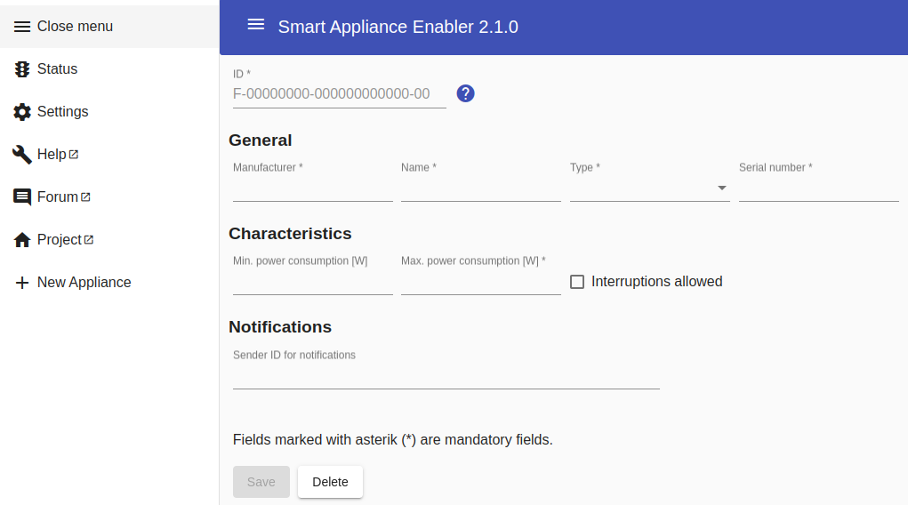
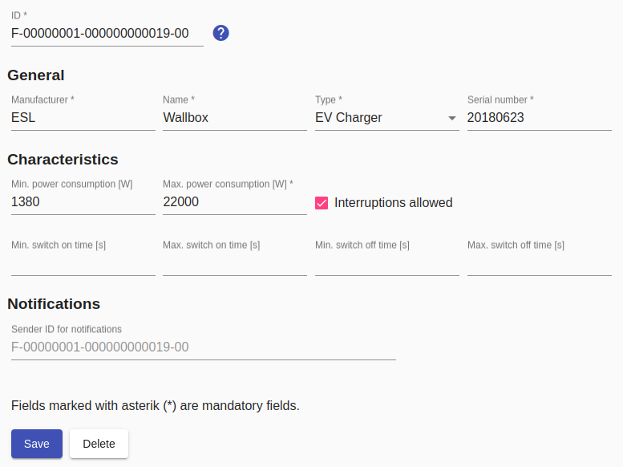
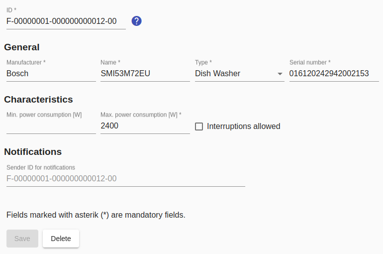

# Appliance

By clicking on `New Appliance` the configuration of a new appliance is started and the following page opens:

After saving the appliance, an entry for the created appliance appears in the menu. In addition, the sub-items `Meter`, `Switch` and `Schedules` appear.

The appliance is deleted by clicking the `Delete` button and confirming the intention to delete.

## Fields

### ID
A very important attribute of the appliance configuration is the `ID`. The structure of the device ID is specified in the SEMP specification and **must be unique across all *Sunny Home Managers* managed by SMA!!**

For the *Smart Appliance Enabler* this means:
* Leave F unchanged ("local scope")
* Replace 00000001 with an 8-digit value that defines your own range (hoping to achieve a unique ID with this - see above), e.g. the date of birth in the form 25021964 for February 25, 1964
* 000000000001 to be incremented for each managed device, or use a unique 12-digit number
* Leave 00 unchanged (sub device id)

The IDs are used directly by Sunny Portal, i.e. if someone else is already using this ID, the device cannot be created in Sunny Portal. However, by using individual components such as date of birth, the risk of this should be low.

Changing the `ID` causes the *Sunny Home Manager* to regard the device as a new device.

### Manufacturer
The value for the manufacturer (e.g. `Bosch`) is only used for the display in the *Smart Appliance Enabler* and in the *Sunny Portal*.

### Name
The name (e.g. `SMI12345XV3`) is only used for the display in the *Smart Appliance Enabler* and in the *Sunny Portal*.

### Type
The `type` is also a central feature of a appliance.

In order to be able to configure a appliance as a wallbox, `EV charger` must be set here.

### Serial number
The value for the serial number (e.g. `40982841`) is only used for the display in *Sunny Portal*.

### Min. power consumption
This field is only displayed for appliances with controllable power consumption (e.g. wallboxes).

The power consumption recommended by the *Sunny Home Manager* will not fall below this value, if specified.

### Max. power consumption
For appliances whose power consumption cannot be controlled, the maximum power consumption according to the type plate. For appliances with controllable power consumption, the recommended power consumption will not exceed this value.

### Interruption allowed
If activated, the *Sunny Home Manager* may interrupt the running time of the appliance as a reaction to unforeseen energy demands from other appliances or bad weather conditions.

#### Min. switch-on time
This field is only active if `Interruption allowed` has been activated.

If the device is switched on, the *Sunny Home Manager* must leave it in this state for the specified duration before it is switched off.

#### Max. switch-on time
This field is only active if `Interruption allowed` has been activated.

If the device is switched on, the *Sunny Home Manager* must not leave it in this state longer than the specified duration before it is switched off.

#### Min. switch-off time
This field is only active if `Interruption allowed` has been activated.

If the device is switched off, the *Sunny Home Manager* must leave it in this state for the specified duration before it is switched on again.

#### Max. switch-off time
This field is only active if `Interruption allowed` has been activated.

If the device is switched off, the *Sunny Home Manager* must not leave it in this state for longer than the specified period before it is switched on again.

### Sender ID for notifications
The value of this field is used as the sender when sending notifications. If no value is entered, the value of the `ID` field will be used instead.

## Example
At least the following information must be provided for an appliance:

