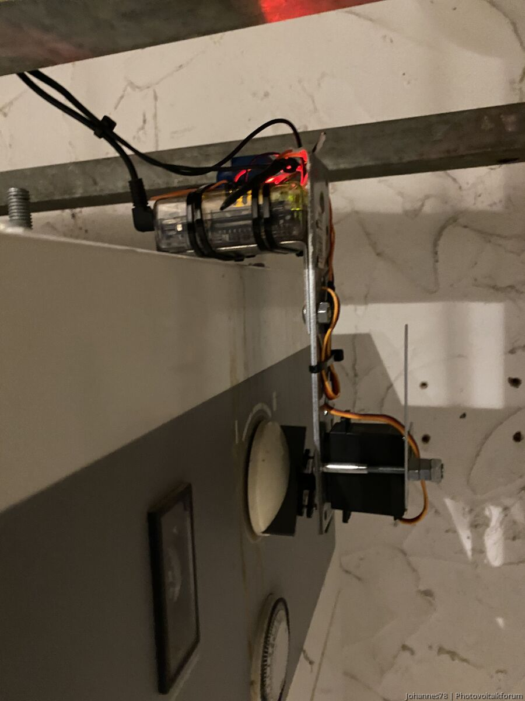
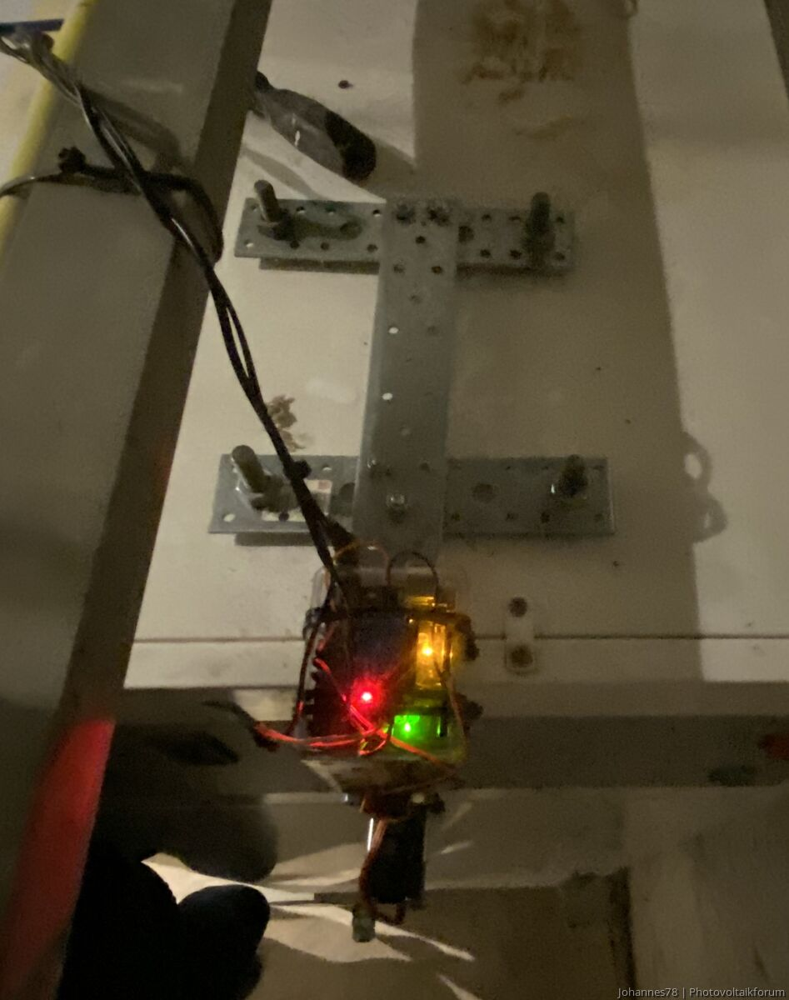

# Anwendungsszenarien

Der *Smart Appliance Enabler* ist für einige Einsatzzwecke "Out-of-the-box" geeignet. Viel interessanter sind aber oft Anwendungsszenarien, an die bei der Entwicklung des *Smart Appliance Enabler* gar nicht gedacht wurde, die ihr aber damit umgesetzt habt. Es wäre doch schön, wenn **andere auch von Euren Ideen profitieren** würden oder vielleicht sogar dazu beitragen könnten, sie noch besser zu machen.

## Änderung der Solltemperatur mittels Servo zur Nutzung von Überschussenergie

Von [Johannes78](https://www.photovoltaikforum.com/core/user/123174-johannes78/):

Da meine uralte Warmwasser-Wärmepumpe keinen Steuereingang hat, stellt ein Servomotor am Drehschalter arduinobetrieben die Solltemperatur bei Vorhandensein von PV-Strom für mich auf 60 Grad. An dunklen Tagen habe ich dann immer noch 40 Grad Soll, was zum warm duschen reicht. Der Arduino kann sein „Go!“ über einen GPIO des Raspberry Pi bekommen, auf dem der *Smart Appliance Enabler* läuft.

<div>
<a href="../pics/user/IMG_0733.jpeg"></a>
<a href="../pics/user/IMG_0736.jpeg"></a>
</div><br><br><br><br><br><br><br><br><br><br><br><br><br><br><br><br><br><br><br><br><br><br><br>

Ganz oben der Arduino und ein Relais, das zwei Pins (3,3 V und Pin 7) des Arduino verbindet, wenn es anzieht. Wichtig ist ein Pull-Down-Widerstand zwischen den beiden Pins, sonst zittert der Servo.

Das Relais kann über einen GPIO des Raspberry Pi geschaltet werden. Man könnte wahrscheinlich auch direkt vom Raspberry auf den Arduino Pin gehen, aber so habe ich die Systeme galvanisch getrennt. Es geht eben nur darum, den PIN 7 auf "high" zu setzen - siehe Arduino-Sketch.

Unten der Servomotor. Die kleinen SG90 reichen hierfür nicht aus - ich habe einen etwas größeren gewählt, der aber noch direkt mit dem Arduino betrieben werden kann. Die Servos haben kleine Plastikärmchen/-kreuze mit Bohrungen. Habe ein paar Löcher in den Drehschalter der WP gebohrt und so ein Ärmchen daran geschraubt. Der Servo wird dann nur draufgesetzt und kann jederzeit entfernt werden. Servo, Arduino usw. sind an einem kleinen Gestell aus Flacheisen, das oben auf der Wärmepumpe liegt und schwer genug ist, damit alles in Position bleibt. Trotzdem kann ich die Sache jederzeit einfach wegnehmen, falls etwas sein sollte. Die vier größeren Schlossschrauben dienen der Ausrichtung, damit die Achse des Servos genau vor der Achse des Drehschalters liegt.

Der Arduino-Sketch sieht wie folgt aus:

```cpp
#include <Servo.h> // Die Servobibliothek wird aufgerufen. Sie wird benötigt, 
                   // damit die Ansteuerung des Servos vereinfacht wird.

Servo servoblau;   // Erstellt für das Programm ein Servo mit dem Namen „servoblau“

void setup() 
{
    pinMode(7, INPUT);   // Setzt den Digitalpin 7 als Intputpin
    servoblau.attach(8); // Das Setup enthält die Information, dass das Servo an
                         // der Steuerleitung (gelb) mit Pin 8 verbunden wird. 
                         // Hier ist natürlich auch ein anderer Pin möglich.
}

void loop()
{
    if (digitalRead(7)==HIGH) // Prüfen, ob am Pin 7 Spannung anliegt
    {
        servoblau.write(130); // Ausprobieren, welche Zahl an braucht
        delay(30); 
    } else {
        servoblau.write(10);
        delay(30);
    }
}
```

Das war es schon. Läuft seit ein paar Monaten problemlos, auch wenn es etwas wild aussieht. Für unter 50 Taler habe ich meine Stiebel Elton WWK300 "SG-Ready" gemacht. Man könnte noch die Legionellenschaltung nutzen, um noch mehr Strom zu verbrauchen. Das hab ich mir erstmal gespart. Die WWK300 zieht im Betrieb 500 Watt über mehrere Stunden. Da kann man schon viel Überschussstrom verbrauchen.

Quelle: https://www.photovoltaikforum.com/thread/104060-ger%C3%A4te-mit-home-manager-koppeln-via-semp-ethernet/?postID=2125435#post2125435
