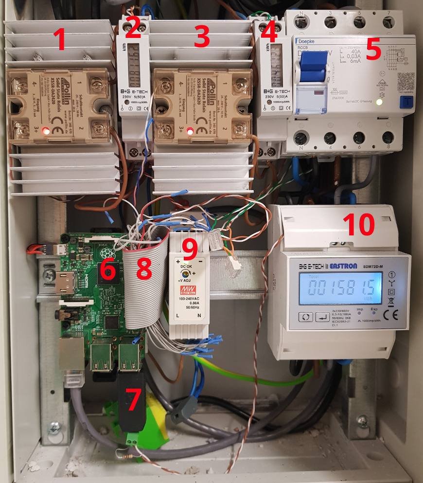

# Montage

*Hinweis: Die Installation von steckerlosen 200/400V-Geräten sollte grundsätzlich durch einen autorisierten Fachbetrieb vorgenommen werden!*

Eine Möglichkeit der Montage des Raspberry Pi besteht darin, ihn direkt im Verteilerschrank zu platzieren. Das bietet sich insbesondere dann an, wenn **Digitalstromzähler** mit S0 oder Modbus-Ausgang und/oder **Solid State Relais** verwendet werden, die ebenfalls dort montiert sind.

Für die Stromversorgung des Raspberry Pi muss dann ein **Netzteil** montiert werden.

Zum Verbinden der Digitalstromzähler und Solid State Relais mit dem Raspberry Pi eignet sich ein **IDE-Flachkabel** aus einem alten PC.

Im Ergebnis könnten die montierten Geräte so aussehen:

| Nummer | Beschreibung                                         |
|--------|------------------------------------------------------|
| 1      | Solid State Relais mit Kühlkörper für Geschirrspüler |
| 2      | Zähler für Geschirrspüler                            |
| 3      | Solid State Relais mit Kühlkörper für Waschmaschine  |
| 4      | Zähler für Waschmaschine                             |
| 5      | FI-Schalter für Wallbox                              |
| 6      | Raspberry Pi                                         |
| 7      | USB-Modbus-Adapter                                   |
| 8      | IDE-Flachkabel                                       |
| 9      | Netzteil für Raspberry Pi                            |
| 10     | Modbus-Zähler für Wallbox (3 Phasen)                 |

## DIN-Schienenhalter

Zur Montage von Raspberry Pi und Solid-State-Relais im Schaltschrank verwende ich DIN-Schienenhalter vom Typ **Bopla TSH 35**, die man bei den großen Elektronikhändlern bestellen kann. Auf diese Schraube ich zunächst eine PVC-Platte auf. Auf dieser wird dann das eigentliche Bauteil mit Nylonschrauben (leiten keinen Strom) befestigt.

