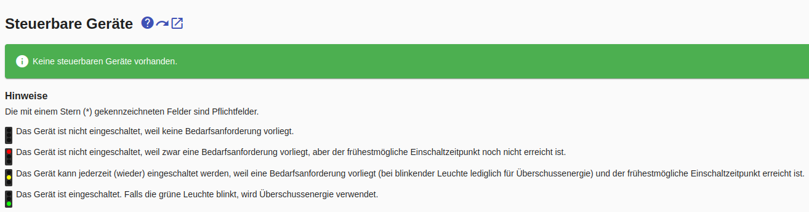
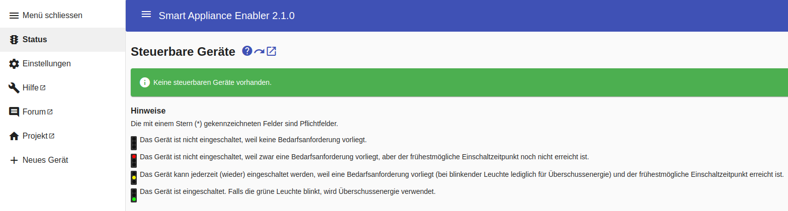
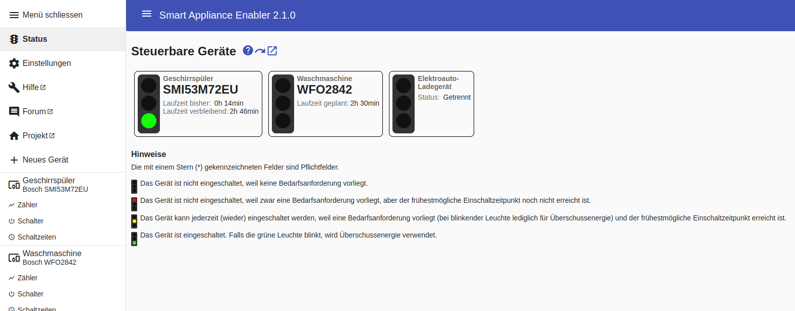

# Konfiguration

## Allgemeine Hinweise
Die Konfiguration erfolgt über das Web-Frontend des *Smart Appliance Enabler*. Dazu muss man im Web-Browser lediglich `http://raspi:8080` eingeben, wobei *raspi* durch den Hostnamen oder die IP-Adresse des Raspberry Pi ersetzt wird. Es öffnet sich die Status-Seite mit dem Hinweis, dass noch keine Geräte konfiguriert sind.

Die Web-Oberfläche ist bewusst einfach und dennoch komfortabel gehalten, um Browser auf PC, Tablett und Handy gleichermaßen zu unterstützen.

Grundsätzlich gilt, dass Eingaben/Änderungen erst nach dem [Klicken der `Speichern`-Schaltfläche](ConfigurationFiles_DE.md#speichern) gespeichert sind. Beim Wechsel auf ein andere Seite erfolgt eine Warnung, wenn nicht gespeicherte Änderungen vorhanden sind.

Werden bei Eingabefeldern Inhalte mit grauer Schrift angezeigt, so handelt es sich um Voreinstellungen, d.h. wenn kein Wert eingegeben wird, gilt dieser Wert ohne dass er eingegeben werden muss.

Pflichtfelder sind mit einem `*` hinter der Feldbezeichnung gekennzeichnet. Solange nicht alle Pflichtfelder ausgefüllt sind, ist die `Speichern`-Schaltfläche nicht aktiv. 

Bei ungültigen Eingaben erscheint unter dem Eingabefled eine Fehlermeldung. Solange auf einer Seite solche Fehlermeldungen existieren, ist die `Speichern`-Schaltfläche nicht aktiv.

Beim ersten Start ohne vorhandene Konfigurationsdateien wird folgende Seite angezeigt:

Über das Menü-Symbol (die drei Striche links vom Titel "Smart Appliance Enabler") lässt sich jederzeit das Menü öffnen und schliessen.

 
Im Menü findet sich ein Eintrag für die [Status](Status_DE.md)-Anzeige, die initial immer angezeigt wird.

Darunter findet sich ein Eintrag zur Verwaltung der zentralen, geräteunabhängigen [Einstellungen](Settings_DE.md).

Nachfolgend finden sich im Menü Links
- zur [Seite mit Fragen / Probleme und Antworten](QA_DE.md)
- zur [Projekt-Hompage](https://github.com/camueller/SmartApplianceEnabler)
- zum [Anwender-Forum](https://github.com/camueller/SmartApplianceEnabler/discussions)

Unterhalb des Eintrags für `Neues Gerät` werden die konfigurierten Geräte mit Zähler, Schalter und Schaltzeiten angezeigt.

## Grundlagen
Vor Beginn der eigentlichen Konfiguration sollten die folgenden Zusammenhänge klar sein. Deren Nichtbeachtung wird dazu führen, dass der *Smart Appliance Enabler* nicht funktionieren kann:

1. Der *Sunny Home Manager* berücksichtigt nur die Leistungsaufnahme von Geräten, für die auch der Zustand "eingeschaltet" vom *Smart Appliance Enabler* übermittelt wird (siehe [Schalter](Control_DE.md))
2. Der *Sunny Home Manager* wird nur dann ein Gerät durch Schaltbefehle steuern, wenn der *Smart Appliance Enabler* zuvor einen Bedarf gemeldet hat. Grundlage dafür ist
   - bei Wallboxen: ein verbundenes Fahrzeug (führt zur Anforderung von Überschussenergie)
   - bei alle anderen Geräten: ein konfigurierter [Zeitplan](Schedules_DE.md) (führt zur Anforderung von Laufzeit)

Nachdem die Grundlagen geklärt sind, kann mit der eigentlichen Konfiguration fortgefahren werden:
- [Geräte](Appliance_DE.md)
- [Zähler](Meter_DE.md)
- [Schalter](Control_DE.md)
- [Zeitpläne](Schedules_DE.md)
- [Benachrichtigungen](Notifications_DE.md)
- [Konfiguration mittels REST](REST_DE.md)
