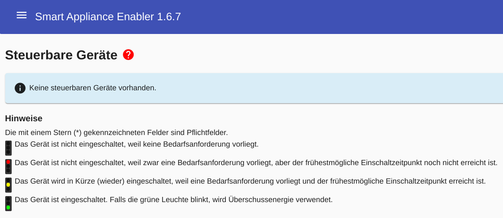
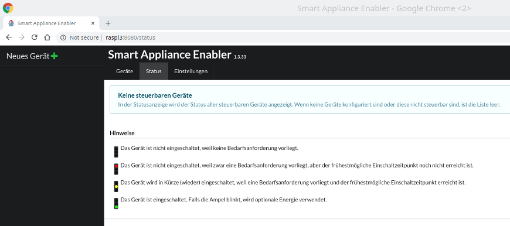
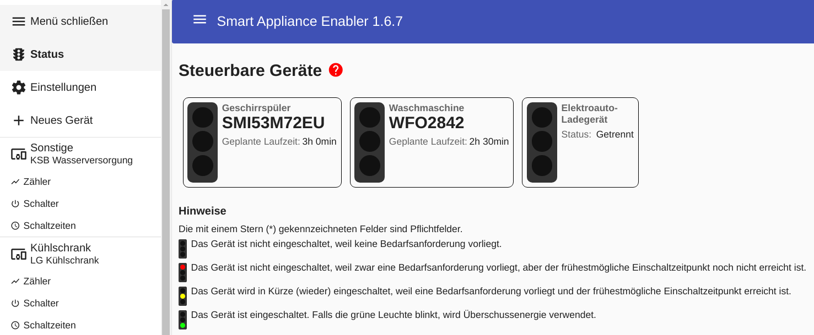
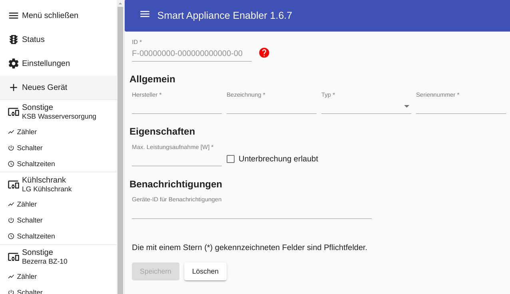
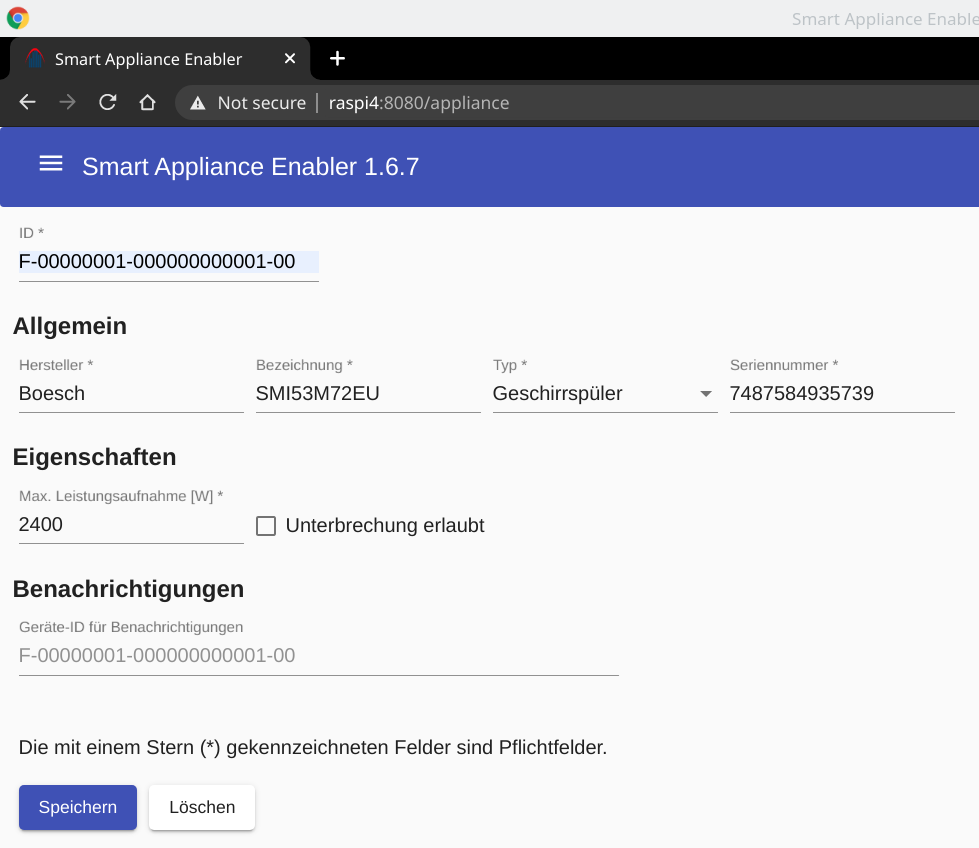
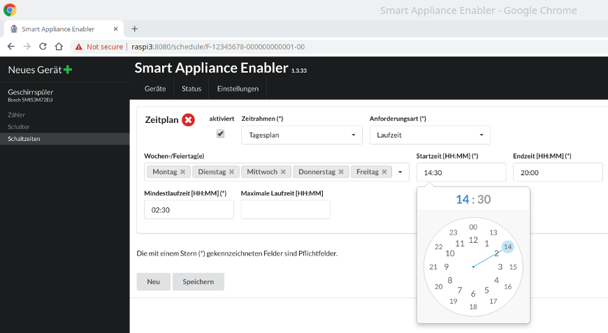
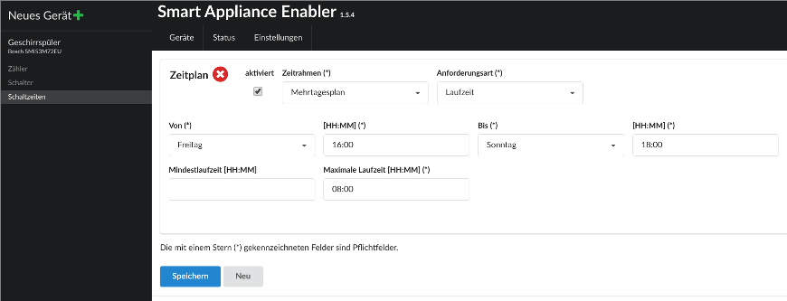
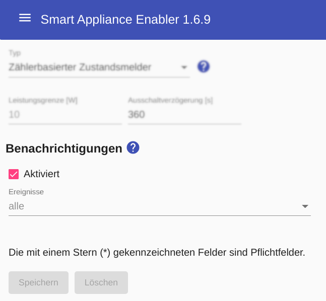

# Konfiguration

Die Konfiguration erfolgt über das Web-Frontend des *Smart Appliance Enabler*. Dazu muss man im Web-Browser lediglich eingeben ```http://raspi:8080/```, wobei *raspi* durch den Hostnamen oder die IP-Adresse des Raspberry Pi ersetzt werden muss. Es öffnet sich die Status-Seite mit dem Hinweis, dass noch keine Geräte konfiguert sind.

Die Web-Oberfläche ist bewusst einfach und dennoch komfortabel gehalten, um Browser auf PC, Tablett und Handy gleichermaßen zu unterstützen.

Grundsätzlich gilt, dass Eingaben/Änderungen erst nach dem Klicken der ```Speichern```-Schaltfläche gespeichert sind. Beim Wechsel auf ein andere Seite erfolgt eine Warnung, wenn nicht gespeicherte Eingaben/Änderungen vorhanden sind.

Werden bei Eingabefeldern Inhalte mit grauer Schrift angezeigt, so handelt es sich um Voreinstellungen, d.h. wenn kein Wert eingegeben wird, gilt dieser Wert.

Pflichtfelder sind mit einem `*` hinter der Feldbezeichnung gekennzeichnet. Solange nicht alle Pflichtfelder ausgefüllt sind, ist die ```Speichern```-Schaltfläche nicht aktiv. 

Beim Speichern werden die Daten in zwei [XML](https://de.wikipedia.org/wiki/Extensible_Markup_Language)-Dateien geschrieben, die sich in dem Verzeichnis befinden, auf das die Variable `SAE_HOME` verweist (normalerweise ```/opt/sae```):
* die Datei `Device2EM.xml` enthält Gerätebeschreibung für den EnergyManager
* die Datei `Appliances.xml` enthält die Gerätekonfiguration für den *Smart Appliance Enabler*
  Die Groß-/Kleinschreibung der Dateinamen muss genau so sein, wie hier angegeben!

Beim Speichern wird der *Smart Appliance Enabler* intern neu gestartet, damit die geänderte Konfiguration wirksam wird. Aktuell laufende Geräte werden in diesem Moment immer gestoppt/ausgeschalten um einen definierten Zustand zu erhalten. Auch werden bereits in Anspruch genommene Energiemengen/Laufzeiten von Geräten zurück gesetzt und neu eingeplant. Um das zu vermeiden sollte man die Konfiguration möglichst dann ändern, wenn die zu steuernden Geräte gerade nicht laufen.

Beim ersten Start ohne vorhandene Konfigurationsdateien wird folgende Seite angezeigt:



Über das Menü-Symbol (die drei Striche links vom Titel "Smart Appliance Enabler") lässt sich jederzeit das Menü öffnen und schliessen.


 
Im Menü findet sich ein Eintrag für die [Status](Status_DE.md)-Anzeige, die initial immer angezeigt wird.

Darunter findet sich ein Eintrag zur Verwaltung der zentralen, geräteunabhängigen [Einstellungen](Settings_DE.md).

Unterhalb des Eintrags für ```Neues Gerät``` werden die konfigurierten Geräte mit [Zähler](#zähler), [Schalter](#schalter) und [Schaltzeiten](#schaltzeiten) angezeigt, wenn sie vorhanden sind.



Durch Klick auf ```Neues Gerät``` wird die Konfiguration eines neuen Geräte begonnen und es öffnet sich folgende Seite:



## Gerätekonfiguration

Ein sehr wichtiges Attribut der Gerätekonfiguration ist die ```ID```. Der Aufbau der Device-ID ist in der SEMP-Spezifikation vorgegeben. Für den *Smart Appliance Enabler* bedeutet das:
* F unverändert lassen ("local scope")
* 00000001 ersetzen durch einen 8-stelligen Wert, der den eigenen Bereich definiert, z.B. das Geburtsdatum in der Form 25021964 für den 25. Februar 1964
* 000000000001 für jedes verwaltete Gerät hochzählen bzw. eine individuelle 12-stellige Zahl verwenden
* 00 unverändert lassen (sub device id)
  Die Device-IDs werden vom Sunny-Portal direkt verwendet, d.h. wenn jemand anderes bereits diese ID verwendet, kann das Gerät nicht im Sunny-Portal angelegt werden. Durch die Verwendung individueller Bestandteile wie Geburtsdatum sollte das Risiko dafür jedoch gering sein.

Das Ändern der ```ID``` führt dazu, dass der SHM das Gerät als Neugerät betrachtet.

Außer der Device-ID müssen allgemeine Angaben und Eigenschaften des Gerätes eingegeben werden.Minimal sind das folgende Angaben:



Wenn alle erforderlichen Eingaben erfolgt sind, wird die ```Speichern```-Schaltfläche freigegeben.

Nach dem Drücken dieser Schaltfläche erscheint im Menü ein Eintrag für das angelegte Gerät. Zusätzlich erscheinen die Unterpunkte [Zähler](#zähler), [Schalter](#schalter) und [Schaltzeiten](#schaltzeiten).

Durch Klicken der ```Löschen```-Schaltfläche und Bestätigung der Löschabsicht wird das Gerät gelöscht.

## Zähler

Um einen Zähler zu konfigurieren muss in der ```Typ```-Auswahlbox der Typ des Zählers ausgewählt werden:

* [S0](SOMeter_DE.md)
* [HTTP](HttpMeter_DE.md)
* [Modbus](ModbusMeter_DE.md) erscheint nur, wenn in den [Einstellungen](Settings_DE.md#modbus) mindesten ein Modbus konfiguriert wurde

Entsprechend dieser Auswahl werden die für den gewählten Zähler-Typ konfigurierbaren Felder eingeblendet.

## Schalter

Um einen Schalter zu konfigurieren muss in der ```Typ```-Auswahlbox der Typ des Schalters ausgewählt werden. 

Derzeit unterstützt der *Smart Appliance Enabler* folgende Schalter:

* [Zählerbasierter Zustandsmelder](MeterReportingSwitch_DE.md) ist automatisch aktiv, wenn kein anderer Schalter konfiguriert wird
* [GPIO](GPIOSwitch_DE.md)
* [Modbus](ModbusSwitch_DE.md) erscheint nur, wenn in den [Einstellungen](Settings_DE.md#modbus) mindesten ein Modbus konfiguriert wurde
* [HTTP](HttpSwitch_DE.md)
* [Immer eingeschaltet](AlwaysOnSwitch_DE.md)

Entsprechend dieser Auswahl werden die für den gewählten Schalter-Typ konfigurierbaren Felder eingeblendet.

Falls der gewählte Schalter-Typ mit [Anlaufstromerkennung](Anlaufstromerkennung_DE.md) kombiniert werden kann und diese durch Anklicken der Checkbox aktiviert wurde, werden weitere Felder mit Konfigurationsparametern der Anlaufstromerkennung eingeblendet.

Wenn als Gerätetyp ```Elektroauto-Ladegerät``` angegeben ist, kann auf dieser Seite die [Konfiguration des Lade-Controllers sowie die Verwaltung der Fahrzeuge](EVCharger_DE.md) vorgenommen werden.

## Zeitpläne

Der *Sunny Home Manager* wird nur dann Geräte einplanen und einschalten, wenn eine Anforderung vorliegt. Neben Ad-Hoc-Anforderungen über die [Ampel](Status_DE.md) sind Zeitpläne das zentrale Element für (potentiell) regelmäßige Anforderungen (z.B. für Gschirrspüler, Waschmaschine, ...)

Falls ein Schalter-Typ konfiguriert wurde, der die Steuerung des Gerätes erlaubt, können Zeitpläne konfiguriert werden.

Ein Zeitplan hat einen Zeitrahmen, auf den er sich bezieht:
- `Tagesplan`: bezieht sich auf einen/alle Wochentage
- `Mehrtagesplan`: bezieht sich auf eine Dauer länger als 24 Stunden aber höchstens eine Woche

Für einen Tagesplan kann angegeben werden, dass dieser an Feiertagen gelten soll.
Dieser hat Vorrang vor anderen Tagesplänen, die entsprechend des Wochentages gelten würden. Voraussetzung dafür ist, dass das [Feiertagshandling in der Konfiguration aktiviert](Settings_DE.md#Feiertage) wurde.

Neben dem Zeitrahmen hat ein Zeitplan auch eine `Anforderungsart`, die (außer für Wallboxen) immer `Laufzeit` ist. Dabei wird über die `Startzeit` und die `Endzeit` ein Zeitfenster definiert, innerhalb dessen der *Sunny Home Manager* die `maximale Laufzeit` unabhängig vom Vorhandensein von PV-Strom sicherstellen muss. Wird zusätzlich die (optionale) `minimale Laufzeit` angegeben, wird der *Sunny Home Manager* nur diese Laufzeit sicherstellen, aber bei Vorhandensein von *Überschussenenergie* die Laufzeit bis zur `maximalen Laufzeit` erweitern. Im Extremfall führt das Setzen einer `minimalen Laufzeit` von 0 dazu, dass das Gerät ausschliesslich mit Überschussenergie betrieben wird. Wenn diese nicht vorhanden ist, wird das Gerät nicht eingeschaltet.

Beispiel für einen Tagesplan:




Beispiel für einen Mehrtagesplan:




Der *Smart Appliance Enabler* meldet dem Sunny Home Manager den Geräte-Laufzeitbedarf für die nächsten 48 Stunden, damit er auf dieser Basis optimal planen kann.

## Benachrichtigungen

Durch Benachrichtigungen kann der *Smart Appliance Enabler* über Ereignisse ("Gerät wurde eingeschaltet", "Kommunikationsfehler") informieren.

Für die Nutzung von Benachrichtigungen muss ein [Shell-Script in den Einstellungen konfiguriert](Settings_DE.md#benachrichtigungen) sein.

Nachdem ein Shell-Script konfiguriert wurde, kann für Zähler und Schalter durch Aktivieren der Checkbox `Aktiviert` das Versenden von Benachrichtigungen gerätespezifisch aktiviert werden.

Ohne Auswahl einzelner Ereignisse erfolgt die Benachrichtiung für alle Ereignisse:



Alternativ kann die Benachrichtiung auf einzlene Ereignisse beschränkt werden:


### Telegram
Zunächst muss in Telegram eine [Gruppe erstellt](https://telegram.org/faq/de#f-wie-kann-ich-eine-gruppe-erstellen) werden, die man z.B. "Haus" nennen könnte.

Für jedes Gerät, das Benachrichtigungen versenden soll, muss ein [Bot anlegt](https://core.telegram.org/bots#3-how-do-i-create-a-bot) werden. Dabei muss ein "Username" angegeben werden, der Telegramweit (!) eindeutig sein und auf `_bot` enden muss. Man kann davon ausgehen, dass `waschmaschine_bot` bereits vergeben ist. Wenn der Bot erfolgreich angelegt wurde, wird in der Bestätigungsnachricht ein `Token to access HTTP API` mitgeteilt. Diesen Token sollte sollte man sichern und niemandem mitteilen. Im *Smart Appliance Enabler* muss dieser Token in der Geräte-Konfiguration in das Feld `Geräte-ID für Benachrichtigungen` eingetragen werden.

Im Dialog mit dem "BotFather" kann man den Bots auch Fotos zuweisen.

Diese [Bots müssen der zuvor angelegten Gruppe hinzugefügt](https://telegram.org/faq/de#f-wie-kann-ich-mehr-mitglieder-hinzufgen-und-was-ist-ein-einladu) werden.

Zum Versenden von Benachrichtigungen wird die Chat ID der Gruppe benötigt. Diese wird angezeigt, wenn man den Bot `@getidsbot` zur Gruppe hinzufügt. Wenn man die ID ermittelt hat, kann der `@getidsbot` wieder aus der Gruppe entfernt werden.

Für die Nutzung von [Benachrichtigungen via Telegram wird ein Shell-Script](Installation_DE.md#Benachrichtigungen) bereitgestellt. In diesem Shell-Script muss die zuvor ermittelte Chat ID eingetragen werden (ggf. vorhandenes Minus-Zeichen muss übernommen werden):
```
chat=-123456789
```

Jetzt steht dem Empfang von Benachrichtigungen nichts mehr im Wege:


# Konfiguration mittels XML-Dateien

## Vorgehensweise

Die XML-Dateien kann man entweder auf dem Raspberry Pi bearbeiten oder man transferiert sie dazu auf den PC. Letzteres bietete sich insbesondere für größere Änderungen an, nach denen noch eine Überprüfung der Inhalte auf Gültigkeit erfolgen soll (siehe unten). Zum Transferieren der Dateien zwischen Raspberry Pi und PC kann man unter Linux ```scp``` verwenden, unter Windows gibt es ```WinSCP``` ([Video mit WinSCP Anleitung auf Deutsch](https://www.youtube.com/watch?v=z6yJDMjTdMg)).

## Überprüfung der Dateien
Die angepassten XML-Dateien sollten hinsichtlich ihrer Gültigkeit überprüft werden.
Dazu ist die Seite http://www.freeformatter.com/xml-validator-xsd.html besonders geeignet:
Der Inhalt der XML-Datei wird in das Fenster *XML Input* kopiert.
In das Fenster *XSD Input* muss der Inhalt (nicht die URL selbst!) der nachfolgenden URL kopiert werden:
* beim Prüfen von Device2EM.xml: https://raw.githubusercontent.com/camueller/SmartApplianceEnabler/master/xsd/SEMP-1.1.5.xsd
* beim Prüfen von Appliances.xml: https://raw.githubusercontent.com/camueller/SmartApplianceEnabler/master/xsd/SmartApplianceEnabler-1.4.xsd

Ist die Prüfung erfolgreich, erscheint oberhalb des *XML Input* eine grün unterlegte Meldung *The XML document is valid.*. Bei Fehlern erscheint eine rot unterlegte Meldung mit entsprechender Fehlerbeschreibung.

# Konfiguration mittels REST
Für die Konfiguration mittels Web-Frontend existieren entsprechende REST-Services. Diese können, wie die SEMP-Schnittstelle selbst, auch unabhängig vom Web-Frontend verwendet werden.

## Schalten eines Gerätes
Zum Einschalten eines Gerätes kann folgender Befehl verwendet werden, wobei die URL und die Device-ID (identisch mit Appliance-ID) anzupassen ist:
```console
curl -X POST -d '<EM2Device xmlns="http://www.sma.de/communication/schema/SEMP/v1"><DeviceControl><DeviceId>F-00000001-000000000002-00</DeviceId><On>true</On></DeviceControl></EM2Device>' --header 'Content-Type: application/xml' http://127.0.0.1:8080/semp
```
Zum Ausschalten muss lediglich ```<On>false</On>``` statt ```<On>true</On>``` gesetzt werden.

Ein Gerät, das manuell eingeschaltet wird bleibt nur dann in diesem Zustand wenn es sich in einem aktiven Timeframe befindet. Andernfalls schaltet es der SAE wieder aus.
Um vor dem Einschalten zusätzlich einen Timeframe für eine bestimmte Laufzeit zu erzeugen ist ein zweiter Befehl notwendig. Beide Befehle direkt hintereinander abgesetzt (zuerst Timeframe, dann Einschalten) bewirken das selbe was die Ampelfunktion zur Verfügung stellt (Klick für sofortigen Start + Auswahl der entsprechenden Laufzeit).
Zum aktivieren eines zusätzlichen Timeframe für 10 Minuten ab sofort funktioniert folgender Befehl:
```console
curl -s -X PUT -F id=F-00000001-000000000002-00 -F runtime=600 http://127.0.0.1:8080/sae/runtime
```

## Setzen der Schedules
Normalerweise werden die Schedules aus der Datei `Appliance.xml` gelesen. Es ist jedoch möglich, die Schedules via REST an den SAE zu übergeben. Dazu müssen der/die Schedules in einem Root-Element `Schedules` zusammengefasst werden, das an SAE unter Angabe der Appliance-ID übergeben wird:
```console
curl -s -X POST -d '<Schedules xmlns="http://github.com/camueller/SmartApplianceEnabler/v1.4"><Schedule><RuntimeRequest min="1800" max="3600" /><DayTimeframe><Start hour="0" minute="0" second="0" /><End hour="18" minute="59" second="59" /></DayTimeframe></Schedule></Schedules>' --header 'Content-Type: application/xml' http://localhost:8080/sae/schedules?id=F-00000001-000000000001-00
```
Das ```xmlns```-Attribut (insbesondere die Version des *Smart Appliance Enabler* am Ende) muss dabei übereinstimmen mit dem ```xmlns```-Attribut in der Datei ```Appliances.xml```.

Im Log des SAE sollte sich danach folgendes finden:
```console
2020-01-12 18:31:10,606 DEBUG [http-nio-8080-exec-3] d.a.s.w.SaeController [SaeController.java:413] F-00000001-000000000099-00: Received request to activate 1 schedule(s)
2020-01-12 18:31:10,614 DEBUG [http-nio-8080-exec-3] d.a.s.a.RunningTimeMonitor [RunningTimeMonitor.java:82] F-00000001-000000000099-00: Using enabled time frame 00:00:00.000-18:59:59.000/1800s/3600s
```
