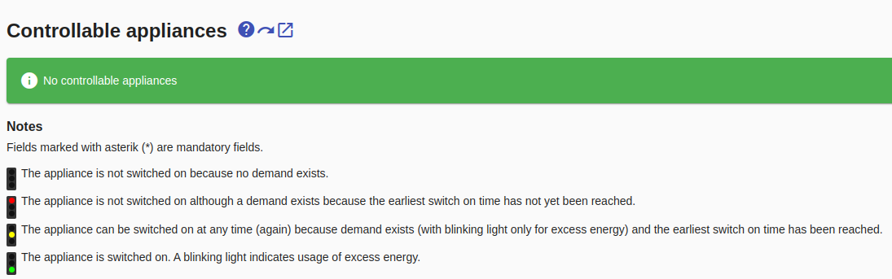
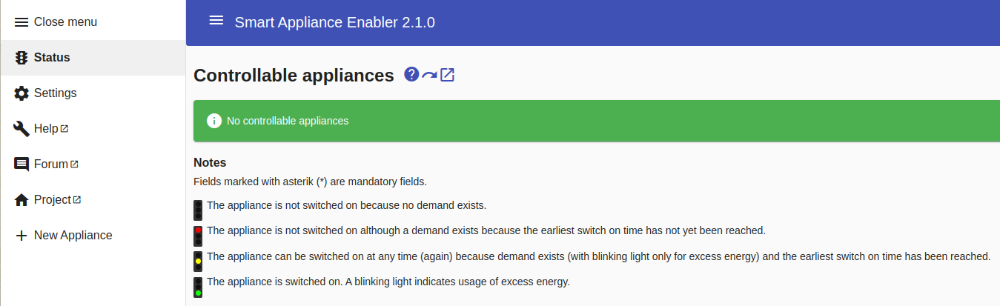
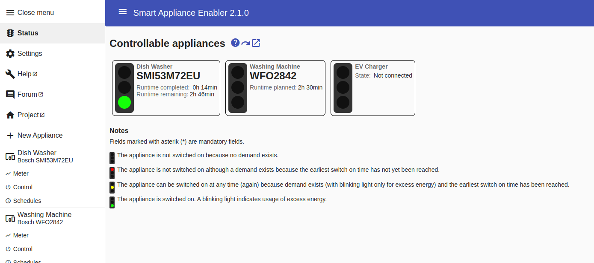

# Configuration

## General information
The configuration is done via the web front end of the *Smart Appliance Enabler*. All you have to do is enter `http://raspi:8080` in the web browser, where *raspi* must be replaced with the host name or the IP address of the Raspberry Pi. The status page opens with the information that no devices have been configured yet.

The web interface is deliberately kept simple and yet comfortable to support browsers on PCs, tablets and mobile phones alike.

In general entries/changes are only saved after [clicking the `Save` button](ConfigurationFiles_EN.md#save). When changing to another page, a warning is displayed if there are unsaved changes.

If the content of input fields is displayed in gray, this is a default, i.e. if no value is entered, this value applies without having to enter it.

Mandatory fields are marked with a `*` after the field name. As long as not all mandatory fields are filled out, the `Save` button is not active.

In the case of invalid entries, an error message appears under the input field. As long as such error messages exist on a page, the `Save` button is not active.

When starting for the first time without existing configuration files, the following page is displayed:

The menu can be opened and closed at any time using the menu symbol (the three lines to the left of the "Smart Appliance Enabler" title).

The menu contains an entry for the [Status](Status_EN.md) display, which is always initially displayed.

Below this is an entry for managing the central, appliance-independent [Settings](Settings_EN.md).

Below are links in the menu
- to [page with questions / problems and answers](QA_EN.md)
- to the [project homepage](https://github.com/camueller/SmartApplianceEnabler)
- to the [user forum](https://github.com/camueller/SmartApplianceEnabler/discussions)

Below the entry for `New appliance`, the configured appliances are displayed with Meter, Control and Schedules, if they are available.

## Basics
Before starting the actual configuration, you should be aware of the following relationships, which if ignored will result in the *Smart Appliance Enabler* not being able to work:

1. The *Sunny Home Manager* only takes into account the power consumption of devices for which the status "switched on" is reported by the *Smart Appliance Enabler* (see [Switch](Control_EN.md))
2. The *Sunny Home Manager* will only control a device by sending control requests if the *Smart Appliance Enabler* previously reported a demand. Basis for it is
    - for wall boxes: a connected vehicle (results in a request for excess energy)
    - for all other devices: a configured [schedule](Schedules_EN.md) (results in a runtime request)

After the basics have been clarified, you can proceed with the actual configuration:
- [Appliances](Appliance_EN.md)
- [Meters](Meter_EN.md)
- [Controls](Control_EN.md)
- [Schedules](Schedules_EN.md)
- [Notifications](Notifications_EN.md)
- [Configuration using REST](REST_EN.md)
