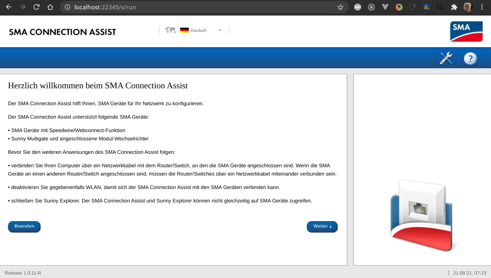
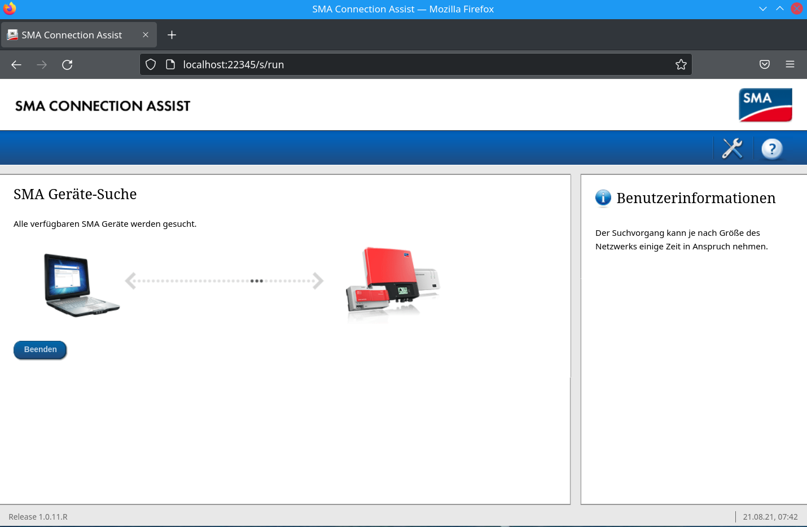
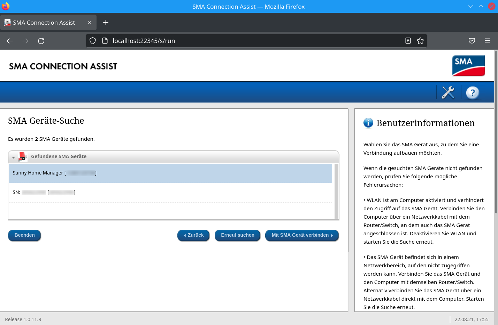
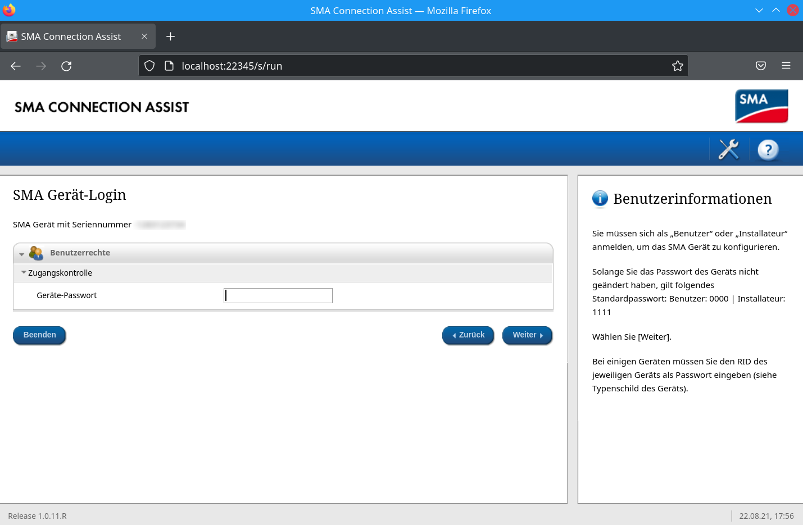
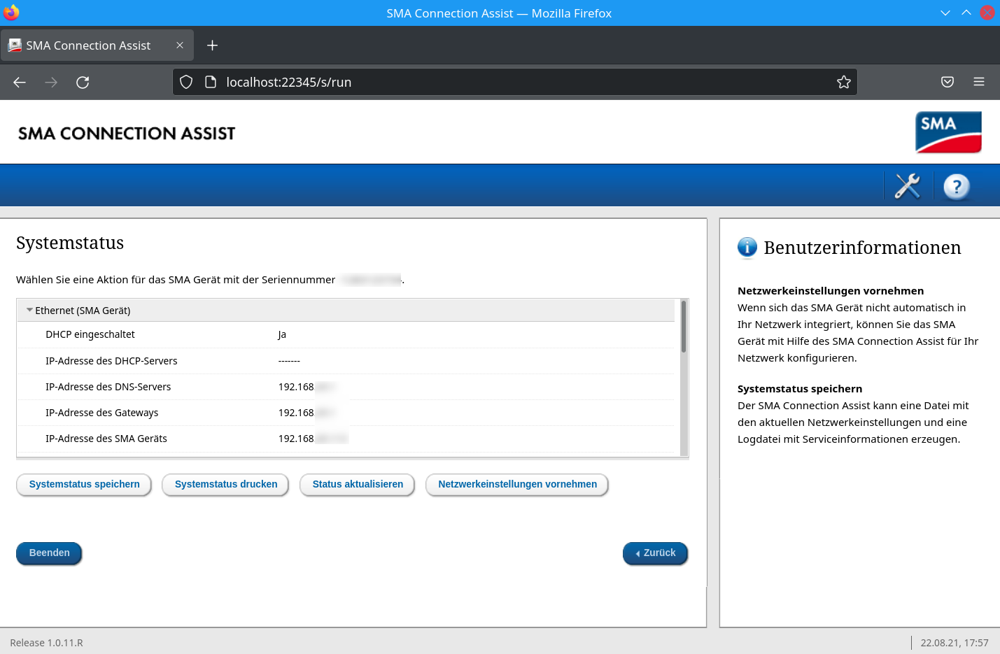
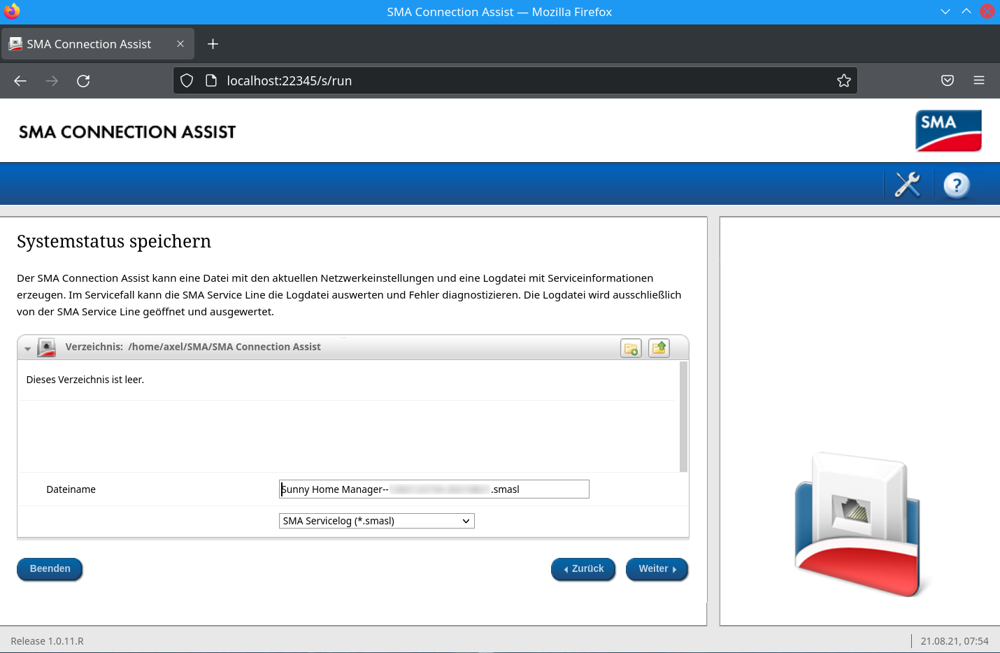
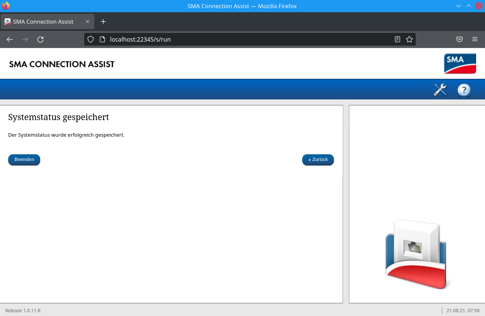

# SMA Connection Assist

Der [*SMA Connection Assist*](https://www.sma.de/produkte/monitoring-control/sma-connection-assist.html) dient eigentlich zur Netzwerkkonfiguration von SMA-Geräten. Allerdings kann man mit ihm auch die SEMP-Logs vom *Sunny Home Manager* laden, um mögliche Probleme bezüglich der Kommunikation mit dem *Smart Appliance Enabler* zu analysieren.

## Installation und Ausführung

Zunächst musst der [*SMA Connection Assist* heruntergeladen](https://raw.githubusercontent.com/camueller/SmartApplianceEnabler/master/run/connection-assist.jar) werden.

Um diesen auszuführen, muss eine Java-Runtime auf dem PC installiert sein - ggf. könnt ihr sie hier herunterladen (Standardeinstellungen ausgewählt lassen): https://adoptopenjdk.net/

In dem Verzeichnis, in sich die heruntergeladene  jar-Datei des *SMA Connection Assist* befindet, muss dieser wie folgt gestartet werden (Versionsnummer ggf. anpassen!):
```bash
java -jar connection-assist.jar -discoverHoman
```

Der *SMA Connection Assist* läuft im installierten Standard-Webbrowser des Systems. Darin wird zunächst diese Seite angezeigt:



Wenn die im Text genannten Vorraussetzungen vorliegen, kann auf *Weiter* geklickt werden.

Der *SMA Connection Assist* wird jetzt die SMA-Geräte im Netzwerk suchen. Das dauert wenige Sekunden und wird so angezeigt:



Dabei sollten mindestens 2 Geräte gefunden werden - der Sunny Home Manager und der Wechselrichter:



Den Eintrag *Sunny Home Manager* auswählen (falls nicht bereits geschehen) und auf *Mit SMA Gerät verbinden* klicken. Daraufhin erscheint die Abfrage des *Geräte-Password*:



Dabei handelt es sich um die *RID* bzw. *Registration ID*:
* beim SHM 2.0 befindet sie sich auf einem Aufkleber mit 3 Nummern (SN, PIC, RID), welcher dem SHM lose beilag
* beim SHM 1.0 befindet sie sich auf einem Aufkleber auf der Rückseite der Hülle der SHM-CD

Nach Eingabe des Passwords auf "Weiter" klicken. Nach einem kurzen Datenaustausch erscheint eine Übersicht mit dem Netzwerkstatus und einigen Schaltflächen:



Hier muss auf *Systemstatus speichern* geklickt werden. Daraufhin wird der Systemstatus gespeichert, was ca. 20-30 Sekunden dauern kann. Danach wird in einem Dialog das Verzeichnis und der Dateiname angezeigt, unter dem das Log gespeichert wird (aufschreiben oder merken!). Außerdem kann das Datenformat festgelegt werden, welches hier _SMA Servicelog (*.smasl)_ sein muss. 



Nachdem der Systemstatus erfolgreich gespeichert wurde, wird folgende Meldung angezeigt:



Der *SMA Connection Assist* kann jetzt geschlossen werden. Die erzeugte Datei mit der Endung `.smasl` ist eine Zip-Datei. Es bietet sich daher an, die Datei umzubenennen und die Endung `.zip` hinzuzufügen, damit sie einfacher geöffnet werden kann.

## Analyse des SEMP-Log

Wenn man die vom *SMA Connection Assist* erzeugte Datei mit einem Zip-Manager öffnet, findet man darin unter anderem eine Datei mit dem Namen `SEMPLog.tgz`. Dabei handelt es sich wiederum um eine gepackte Datei, die mehrere Log-Dateien im Text-Format beinhaltet, welche die letzten Stunden abdecken. Man muss die Logs also während oder kurz nach der relevanten Situation vom *Sunny Home Manager* ziehen.

Alle 60 Sekunden fragt der *Sunny Home Manager* alle SEMP-Gatesways (also auch den *Smart Appliance Enabler*) ab:
```console
[2021-08-21T09:20:56] SEMP(Info): SEMP update
```

Dadurch erhält der *Sunny Home Manager* Informationen zum aktuellen Status der Geräte und eventuell vorhandene Timeframes:
```console
[2021-08-21T09:20:56] SEMP(Info): Current timeframes and plans: 
[2021-08-21T09:20:56] SEMP(Info):   Device: F-00000001-000000000003-00
[2021-08-21T09:20:56] SEMP(Info):     Status: SignalsAccepted: true On: false LastSeen=2021-08-21T09:19:56 TimedOut=false
[2021-08-21T09:20:56] SEMP(Info):     Timeframes: 
[2021-08-21T09:20:56] SEMP(Info):       [0]: CT(dayRel)=9:20(33656) ES(dayRel)=9:19(33540) LE(dayRel)=19:00(68400) LE-ES=9:41(34860) MinRT=7:42(27720) MaxRT=7:42(27720) MinP=960 MaxP=960
[2021-08-21T09:20:56] SEMP(Info):     Plans: 
[2021-08-21T09:20:56] SEMP(Info):       Plan[0]: Start=2021-08-21T10:22:03 End=2021-08-21T18:04:03 Power=0
```

Danach folgt eine Zusammenfassung der SEMP-Abfrage:
```console
[2021-08-21T09:20:57] SEMP(Info): SEMP devices (active: 22, timed-out: 0)
```

Falls Timeframes vorhanden sind, erfolgt eine Analyse. Wenn Timeframes verworfen werden, wird das hier dokumentiert und man braucht sich nicht wundern, warum das Gerät keinen Einschaltbefehlt erhält.

Folgende Abkürzungen werden dabei verwendet:
- **ES**: Earliest Start
- **LE**: Latest End
- **MinRT**: minimale Laufzeit
- **MaxRT**: maximale Laufzeit
- **MinP**: minimale Leistung
- **MaxP**: maximale Leistung
```console
[2021-08-21T09:20:57] SEMP(Info): Received timeframe: DevID=F-00000001-000000000003-00 ES(rel)=+0:00(+0) LE(rel)=+9:39(+34742) MinRT=7:41 (27719) MaxRT=7:42(27720)
[2021-08-21T09:20:57] SEMP(Info): Received timeframe: DevID=F-00000001-000000000003-00 ES(rel)=+21:39(+77942) LE(rel)=+33:39(+121142) MinRT=7:59 (28799) MaxRT=8:00(28800)
[2021-08-21T09:20:57] SEMP(Info): Received timeframe: DevID=F-00000001-000000000003-00 ES(rel)=+45:39(+164342) LE(rel)=+57:39(+207542) MinRT=7:59 (28799) MaxRT=8:00(28800)
[2021-08-21T09:20:57] SEMP(Info): Timeframe (pre-normalized): F-00000001-000000000003-00 CT(dayRel)=9:20(33657) ES(dayRel)=9:20(33657) LE(dayRel)=18:59(68399) LE-ES=9:39(34742) MinRT=7:41(27719) MaxRT=7:42(27720) MinP=960 MaxP=960
[2021-08-21T09:20:57] SEMP(Info): Timeframe (pre-normalized): F-00000001-000000000003-00 CT(dayRel)=9:20(33657) ES(dayRel)=30:59(111599) LE(dayRel)=42:59(154799) LE-ES=12:00(43200) MinRT=7:59(28799) MaxRT=8:00(28800) MinP=960 MaxP=960
[2021-08-21T09:20:57] SEMP(Info): Timeframe (pre-normalized): F-00000001-000000000003-00 CT(dayRel)=9:20(33657) ES(dayRel)=54:59(197999) LE(dayRel)=66:59(241199) LE-ES=12:00(43200) MinRT=7:59(28799) MaxRT=8:00(28800) MinP=960 MaxP=960
[2021-08-21T09:20:57] SEMP(Warn): [InvalidTimeframe: EarliestStart more than one day ahead -> Timeframe ignored] DevId=F-00000001-000000000003-00 CT(dayRel)=9:20(33600) ES(dayRel)=54:59(197999) LE(dayRel)=66:59(241199) LE-ES=12:00(43200) MinRT=7:59(28799) MaxRT=8:00(28800) MinP=960 MaxP=960
[2021-08-21T09:20:57] SEMP(Warn): [InvalidTimeframe: EarliestStart not before next day and LatestEnd more than one day ahead -> Timeframe ignored] DevId=F-00000001-000000000003-00 CT(dayRel)=9:20(33600) ES(dayRel)=30:59(111599) LE(dayRel)=42:59(154799) LE-ES=12:00(43200) MinRT=7:59(28799) MaxRT=8:00(28800) MinP=960 MaxP=960
[2021-08-21T09:20:57] SEMP(Info): Timeframe created (adjusted): F-00000001-000000000003-00 CT(dayRel)=9:20(33600) ES(dayRel)=9:20(33600) LE(dayRel)=18:59(68340) LE-ES=9:39(34740) MinRT=7:42(27720) MaxRT=7:42(27720) MinP=960 MaxP=960
[2021-08-21T09:20:57] SEMP(Info): received DeviceStatus (device-id: F-00000001-000000000001-00)
[2021-08-21T09:20:57] SEMP(Info): Status[F-00000001-000000000001-00]: sigAccept:0 status:Off power:[(time:0 P_avg:0 t_avg:60)]
[2021-08-21T09:20:57] SEMP(Info): received DeviceStatus (device-id: F-00000001-000000000003-00)
[2021-08-21T09:20:57] SEMP(Info): Status[F-00000001-000000000003-00]: sigAccept:1 status:Off power:[(time:0 P_avg:0 t_avg:60)]
```

Nach den Timeframes wird der DeviceStatus aller Geräte aufgelistet:
```console
[2021-08-21T09:20:58] SEMP(Info): received DeviceStatus (device-id: F-00000001-000000000019-00)
[2021-08-21T09:20:58] SEMP(Info): Status[F-00000001-000000000019-00]: sigAccept:1 status:On power:[(time:0 P_avg:1374 t_avg:60)]
```

Abschliessend werden ggf. Schaltbefehle an den SEMP-Gateway (also den *Smart Appliance Enabler*) gesendet:
```console
[2021-08-21T09:21:04] SEMP(Info): Sending DeviceControl message: deviceId=F-00000001-000000000019-00 on=1 power=2411
```