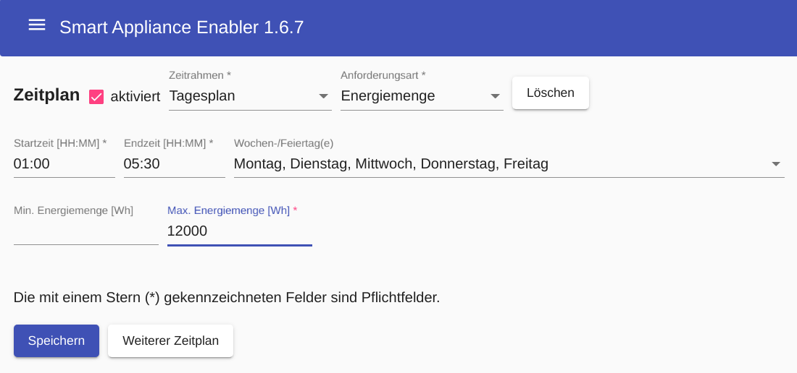
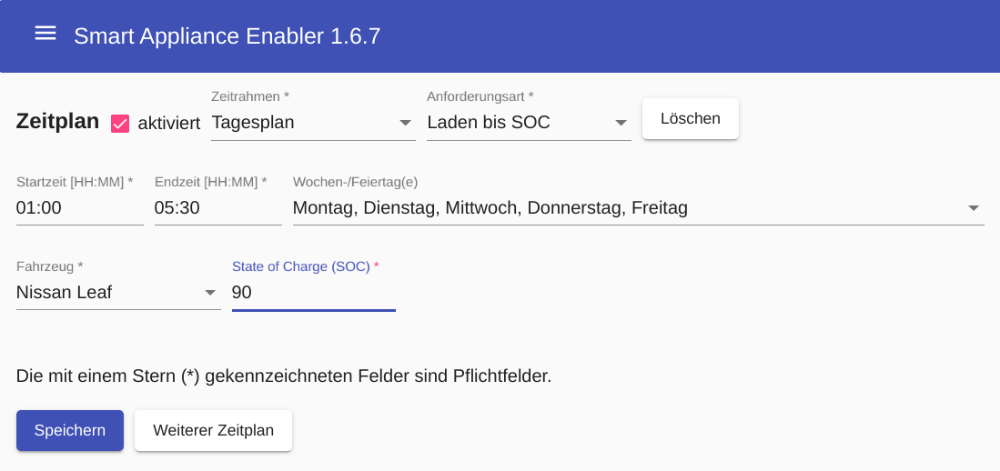
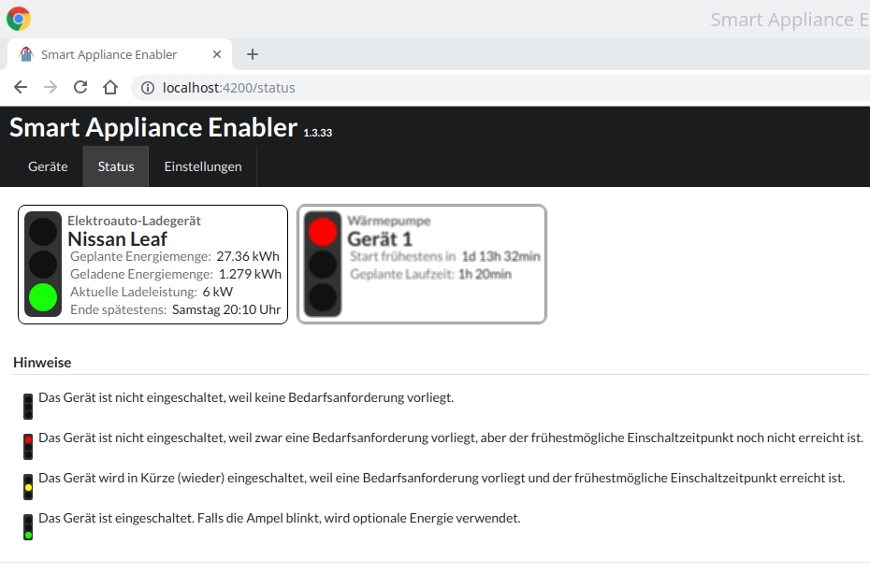
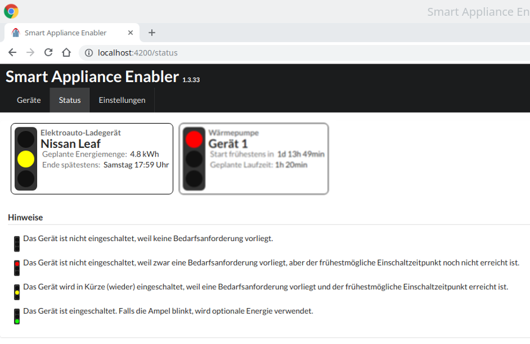

# Ladegeräte für Elektro-Fahrzeuge (Wallboxen)

Damit der Sunny Home Manager die Leistung von Ladegeräten für Elekto-Fahrzeuge steuern kann, **muss zur Bestimmung der aktuellen Leistungsaufnahme ein Stromzähler im Smart Appliance Enabler konfiguriert werden**!

## Konfiguration
### Appliance
Um ein Gerät zum Laden von Elektroautos konfigurieren zu können, muss als Typ des Gerätes ```Elektroauto-Ladegerät``` eingestellt werden.


### Schalter
Im *Smart Appliance Enabler* wird ein Ladegerät für Elektro-Autos als komplexer Schalter mit diversen Konfigurationsparametern und die Fahrzeuge repräsentiert.

Momentan unterstützt der *Smart Appliance Enabler* folgende Ladegeräte für Elektro-Fahrzeuge:
* [Ladegeräte mit Phoenix Contact EM-CP-PP-ETH-Controller](PhoenixContactEMCPPPETH_DE.md) wie z.B. Walli
* [go-eCharger](GoeCharger_DE.md)
* wallbe

Der *Smart Appliance Enabler* stellt Vorlagen bereit, welche die Konfiguration für die genannt Ladegeräte beinhalten.
Darüber hinaus sollte auch die Verwendung von anderen Ladegeräten möglich sein, solange diese über ein unterstütztes Protokoll angebunden werden:
* [Modbus/TCP](Modbus_DE.md)
* HTTP

#### Fahrzeuge
Die Konfiguration von Fahrzeugen beinhaltet Parameter zur Steuerung des Ladevorgangs und Standardwerte für Dialoge.

Für den Ladezustand bzw. SOC können Standardwerte festgelegt werden.
Der Standartwert für manuelles Laden beinhaltet lediglich die Vorbelegung des Feldes für den Soll-Ladezustand in der Eingabemaske, die nach Klick auf die grüne Ampelleuchte angezeigt wird.
Wird ein Standardwert für Optionale Energie gesetzt, wird nach dem Verbinden des Fahrzeugs nur bis zu diesem Wert mit Optionaler Energie geladen und danach der Ladevorgang gestoppt.  
Für eine möglichst genaue Ermittlung des Energiebedarfs muss der Ladezustand (State of Charge bzw. SOC) beim Verbinden des Fahrzeugs mit dem Ladegerät bekannt sein. Während dieser Wert beim [manuellen Start des Ladevorganges](#status-anzeige-und-manuelle-steuerung) auch eingegeben werden kann, kann dieser Wert bei Verwendung von [Zeitplänen](#Zeitpläne) nur durch ein [Script zum automatisierten Abfragen des SOC](soc/SOC_DE.md) ermittelt werden. Wird kein solches Script konfiguriert, wird beim Verbinden des Fahrzeugs mit dem Ladegerät der SOC mit 0 angenommen und ein entsprechend großer Energiebedarf gemeldet.


### Zeitpläne
Die grundsätzliche Konfiguration der Zeitpläne ist [hier](Configuration_DE.md#zeitpläne) beschrieben.
Abweichend davon existiert bei E-Auto-Ladegeräten nicht nur die **Anforderungsart** mit dem Wert ```Laufzeit```, sondern zwei weitere Optionen:

Mit der Anforderungsart ```Energiemenge``` kann eine bestimmte minimale und/oder maximale Energiemenge (in Wh) zum Ausdruck gebracht werden. Wenn die minimale Energiemenge auf ```0``` gesetzt wird und die maximale Energiemenge auf einen größeren Wert, wird damit zum Ausdruck gebracht, dass für die angeforderte Energiemenge *Überschussenenergie* genutzt soll.



Mit der Anforderungsart ```Laden bis SOC``` wird genau die Energiemenge angefordert, die notwendig ist, um einen bestimmten SOC zu erreichen. Zur Berechnung dieser Energiemenge wird die Batteriekapazität und der SOC des Fahrzeugs bei Ladebeginn herangezogen. Für letzteres ist es notwendig, dass der [SOC des Fahrzeugs via Script](soc/SOC_DE.md) abgefragt werden kann.



## Status-Anzeige und manuelle Steuerung

Für Geräte vom Typ ```Elektroauto-Ladegerät``` unterscheiden sich die Eingabe-Felder zum manuellen Schalten, die nach einem **Klick auf die grüne Lampe der Ampel** angezeigt werden, von den Feldern, die bei anderen Geräten angezeigt werden.


Wenn ein [SOC-Script](soc/SOC_DE.md) für das ausgewählte Fahrzeug angegeben wurde, wird das Eingabefeld ```Ladezustand: Ist``` vorbelegt mit dem aktuellen Wert zu diesem Zeitpunkt. Ansonsten kann er im Auto abgelesen und eingegeben werden, wenn man dem SHM eine gute Planung ermöglichen will. Ansonsten wird 0 angenommen und ein entsprechend hoher Energiebedarf gemeldet.

Wird im Eingabefeld ```Ladezustand: Soll``` kein Wert eingegeben, wird 100% angenommen und ein entsprechend hoher Energiebedarf gemeldet.

Wenn im Eingabefeld ``bis`` ein Wochentag/Zeit eingegeben, wird dem SHM der Bedarf gemeldet aber der SAE schaltet das Ladegerät nicht selbst an, d.h. das Laden beginnt erst, wenn der SHM einen Einschaltbefehl schickt, wobei auch die Ladeleistung von ihm vorgegeben wird. Der SAE schaltet den Lader sofort ein, wenn kein Wochentag/Zeit eingegeben werden. Weil der SAE in diesem Fall die Ladeleistung nicht reduziert, lädt das Ladegerät mit voller Leistung.

Auch die Status-Anzeige sieht bei Geräten vom Typ ```Elektroauto-Ladegerät``` anders aus. Nachfolgendes Bild zeigt einen manuell gestarteten Ladevorgang:



Für eine via Schaltzeiten anforderte Energiemenge sieht die Statusanzeige vor dem Einschalten wie folgt aus:


