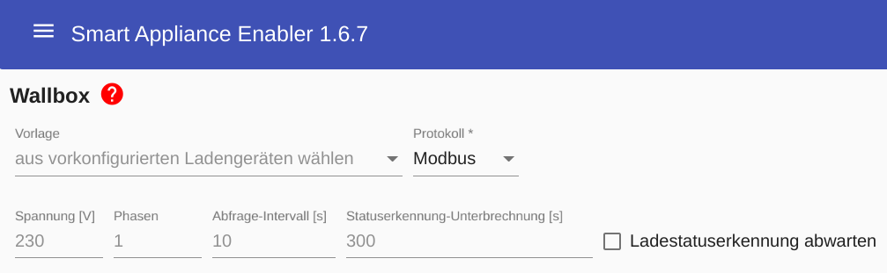
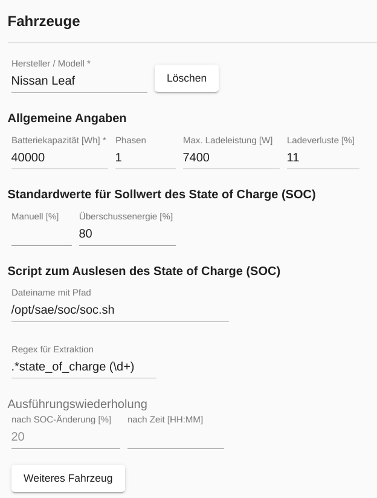

# Wallboxen

Im *Smart Appliance Enabler* wird eine Wallbox als komplexer Schalter mit diversen Konfigurationsparametern und die Fahrzeuge repräsentiert.

Damit der Sunny Home Manager die Leistung von Wallboxen steuern kann, **muss zur Bestimmung der aktuellen Leistungsaufnahme ein Stromzähler im Smart Appliance Enabler konfiguriert werden**!

Der *Sunny Home Manager* gibt dabei die aktuell einzustellende **Leistung in W** vor. Falls sie den im *Smart Appliance Enabler* für das Fahrzeug eingegebenen Wert für `Max. Leistung` übersteigt, wird sie auf diesen **Wert begrenzt**. 
Der *Smart Appliance Enabler* **errechnet die an der Wallbox einzustellende Stromstärke** aus der Leistung und der Phasenanzahl. Massgeblich dabei ist die für das Fahrzeug eingestellte Phasenanzahl, ansonsten die für die Wallbox eingestellte Phasenanzahl. 

## Konfiguration

Momentan unterstützt der *Smart Appliance Enabler* folgende Wallboxen:
* [Wallboxen mit Phoenix Contact EM-CP-PP-ETH-Controller](PhoenixContactEMCPPPETH_DE.md) wie z.B. Walli
* [go-eCharger](GoeCharger_DE.md)
* wallbe

Der *Smart Appliance Enabler* stellt Vorlagen bereit, welche die Konfiguration für die genannten Wallboxen beinhalten.
Darüber hinaus sollte auch die Verwendung von anderen Wallboxen möglich sein, solange diese über ein unterstütztes Protokoll angebunden werden:
* [Modbus/TCP](Modbus_DE.md)
* HTTP



Unabhängig von der spezifischen Wallbox gibt folgende Einstellungen, die für alle Wallboxen gelten:
- `Spannung`: wird für die Berechnung der ladestromstärke benötigt (Standardwert: 230V)
- `Phasen`: Anzahl der Phasen, mit denen die Wallbox maximal laden kann. Kann für jedes Fahrzeug individuell überschrieben werden. (Standardwert: 1)
- `Abfrage-Intervall`: in diesen Zeitabständen wird der Status der Wallbox abgefragt (Standardwert: 10s)
- `Statuserkennung-Unterbrechung`: Nach dem Ein-/Ausschalten wird der Ladestatus für die angegebene Dauer nicht abgefragt um der Wallbox Zeit zu geben, den gewünschten Status herbeizuführen
- `Ladestatuserkennung abwarten`: Nachdem ein angeschlosses Fahrzeug erkannt wird erfolgt ein sofortiger Ladestart bis die Wallbox den Status 'Laden' zurückmeldet. Danach wird das Laden wieder gestoppt bis ein Einschaltbefehl empfangen wird. Erforderlich Für Renault Zoe!
 
### Fahrzeuge
<a name="ev">

Die Konfiguration von Fahrzeugen beinhaltet Parameter zur Steuerung des Ladevorgangs und Standardwerte für Dialoge.

Für den Ziel-Ladezustand können Standardwerte festgelegt werden.
Der Standardwert für manuelles Laden beinhaltet lediglich die Vorbelegung des Feldes für den Soll-Ladezustand in der Eingabemaske, die nach Klick auf die grüne Ampelleuchte angezeigt wird.
Wird ein Standardwert für Überschussenergie gesetzt, wird nach dem Verbinden des Fahrzeugs nur bis zu diesem Wert mit Überschussenergie geladen und danach der Ladevorgang gestoppt.

Die vom *Smart Appliance Enabler* unterstützten Wechselstrom-Wallboxen können nicht den aktuellen Ist-Ladezustand vom Fahrzeug ermitteln und an den *Smart Appliance Enabler* kommunizieren! Für eine möglichst genaue Ermittlung des Energiebedarfs muss dieser Wert aber bekannt sein. Der *Smart Appliance Enabler* bietet deshalb die Möglichkeit der Einbindung eines [Scripts zum automatisierten Abfragen des SOC](soc/SOC_DE.md), sofern dies vom Fahrzeug-Hersteller unterstützt wird. Zusätzlich besteht die Möglichkeit, den Ist- und Soll-Ladezustand einzugeben beim [manuellen Start des Ladevorganges](#status-anzeige-und-manuelle-steuerung).

Auf Basis der Werte für
- `Batteriekapazität`: aus der Fahrzeug-Konfiguration
- `Ladeverluste`: aus der Fahrzeug-Konfiguration
- `Ist-SOC`: geliefert vom SOC-Script oder eingegeben über die [Ampel-Steuerung]
- `Soll-SOC` Standardwert aus der Fahrzeug-Konfiguration oder eingegeben über [Ampel-Steuerung](#manuelle-steuerung))

wird die initial vom *Sunny Home Manager* anzufordernde Energiemenge berechnet. 

Wenn ein *SOC-Script* konfiguriert wurde, wird dieses **automatisch nach dem Verbinden des Fahrzeuges mit der Wallbox** ausgeführt.

Der *Smart Appliance Enabler* **berechnet fortlaufend den SOC** entsprechend der bereits geladenen Energiemenge. Von dieser Energiemenge müssen aber die Ladeverluste abgezogen werden, weil sie nicht zu einer Erhöhung des SOC im Fahrzeug führen. Aus diesem Grund sollte hier ein möglichst zutreffender Wert eingetragen werden, der Standardwert beträgt 10%.

Wenn ein SOC-Script konfiguriert wurde und sich der berechnete SOC entweder um den konfigurierte Wert (Standard: 20%) erhöht oder seit der letzten Ausführung des SOC-Script die konfigurierte Zeit vergangen ist, wird das **SOC-Script erneut ausgeführt**. Der berechnete SOC wird mit dem tatsächlichen SOC verglichen und daraus die tatsächlichen Ladeverluste berechnet. Für alle nachfolgenden Berechnungen des SOC bis zur nächsten Ausführung des SOC-Scripts während des aktuellen Ladevorganges werden die tatsächlichen Ladeverluste berücksichtigt.

**Ohne SOC-Script** und ohne Eingabe des aktuellen Ist-Ladezustands geht der *Smart Appliance Enabler* von einem Ist-Ladezustand von 0% aus und meldet einen entsprechend großen Energiebedarf. Das verschlechtert zwar die Planung des *Sunny Home Manager*, aber unabhängig davon beendet die Wallbox das Laden spätestens, wenn das Fahrzeug voll geladen ist.

Wenn vom SOC-Script nicht nur eine Zahl ohne weitere Zeichen geliefert wird, sondern der Verbrauchswert irgendwo in einem Text (XML, JSON, ...) enthalten ist, muss ein [Regulärer Ausdruck/Regex](WertExtraktion_DE.md) zum Extrahieren der Leistung mit angegeben werden.



## Vebraucherkonfiguration im Sunny Home Manager

Im *Sunny Home Manager* sollte die Verbraucher-Konfiguration für eine Wallbox wie folgt aussehen: 


## Log

### Schaltbefehl

Wird vom *Sunny Home Manager* ein Schaltbefehl für eine Wallbox (hier `F-00000001-000000000019-00`) empfangen, kann man das im [Log](Logging_DE.md) mit folgendem Befehl anzeigen:

```console
sae@raspi:~ $ grep "Received control" -A 3 /tmp/rolling-2020-11-18.log
2020-11-18 09:36:10,008 DEBUG [http-nio-8080-exec-3] d.a.s.s.w.SempController [SempController.java:220] F-00000001-000000000019-00: Received control request: on=true, recommendedPowerConsumption=3442W
2020-11-18 09:36:10,060 DEBUG [http-nio-8080-exec-3] d.a.s.a.Appliance [Appliance.java:334] F-00000001-000000000019-00: Setting appliance state to ON
2020-11-18 09:36:10,062 DEBUG [http-nio-8080-exec-3] d.a.s.c.e.ElectricVehicleCharger [ElectricVehicleCharger.java:642] F-00000001-000000000019-00: Set charge power: 3442W corresponds to 14A using 1 phases
2020-11-18 09:36:10,063 DEBUG [http-nio-8080-exec-3] d.a.s.m.EVModbusControl [EVModbusControl.java:178] F-00000001-000000000019-00: Set charge current 14A
```

*Webmin*: In [View Logfile](Logging_DE.md#webmin-logs) gibt man hinter `Only show lines with text` ein `Received control` und drückt Refresh.

### SOC-Script

Für jede Ausführung des SOC-Scripts finden sich im [Log](Support_DE.md#log) folgende Zeilen:

```console
sae@raspi:~ $ grep "SocScript" /tmp/rolling-2021-01-09.log
2021-01-09 08:50:23,205 DEBUG [Thread-7] d.a.s.c.e.SocScript [SocScript.java:108] F-00000001-000000000019-00: Executing SoC script: /opt/sae/soc/soc.sh
2021-01-09 08:51:15,495 DEBUG [Thread-7] d.a.s.c.e.SocScript [SocScript.java:118] F-00000001-000000000019-00: SoC script output: Prepare Session
2021-01-09 08:51:15,499 DEBUG [Thread-7] d.a.s.c.e.SocScript [SocScript.java:120] F-00000001-000000000019-00: SoC script exited with return code 0
2021-01-09 08:51:15,502 DEBUG [Thread-7] d.a.s.c.e.SocScript [SocScript.java:147] F-00000001-000000000019-00: SoC extraction regex: .*state_of_charge (\d+)
2021-01-09 08:51:15,503 DEBUG [Thread-7] d.a.s.c.e.SocScript [SocScript.java:87] F-00000001-000000000019-00: SoC: 94.0
```

*Webmin*: In [View Logfile](Logging_DE.md#webmin-logs) gibt man hinter `Only show lines with text` ein `SocScript` und drückt Refresh.
