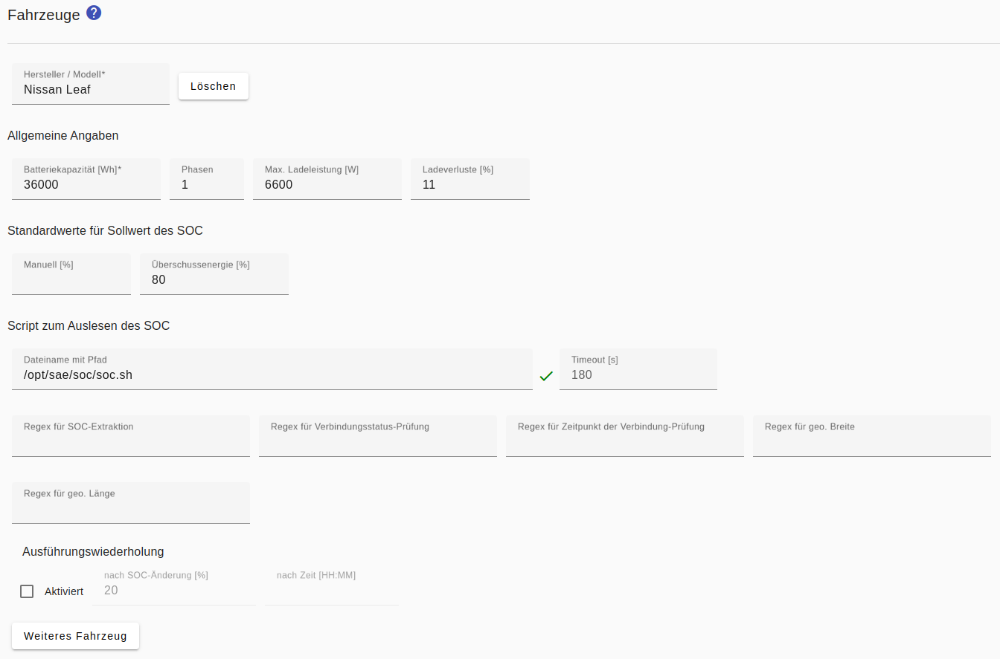

# Wallboxen
Im *Smart Appliance Enabler* wird eine Wallbox als komplexer Schalter mit diversen Konfigurationsparametern und die Fahrzeuge repräsentiert.

Damit der Sunny Home Manager die Leistung von Wallboxen steuern kann, **muss zur Bestimmung der aktuellen Leistungsaufnahme ein Stromzähler im Smart Appliance Enabler konfiguriert werden**!

Der *Sunny Home Manager* gibt dabei die aktuell einzustellende **Leistung in W** vor. Falls sie den im *Smart Appliance Enabler* für das Fahrzeug eingegebenen Wert für `Max. Leistung` übersteigt, wird sie auf den konfigurierten **Wert begrenzt**. 

Der *Smart Appliance Enabler* **errechnet die an der Wallbox einzustellende Stromstärke** aus der Leistung und der Phasenanzahl. Massgeblich dabei ist die für das Fahrzeug eingestellte Phasenanzahl, ansonsten die für die Wallbox eingestellte Phasenanzahl. 

## Konfiguration
Momentan stellt der *Smart Appliance Enabler* Vorlagen bzw. Konfigurationen für die folgende Wallboxen bereit:
* [go-eCharger](GoeCharger_DE.md)
* [Keba KeContact P30 c-series / x-series](Keba_DE.md)  
* [Phoenix Contact EM-CP-PP-ETH-Controller](PhoenixContactEMCPPPETH_DE.md) wie z.B. Walli, wallbe mit altem Controller
* wallbe mit neuem Controller
* [Warp Charger Smart / Pro](WarpCharger_DE.md)

Diese Konfigurationen sind in der Datei `evcharger-templates.json` enthalten, welche bei jedem Start des *Smart Appliance Enabler* von https://raw.githubusercontent.com/camueller/SmartApplianceEnabler/master/run/evcharger-templates.json heruntergeladen wird in das Verzeichnis, auf das die Variable `SAE_HOME` verweist (normalerweise `/opt/sae`). Falls der *Smart Appliance Enabler* die Datei nicht herunterladen kann, muss die Datei manuell heruntergeladen und dort platziert werden.

Darüber hinaus sollte auch die Verwendung von anderen Wallboxen möglich sein, wenn diese über ein unterstütztes Protokoll steuerbar sind:
* [Modbus/TCP](EVChargerModbus_DE.md)
* HTTP

_Hinweis für HTTP-basierte Wallboxen:_

Die Konfiguration des Schreibzugriffs für das Setzen der Ladestromstärke muss in der URL oder den Daten den Platzhalter `{0}` enthalten, der durch die zu setzende Stromstärke in Ampere ersetzt wird.

Falls der Wert in Milliampere gesetzt werden muss, kann diese ganz normal mittels `factorToValue="1000"` erfolgen. Der Zahlenwert der zu setzenden Stromstärke wird dadurch grösser also 1000 sein, weshalb in diesem Fall als Platzhalter `{0,number,#}` verwendet werden muss, damit kein Tausender-Trennzeichnen eingefügt wird.

Falls der Wert selbst die Zeichen `{` oder `}` enthält, müssen diese in einfachen Anführungszeichen "maskiert" werden.

Die Konfiguration mit der Kombination der zuvor beschriebenen Besonderheiten könnte also wie folgt aussehen:
```
<HttpWriteValue name="ChargingCurrent" value="'{'current:{0,number,#}'}'" method="POST" factorToValue="1000"/>
```

### Protokoll-unabhängige Einstellungen für Wallboxen


Unabhängig von der spezifischen Wallbox gibt es folgende Einstellungen, die für alle Wallboxen gelten:
- `Spannung`: wird für die Berechnung der Ladestromstärke benötigt (Standardwert: 230V)
- `Phasen`: Anzahl der Phasen, mit denen die Wallbox maximal laden kann. Kann für jedes Fahrzeug individuell überschrieben werden. (Standardwert: 1)
- `Abfrage-Intervall`: in diesen Zeitabständen wird der Status der Wallbox abgefragt (Standardwert: 10s)
- `Statuserkennung-Unterbrechung`: Nach dem Ein-/Ausschalten wird der Ladestatus für die angegebene Dauer nicht abgefragt um der Wallbox Zeit zu geben, den gewünschten Status herbeizuführen
- `Wiederholung Ladestrom setzen`: Falls gesetzt, wird die Ladestromstärke trotz gleichbleibenden Wertes wiederholt nach Ablauf der durch den Wert angegebenen Dauer in Sekunden gesetzt. Das kann notwendig sein, um einen Rückfall der Wallbox auf eine niedrigere Stromstärke zu verhindern.
- `Ladestatuserkennung abwarten`: Nachdem ein angeschlosses Fahrzeug erkannt wird, erfolgt ein sofortiger Ladestart bis die Wallbox den Status 'Laden' zurückmeldet. Danach wird das Laden wieder gestoppt bis ein Einschaltbefehl empfangen wird. Erforderlich für Renault Zoe!
- `Geo. Breite`, `Geo. Länge`: Die geografische Breite und Länge der Wallbox dient bei mehreren konfigurierten Fahrzeugen zur Identifikation des Fahrzeugs, welches sich in der Nähe der Wallbox befindet.
 
### <a name="ev"></a> Fahrzeuge

Die Konfiguration von Fahrzeugen beinhaltet Parameter zur Steuerung des Ladevorgangs und Standardwerte für Dialoge.

Beim Laden des Fahrzeugs entstehen Ladeverluste, die vom Zähler gezählt werden, aber nicht zu einer Erhöhung der im Fahrzeug gespeicherten Energie führen. Deshalb kann ein Wert für die `Ladeverluste` konfiguriert werden (Standardwert: 10%), der bei der Berechnung der angeforderten Energiemenge verwendet wird. 

Für den Sollwert des Ladezustands können Standardwerte festgelegt werden:

Der *Standardwert für manuelles Laden* beinhaltet lediglich die Vorbelegung des Feldes für den Soll-Ladezustand in der Eingabemaske, die nach Klick auf die grüne Ampelleuchte angezeigt wird.

Wird ein *Standardwert für Überschussenergie* gesetzt, wird nach dem Verbinden des Fahrzeugs nur bis zu diesem Wert mit Überschussenergie geladen und danach der Ladevorgang gestoppt.

Die vom *Smart Appliance Enabler* unterstützten Wechselstrom-Wallboxen können nicht den aktuellen Ist-Ladezustand vom Fahrzeug ermitteln und an den *Smart Appliance Enabler* kommunizieren! Für eine möglichst genaue Ermittlung des Energiebedarfs muss dieser Wert aber bekannt sein. Der *Smart Appliance Enabler* bietet deshalb die Möglichkeit der Einbindung eines [Scripts zum automatisierten Abfragen des SOC](soc/SOC_DE.md), sofern dies vom Fahrzeug-Hersteller unterstützt wird.

Wenn mehrere Fahrzeuge konfiguriert werden, ist eine automatische Erkennung des mit der Wallbox verbundenen Fahrzeugs nur möglich, wenn das [Scripts zum automatisierten Abfragen des SOC](soc/SOC_DE.md) neben dem SOC auch mindestens einen der folgenden Werte liefern kann:

- Verbindungsstatus des Ladekabels
- Zeitpunkt des Einsteckens des Ladekabels
- Geo. Breite/Länge des Fahrzeugs

Falls vorhanden, müssen diese Werte zusätzlich zum eigentlichen SOC mit [Regulären Ausdrücken(Regex)](ValueExtraction_DE.md) aus der Ausgabe des [Scripts zum automatisierten Abfragen des SOC](soc/SOC_DE.md) extrahiert werden.



## Vebraucherkonfiguration im Sunny Home Manager

Im *Sunny Home Manager* sollte die Verbraucher-Konfiguration für eine Wallbox wie folgt aussehen: 


## Ladevorgang
Wenn ein *SOC-Script* konfiguriert wurde, wird dieses **automatisch nach dem Verbinden des Fahrzeuges mit der Wallbox** ausgeführt.

Zusätzlich besteht die Möglichkeit, den Ist- und Soll-Ladezustand beim [manuellen Start des Ladevorganges](Status_DE.md#user-content-click-green-ev) einzugeben.

Auf Basis der Werte für
- `Batteriekapazität` aus der Fahrzeug-Konfiguration,
- vom SOC-Script geliefertem oder über die [Ampel-Steuerung](Status_DE.md#user-content-click-green-ev) eingegebenem `Ist-SOC`,
- sowie dem `Soll-SOC` Standardwert aus der Fahrzeug-Konfiguration oder über [Ampel-Steuerung](Status_DE.md#user-content-click-green-ev) eingegebenem Wert

wird die **initiale Energie** berechnet, die vom *Sunny Home Manager* anzufordern ist.

Während des Ladenvorgangs wird der **aktuelle SOC berechnet** aus:
- `letzter bekannter SOC`: vom SOC-Script (Ladebeginn bzw. letzte Ausführung) bzw. Eingabe via Ampel (bei Ladebeginn)
- `bezogene Energie`:  gemessen vom Zähler
- `Batteriekapazität`: aus der Fahrzeug-Konfiguration
- `Ladeverluste`: initial aus der Fahrzeug-Konfiguration; bei konfiguriertem SOC-Script werden die tatsächlichen Ladeverluste berechnet und verwendet

Aus der Differenz von berechnetem SOC und Soll-SOC wird **kontinuierlich die Energie berechnet**, die vom *Sunny Home Manager* angefordert wird.

Während des Ladevorgangs wird das **SOC-Script periodisch ausgeführt**. Wenn sich der berechnete SOC entweder um einen konfigurierten Wert (Standard: 20%) erhöht oder seit der letzten Ausführung des SOC-Script eine konfigurierte Zeit vergangen ist, wird das SOC-Script erneut ausgeführt. Der berechnete SOC wird mit dem tatsächlichen SOC verglichen und daraus die tatsächlichen Ladeverluste berechnet. Für alle nachfolgenden Berechnungen des SOC bis zur nächsten Ausführung des SOC-Scripts während des aktuellen Ladevorganges werden die tatsächlichen Ladeverluste berücksichtigt.

**Ohne SOC-Script** und ohne [Eingabe des aktuellen Ist-Ladezustands](Status_DE.md#user-content-click-green-ev) geht der *Smart Appliance Enabler* von einem Ist-Ladezustand von 0% aus wenn das Fahrzeug verbunden wird und meldet einen entsprechend großen Energiebedarf. Das verschlechtert zwar die Planung des *Sunny Home Manager*, aber unabhängig davon beendet die Wallbox das Laden spätestens, wenn das Fahrzeug voll geladen ist.

### Beispiel
Der Ablauf eines (Überschuss-) Ladevorgangs soll hier anhand von Auszügen aus dem Log veranschaulicht werden:

Nachdem das Fahrzeug mit der Wallbox verbunden wurde:

```
2021-05-02 13:04:04,740 DEBUG: Vehicle state changed: previousState=VEHICLE_NOT_CONNECTED newState=VEHICLE_CONNECTED
```

... wurde das SOC-Script ausgeführt und liefert 51%:

```
2021-05-02 13:04:05,048 DEBUG: Executing SoC script: /opt/sae/soc/soc.sh
2021-05-02 13:04:59,092 DEBUG: SoC: 51.0
```

Aus dem Ist-SOC (51%), Soll-SOC (80% laut Fahrzeug-Konfguration) und Netto-Batteriekapzität (36 kWh) wird die benötige Energie (ohne Berücksichtigung von Ladeverlusten) mit 10,4 kWh berechnet:

```
2021-05-02 13:05:04,747 DEBUG: energy calculation: 10440Wh evId=1 batteryCapactiy=36000Wh currentSoc=51% targetSoc=80%
2021-05-02 13:05:32,404 DEBUG: ACTIVE/2021-05-02T13:04:04/2021-05-04T13:04:04::ENABLED/evId=1/soc=51%=>80%/energy=10440Wh/Optional Energy
```

Für die Berechnung des SOC wird der für das Fahrzeug konfigurierte Wert für die Ladeverluste (`chargeLoss`) herangezogen - hier 11%:

```
2021-05-02 13:06:25,018 DEBUG: SOC calculation: socCurrent=51% socRetrievedOrInitial=51% batteryCapacity=36000Wh energyMeteredSinceLastSocScriptExecution=0Wh chargeLoss=11%
```

Der Ladevorgang ist vorangeschritten und der berechnete SOC liegt um 20% über dem SOC der letzten Ausführung des SOC-Scripts (Standardwert der Konfiguration) - also ist eine erneute Ausführung notwendig:

```
2021-05-03 09:26:45,464 DEBUG: SOC calculation: socCurrent=71% socRetrievedOrInitial=51% batteryCapacity=36000Wh energyMeteredSinceLastSocScriptExecution=7796Wh chargeLoss=11%
2021-05-03 09:26:45,468 DEBUG: Executing SoC script: /opt/sae/soc/soc.sh
2021-05-03 09:27:37,613 DEBUG: SoC: 72.0
```

Der berechnete SOC ist 71%, der vom SOC-Script gelieferte Wert ist 72%. Aus der SOC-Änderung läßt sich die Energie berechnen, die im Fahrzeug "angekommen" ist (`energyReceivedByEv`). Aus dieser und der laut Zähler dafür aufgewendeten Energiemenge lassen sich die tatsächlichen Ladeverluste berechnen - hier 4%:

```
2021-05-03 09:27:37,674 DEBUG: charge loss calculation: chargeLoss=4% socCurrent=72% socLastRetrieval=51% batteryCapacity=36000Wh energyMeteredSinceLastSocScriptExecution=7844Wh energyReceivedByEv=7560Wh
```

Ab jetzt wird für die Berechnung des SOC für die Ladeverluste anstelle des für das Fahrzeug konfigurierten Wertes der zuvor berechnete Wert für die tatsächlichen Ladeverluste verwendet:

```
2021-05-03 09:27:45,461 DEBUG: SOC calculation: socCurrent=72% socRetrievedOrInitial=72% batteryCapacity=36000Wh energyMeteredSinceLastSocScriptExecution=7Wh chargeLoss=4%
```

An dieser Stelle wurde der Soll-SOC für diesen Ladevorgang manuell via Ampel auf 100% erhöht:

```
2021-05-03 09:56:15,985 DEBUG: Received request to update SOC: socCurrent=74 socTarget=100
```

Der berechnete SOC liegt abermals 20% über dem SOC der letzten Ausführung des SOC-Scripts - also ist eine erneute Ausführung notwendig:

```
2021-05-03 11:47:05,529 DEBUG: SOC retrieval is required: SocValues{batteryCapacity=36000Wh, initial=51%, retrieved=72%, current=92%}
2021-05-03 11:47:05,532 DEBUG: Executing SoC script: /opt/sae/soc/soc.sh
2021-05-03 11:47:59,060 DEBUG: SoC: 90.0
```

Der berechnete SOC war 92%, der vom SOC-Script gelieferte Wert war 90%. Die Berechnung der tatsächlichen Ladeverluste ergibt 14%:

```
2021-05-03 11:47:59,119 DEBUG: charge loss calculation: chargeLoss=14% socCurrent=90% socLastRetrieval=72% batteryCapacity=36000Wh energyMeteredSinceLastSocScriptExecution=7416Wh energyReceivedByEv=6480Wh
```

Ab jetzt wird für die Berechnung des SOC für die Ladeverluste der neu berechnete Wert von 14% verwendet:

```
2021-05-03 11:48:05,532 DEBUG: SOC calculation: socCurrent=90% socRetrievedOrInitial=90% batteryCapacity=36000Wh energyMeteredSinceLastSocScriptExecution=10Wh chargeLoss=14%
```

Die berechnete Restmenge der benötigen Energie zur Erreichung des Soll-SOC ist erstmals kleiner 1 kWh - deshalb wird eine weitere Ausführung des SOC-Scripts angestossen um sicherzustellen, dass das Fahrzeug tatsächlich kurz davor ist, den Soll-SOC zu erreichen:

```
2021-05-03 12:55:05,777 DEBUG: energy calculation: 360Wh evId=1 batteryCapactiy=36000Wh currentSoc=99% targetSoc=100%
2021-05-03 12:55:05,767 DEBUG: SOC calculation: socCurrent=99% socRetrievedOrInitial=90% batteryCapacity=36000Wh energyMeteredSinceLastSocScriptExecution=3515Wh chargeLoss=14%
2021-05-03 12:55:05,768 DEBUG: SOC retrieval: socCalculationRequired=false socChanged=true chargingAlmostCompleted=true socRetrievalForChargingAlmostCompleted=false
2021-05-03 12:55:05,769 DEBUG: SOC retrieval is required: SocValues{batteryCapacity=36000Wh, initial=51%, retrieved=90%, current=99%}
2021-05-03 12:55:05,772 DEBUG: Executing SoC script: /opt/sae/soc/soc.sh
2021-05-03 12:55:58,372 DEBUG: SoC: 98.0
```

Der berechnete SOC ist 99%, der vom SOC-Script gelieferte Wert ist 98%. Daraus lassen sich die Ladeverluste berechnen: 23% in dieser Phase des Ladens:

```
2021-05-03 12:55:58,436 DEBUG: charge loss calculation: chargeLoss=23% socCurrent=98% socLastRetrieval=90% batteryCapacity=36000Wh energyMeteredSinceLastSocScriptExecution=3552Wh energyReceivedByEv=2880Wh
```

Auch die noch benötigte Energie wird auf Basis des tatsächlichen SOC korrigiert - von 360 Wh auf 720 Wh:

```
2021-05-03 12:56:05,778 DEBUG: energy calculation: 720Wh evId=1 batteryCapactiy=36000Wh currentSoc=98% targetSoc=100%
2021-05-03 12:56:35,676 DEBUG: ACTIVE/2021-05-03T09:56:15/2021-05-04T13:04:04::ENABLED/evId=1/soc=98%=>100%/energy=720Wh/Optional Energy
```

Sobald diese Energie geladen wurde, wurde der Soll-SOC erreicht und das Laden wird beendet:

```
2021-05-03 13:23:25,811 DEBUG: SOC calculation: socCurrent=100% socRetrievedOrInitial=98% 
batteryCapacity=36000Wh energyMeteredSinceLastSocScriptExecution=666Wh chargeLoss=23%
2021-05-03 13:23:35,691 DEBUG: EXPIRED/2021-05-03T09:56:15/2021-05-04T13:04:04::DISABLED/evId=1/soc=100%=>100%/energy=0Wh/Optional Energy
2021-05-03 13:23:35,694 DEBUG: Vehicle state changed: previousState=CHARGING newState=CHARGING_COMPLETED
```

## Log
### Schaltbefehl
Wird vom *Sunny Home Manager* ein Schaltbefehl für eine Wallbox (hier `F-00000001-000000000019-00`) empfangen, kann man das im [Log](Logging_DE.md) mit folgendem Befehl anzeigen:

```bash
$ grep "Received control" -A 3 /tmp/rolling-2020-11-18.log
2020-11-18 09:36:10,008 DEBUG [http-nio-8080-exec-3] d.a.s.s.w.SempController [SempController.java:220] F-00000001-000000000019-00: Received control request: on=true, recommendedPowerConsumption=3442W
2020-11-18 09:36:10,060 DEBUG [http-nio-8080-exec-3] d.a.s.a.Appliance [Appliance.java:334] F-00000001-000000000019-00: Setting appliance state to ON
2020-11-18 09:36:10,062 DEBUG [http-nio-8080-exec-3] d.a.s.c.e.ElectricVehicleCharger [ElectricVehicleCharger.java:642] F-00000001-000000000019-00: Set charge power: 3442W corresponds to 14A using 1 phases
2020-11-18 09:36:10,063 DEBUG [http-nio-8080-exec-3] d.a.s.m.EVModbusControl [EVModbusControl.java:178] F-00000001-000000000019-00: Set charge current 14A
```

*Webmin*: In [View Logfile](Logging_DE.md#user-content-webmin-logs) gibt man hinter `Only show lines with text` ein `Received control` und drückt Refresh.

### SOC-Script
Für jede Ausführung des SOC-Scripts finden sich im [Log](Logging_DE.md) folgende Zeilen:

```bash
$ grep "SocScript" /tmp/rolling-2021-01-09.log
2021-01-09 08:50:23,205 DEBUG [Thread-7] d.a.s.c.e.SocScript [SocScript.java:108] F-00000001-000000000019-00: Executing SoC script: /opt/sae/soc/soc.sh
2021-01-09 08:51:15,495 DEBUG [Thread-7] d.a.s.c.e.SocScript [SocScript.java:118] F-00000001-000000000019-00: SoC script output: Prepare Session
2021-01-09 08:51:15,499 DEBUG [Thread-7] d.a.s.c.e.SocScript [SocScript.java:120] F-00000001-000000000019-00: SoC script exited with return code 0
2021-01-09 08:51:15,502 DEBUG [Thread-7] d.a.s.c.e.SocScript [SocScript.java:147] F-00000001-000000000019-00: SoC extraction regex: .*state_of_charge (\d+)
2021-01-09 08:51:15,503 DEBUG [Thread-7] d.a.s.c.e.SocScript [SocScript.java:87] F-00000001-000000000019-00: SoC: 94.0
```

*Webmin*: In [View Logfile](Logging_DE.md#user-content-webmin-logs) gibt man hinter `Only show lines with text` ein `SocScript` und drückt Refresh.
