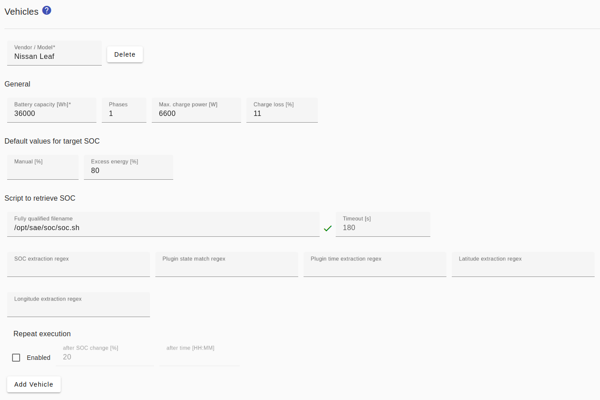

# Wallboxes
In the *Smart Appliance Enabler*, a wallbox is represented as a complex control with various configuration parameters and the vehicles.

In order for the Sunny Home Manager to be able to control the power of wallboxes, **an electricity meter must be configured in the Smart Appliance Enabler** to determine the current power consumption!

The *Sunny Home Manager* specifies the **power in W**  to be set. If it exceeds the `Max. power` configured for the electric vehicle in *Smart Appliance Enabler*, it will be limited to the configured **value**.

The *Smart Appliance Enabler* **calculates the current** to be set on the wallbox from the power and the number of phases. The number of phases set for the vehicle is decisive here, otherwise the number of phases set for the wallbox.

## Configuration
The *Smart Appliance Enabler* currently provides templates and configurations for the following wallboxes:
* [go-eCharger](GoeCharger_EN.md)
* [Keba KeContact P30 c-series / x-series](Keba_EN.md)
* [Phoenix Contact EM-CP-PP-ETH-Controller](PhoenixContactEMCPPPETH_EN.md) e.g. Walli, wallbe feat. old controller
* wallbe feat. new controller
* [Warp Charger Smart / Pro](WarpCharger_EN.md)

These configurations are contained in the `evcharger-templates.json` file, which is downloaded from https://raw.githubusercontent.com/camueller/SmartApplianceEnabler/master/run/evcharger-templates.json into the directory pointed to by the variable `SAE_HOME` (usually `/opt/sae`) every time the *Smart Appliance Enabler* is started . If the *Smart Appliance Enabler* cannot download the file, it must be downloaded manually and placed there.

In addition, the use of other wallboxes should also be possible as long as they can be controlled using a supported protocol:
* [Modbus/TCP](EVChargerModbus_EN.md)
* HTTP

_Note for HTTP-based wallboxes:_

The write access configuration for setting the charging current must contain the placeholder `{0}` in the URL or data, which is replaced with the current in amperes to be set.

If the value has to be set in milliamps, this can be done as usual using `factorToValue="1000"`. The numerical value of the current to be set will be greater than 1000, which is why in this case `{0,number,#}` must be used as a placeholder so that no thousands separator is inserted.

If the value itself contains the characters `{` or `}`, these must be "escaped" in single quotes.

The configuration with the combination of the features described above could look like this:
```
<HttpWriteValue name="ChargingCurrent" value="'{'current:{0,number,#}'}'" method="POST" factorToValue="1000"/>
```

### Protocol-independent settings for wallboxes


Regardless of the specific wallbox, the following settings apply to all wallboxes:
- `voltage`: is required for the calculation of the charging current (default value: 230V)
- `phases`: Maximum number of phases with which the wallbox can charge. Can be overwritten individually for each vehicle. (default value: 1)
- `poll interval`: the status of the wallbox is queried at these time intervals (default value: 10s)
- `Start state detection delay`: After switching on/off, the charging status is not queried for the specified period of time to give the wallbox time to bring about the desired status
- `Charge current repetition`: If set, the charging current is set repeatedly after the duration specified by the value in seconds has elapsed, despite the value remaining the same. This may be necessary to prevent the wallbox from falling back to a lower current level.
- `force initial charging`: After a connected vehicle is detected, charging starts immediately until the wall box reports back the status 'Charging'. After that, charging is stopped again until a switch-on command is received. Required for Renault Zoe!
- `Latitude`: The geographic latitude of the Wallbox is used to identify the vehicle that is close to the Wallbox in the case of multiple configured vehicles.
- `Longitude`: The geographic longitude of the Wallbox is used to identify the vehicle that is close to the Wallbox in the case of multiple configured vehicles.

### <a name="ev"></a> Vehicles

The configuration of vehicles includes parameters for controlling the charging process and default values for dialogs.

When charging the vehicle, charge loss occur that are counted by the meter, but do not lead to an increase of the energy stored in the vehicle. Therefore a value can be configured for the `Charge loss` (default value: 10%), which is used in the calculation of the requested amount of energy.

For the target SOC default values can be set:

The *default value for manual charging* only contains the pre-assignment of the field for the target SOC in the input mask, which is displayed after clicking on the green traffic light.

If a *default value for excess energy* is set, after connecting the vehicle, excess energy will only be charged up to this value and then the charging process will be stopped.

The AC wallboxes supported by the *Smart Appliance Enabler* cannot determine the current SOC of the vehicle and communicate this value to the *Smart Appliance Enabler*! In order to determine the energy demand as precisely as possible, however, this value must be known. The *Smart Appliance Enabler* therefore offers the option of integrating a [script for automated querying of the SOC](soc/SOC_EN.md), provided this is supported by the vehicle manufacturer.

If several vehicles are configured, automatic detection of the vehicle connected to the wallbox is only possible if the [scripts for automated querying of the SOC](soc/SOC_DE.md) can also supply at least one of the following values in addition to the SOC:

- Connection status of the charging cable
- Time of plugging in the charging cable
- Latitude/longitude of vehicle

If available, these values must be extracted from the output of the [Script for automated querying of the SOC](soc/SOC_EN.md) in addition to the actual SOC with [Regular Expressions(Regex)](ValueExtraction_EN.md).



## Load configuration in Sunny Home Manager
In the *Sunny Home Manager*, the consumer configuration for a wallbox should look like this:


## Charging process
If a *SOC script* has been configured, it will **run automatically after connecting the vehicle to the wallbox**.

There is also the option of entering the current and target SOC when [manually starting the charging process](Status_EN.md#user-content-click-green-ev).

Based on the values for
- `Battery capcity`: from vehicle configuration
- `Current SOC`: delivered by the SOC script or entered via the [traffic light control](Status_EN.md#user-content-click-green-ev)
- `Targate SOC` default value from the vehicle configuration or entered via [traffic light control](Status_EN.md#user-content-click-green-ev)

...the **initial energy** is calculated, which is to be requested from the *Sunny Home Manager*.

During the charging process, the **current SOC is calculated** from:
- `last known SOC`: from the SOC script (start of charging or last execution) or input via traffic lights (at the start of charging)
- `charged energy`:  metered by meter
- `battery capacity`: from the vehicle configuration
- `charge loss`: initial from the vehicle configuration; if the SOC script is configured, the actual charging loss are calculated and used

The energy requested by the *Sunny Home Manager* is **continuously calculated** from the difference between the calculated SOC and the target SOC.

During the charging process, the **SOC script is executed periodically**. If the calculated SOC either increases by a configured value (default: 20%) or a configured time has passed since the SOC script was last executed, the SOC script is executed again. The calculated SOC is compared with the actual SOC and the actual charge loss are calculated from this. The actual charge loss are taken into account for all subsequent calculations of the SOC until the next execution of the SOC script during the current charging process.

**Without SOC script** and without [entering the current actual state of charge](Status_EN.md#user-content-click-green-ev), the *Smart Appliance Enabler* assumes an current SOC of 0% when the vehicle gets connected and reports a correspondingly large energy requirement. Although this worsens the planning of the *Sunny Home Manager*, regardless of this, the wallbox stops charging at the latest when the vehicle is fully charged.

### Example
The course of a charging process using excess energy is illustrated here using excerpts from the log:

After the vehicle has been connected to the Wallbox:
```
2021-05-02 13:04:04,740 DEBUG: Vehicle state changed: previousState=VEHICLE_NOT_CONNECTED newState=VEHICLE_CONNECTED
```
... the SOC script was executed and returns 51%:
```
2021-05-02 13:04:05,048 DEBUG: Executing SoC script: /opt/sae/soc/soc.sh
2021-05-02 13:04:59,092 DEBUG: SoC: 51.0
```
From the actual SOC (51%), target SOC (80% according to the vehicle configuration) and net battery capacity (36 kWh), the energy required (without taking charge loss into account) is calculated at 10.4 kWh:
```
2021-05-02 13:05:04,747 DEBUG: energy calculation: 10440Wh evId=1 batteryCapactiy=36000Wh currentSoc=51% targetSoc=80%
2021-05-02 13:05:32,404 DEBUG: ACTIVE/2021-05-02T13:04:04/2021-05-04T13:04:04::ENABLED/evId=1/soc=51%=>80%/energy=10440Wh/Optional Energy
```
To calculate the SOC, the value configured for the vehicle for charging loss (`chargeLoss`) is used - here 11%:
```
2021-05-02 13:06:25,018 DEBUG: SOC calculation: socCurrent=51% socRetrievedOrInitial=51% batteryCapacity=36000Wh energyMeteredSinceLastSocScriptExecution=0Wh chargeLoss=11%
```
The charging process has progressed and the calculated SOC is 20% above the SOC of the last execution of the SOC script (default value of the configuration) - so a new execution is necessary:
```
2021-05-03 09:26:45,464 DEBUG: SOC calculation: socCurrent=71% socRetrievedOrInitial=51% batteryCapacity=36000Wh energyMeteredSinceLastSocScriptExecution=7796Wh chargeLoss=11%
2021-05-03 09:26:45,468 DEBUG: Executing SoC script: /opt/sae/soc/soc.sh
2021-05-03 09:27:37,613 DEBUG: SoC: 72.0
```
The calculated SOC is 71%, the value returned by the SOC script is 72%. The energy that has "arrived" in the vehicle can be calculated from the SOC change (`energyReceivedByEv`). From this and the amount of energy used according to the meter, the actual charge loss can be calculated - here 4%:
```
2021-05-03 09:27:37,674 DEBUG: charge loss calculation: chargeLoss=4% socCurrent=72% socLastRetrieval=51% batteryCapacity=36000Wh energyMeteredSinceLastSocScriptExecution=7844Wh energyReceivedByEv=7560Wh
```
From now on, the previously calculated value for the actual charge loss will be used for the calculation of the SOC instead of the value configured for the vehicle:
```
2021-05-03 09:27:45,461 DEBUG: SOC calculation: socCurrent=72% socRetrievedOrInitial=72% batteryCapacity=36000Wh energyMeteredSinceLastSocScriptExecution=7Wh chargeLoss=4%
```
At this point, the target SOC for this charging process was increased to 100% manually via traffic lights:
```
2021-05-03 09:56:15,985 DEBUG: Received request to update SOC: socCurrent=74 socTarget=100
```
The calculated SOC is again 20% above the SOC of the last execution of the SOC script - so a new execution is necessary:
```
2021-05-03 11:47:05,529 DEBUG: SOC retrieval is required: SocValues{batteryCapacity=36000Wh, initial=51%, retrieved=72%, current=92%}
2021-05-03 11:47:05,532 DEBUG: Executing SoC script: /opt/sae/soc/soc.sh
2021-05-03 11:47:59,060 DEBUG: SoC: 90.0
```
The calculated SOC was 92%, the value returned by the SOC script was 90%. The calculation of the actual charge loss gives 14%:
```
2021-05-03 11:47:59,119 DEBUG: charge loss calculation: chargeLoss=14% socCurrent=90% socLastRetrieval=72% batteryCapacity=36000Wh energyMeteredSinceLastSocScriptExecution=7416Wh energyReceivedByEv=6480Wh
```
From now on, the newly calculated value of 14% will be used to calculate the SOC for the charge loss:
```
2021-05-03 11:48:05,532 DEBUG: SOC calculation: socCurrent=90% socRetrievedOrInitial=90% batteryCapacity=36000Wh energyMeteredSinceLastSocScriptExecution=10Wh chargeLoss=14%
```
The calculated remaining amount of energy required to achieve the target SOC is less than 1 kWh for the first time - this is why another execution of the SOC script is triggered to ensure that the vehicle is actually close to reaching the target SOC:
```
2021-05-03 12:55:05,777 DEBUG: energy calculation: 360Wh evId=1 batteryCapactiy=36000Wh currentSoc=99% targetSoc=100%
2021-05-03 12:55:05,767 DEBUG: SOC calculation: socCurrent=99% socRetrievedOrInitial=90% batteryCapacity=36000Wh energyMeteredSinceLastSocScriptExecution=3515Wh chargeLoss=14%
2021-05-03 12:55:05,768 DEBUG: SOC retrieval: socCalculationRequired=false socChanged=true chargingAlmostCompleted=true socRetrievalForChargingAlmostCompleted=false
2021-05-03 12:55:05,769 DEBUG: SOC retrieval is required: SocValues{batteryCapacity=36000Wh, initial=51%, retrieved=90%, current=99%}
2021-05-03 12:55:05,772 DEBUG: Executing SoC script: /opt/sae/soc/soc.sh
2021-05-03 12:55:58,372 DEBUG: SoC: 98.0
```
The calculated SOC is 99%, the value returned by the SOC script is 98%. The charging loss can be calculated from this: 23% in this phase of charging:
```
2021-05-03 12:55:58,436 DEBUG: charge loss calculation: chargeLoss=23% socCurrent=98% socLastRetrieval=90% batteryCapacity=36000Wh energyMeteredSinceLastSocScriptExecution=3552Wh energyReceivedByEv=2880Wh
```
The energy still required is also corrected based on the actual SOC - from 360 Wh to 720 Wh:
```
2021-05-03 12:56:05,778 DEBUG: energy calculation: 720Wh evId=1 batteryCapactiy=36000Wh currentSoc=98% targetSoc=100%
2021-05-03 12:56:35,676 DEBUG: ACTIVE/2021-05-03T09:56:15/2021-05-04T13:04:04::ENABLED/evId=1/soc=98%=>100%/energy=720Wh/Optional Energy
```
As soon as this energy has been charged, the target SOC has been reached and charging is stopped:
```
2021-05-03 13:23:25,811 DEBUG: SOC calculation: socCurrent=100% socRetrievedOrInitial=98% 
batteryCapacity=36000Wh energyMeteredSinceLastSocScriptExecution=666Wh chargeLoss=23%
2021-05-03 13:23:35,691 DEBUG: EXPIRED/2021-05-03T09:56:15/2021-05-04T13:04:04::DISABLED/evId=1/soc=100%=>100%/energy=0Wh/Optional Energy
2021-05-03 13:23:35,694 DEBUG: Vehicle state changed: previousState=CHARGING newState=CHARGING_COMPLETED
```

## Log

### Control requests
If a control request for a wallbox (here `F-00000001-000000000019-00`) is received from the *Sunny Home Manager*, this can be displayed in the [Log](Logging_EN.md) with the following command:

```console
sae@raspi:~ $ grep "Received control" -A 3 /tmp/rolling-2020-11-18.log
2020-11-18 09:36:10,008 DEBUG [http-nio-8080-exec-3] d.a.s.s.w.SempController [SempController.java:220] F-00000001-000000000019-00: Received control request: on=true, recommendedPowerConsumption=3442W
2020-11-18 09:36:10,060 DEBUG [http-nio-8080-exec-3] d.a.s.a.Appliance [Appliance.java:334] F-00000001-000000000019-00: Setting appliance state to ON
2020-11-18 09:36:10,062 DEBUG [http-nio-8080-exec-3] d.a.s.c.e.ElectricVehicleCharger [ElectricVehicleCharger.java:642] F-00000001-000000000019-00: Set charge power: 3442W corresponds to 14A using 1 phases
2020-11-18 09:36:10,063 DEBUG [http-nio-8080-exec-3] d.a.s.m.EVModbusControl [EVModbusControl.java:178] F-00000001-000000000019-00: Set charge current 14A
```

*Webmin*: In [View Logfile](Logging_EN.md#user-content-webmin-logs) enter `Received control` after `Only show lines with text` and press Refresh.

### SOC script
The [Log](Logging_EN.md) contains the following lines for each execution of the SOC script:

```console
sae@raspi:~ $ grep "SocScript" /tmp/rolling-2021-01-09.log
2021-01-09 08:50:23,205 DEBUG [Thread-7] d.a.s.c.e.SocScript [SocScript.java:108] F-00000001-000000000019-00: Executing SoC script: /opt/sae/soc/soc.sh
2021-01-09 08:51:15,495 DEBUG [Thread-7] d.a.s.c.e.SocScript [SocScript.java:118] F-00000001-000000000019-00: SoC script output: Prepare Session
2021-01-09 08:51:15,499 DEBUG [Thread-7] d.a.s.c.e.SocScript [SocScript.java:120] F-00000001-000000000019-00: SoC script exited with return code 0
2021-01-09 08:51:15,502 DEBUG [Thread-7] d.a.s.c.e.SocScript [SocScript.java:147] F-00000001-000000000019-00: SoC extraction regex: .*state_of_charge (\d+)
2021-01-09 08:51:15,503 DEBUG [Thread-7] d.a.s.c.e.SocScript [SocScript.java:87] F-00000001-000000000019-00: SoC: 94.0
```

*Webmin*: In [View Logfile](Logging_EN.md#user-content-webmin-logs) enter `SocScript` after `Only show lines with text` and press Refresh.
