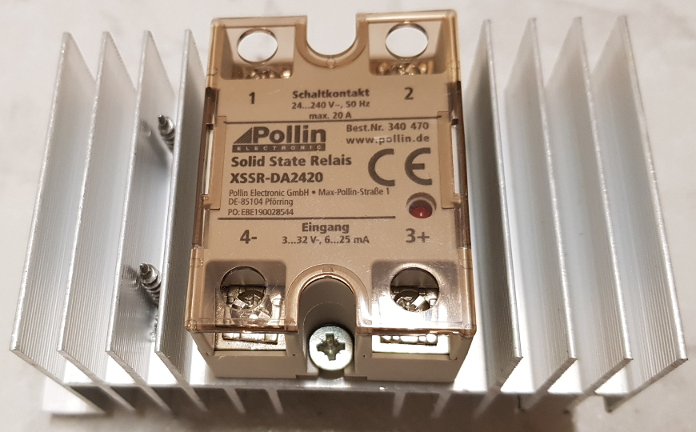
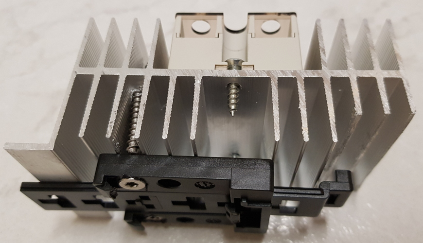
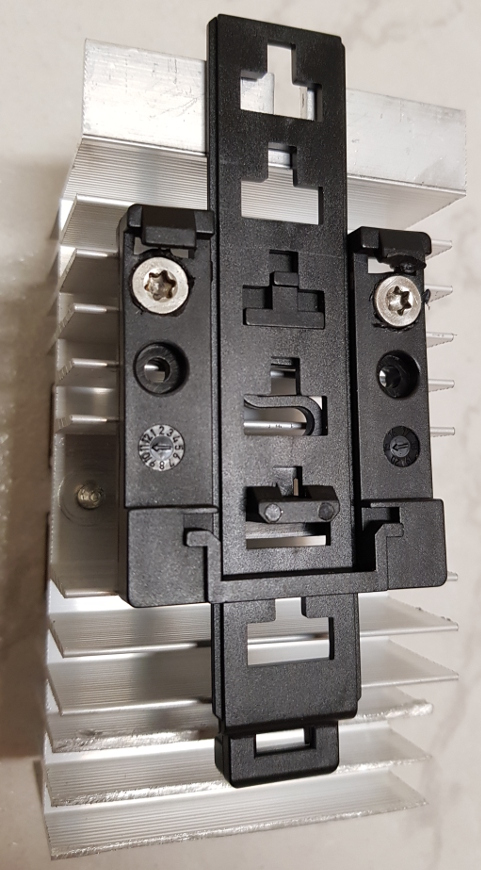
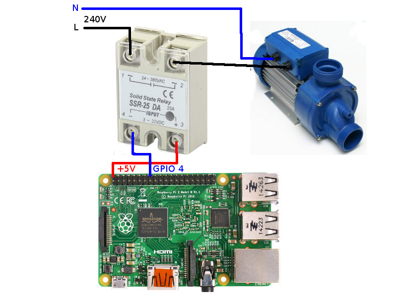

# GPIO-Schalter
Der Raspberry Pi verfügt über **GPIO-Anschlüsse** die ein- und ausgeschaltet werden können.
Dabei sollten unbedingt die [Hinweise zum Raspberry Pi und zur Numerierung der GPIO-Anschlüsse](Raspberry_DE.md) beachtet werden! 

Zur Konfiguration eines GPIO-Schalters gehört die Nummer des GPIO-Anschlusses und die Angabe, ob der Schalter-Status invertiert werden soll.


## Log

Wird ein Gerät (hier `F-00000001-000000000013-00`) mittels GPIO-basiertem Schalter geschaltet, kann man den Schaltbefehl im [Log](Logging_DE.md) mit folgendem Befehl anzeigen:

```bash
$ grep "c.Switch" /tmp/rolling-2020-12-30.log | grep F-00000001-000000000013-00
2020-12-30 11:02:24,686 INFO [pi4j-gpio-event-executor-39] d.a.s.c.Switch [Switch.java:101] F-00000001-000000000013-00: Switching off GPIO 3
2020-12-30 11:05:59,820 INFO [http-nio-8080-exec-6] d.a.s.c.Switch [Switch.java:101] F-00000001-000000000013-00: Switching on GPIO 3
```

*Webmin*: In [View Logfile](Logging_DE.md#user-content-webmin-logs) gibt man hinter `Only show lines with text` ein `c.Switch` und drückt Refresh.

## Solid-State-Relais

Zum Schalten von 240V-Geräten eignen sich [**Solid-State-Relais**](https://de.wikipedia.org/wiki/Relais#Halbleiterrelais).

Ursprünglich hatte ich mehrere SSRs von Fotek, Typ SSR-40 DA, gekauft, zwei davon (Geschirrspüler und Waschmaschine) musste ich nach 3 Jahren ersetzen, nachdem diese durchgeschmort waren. Diese SSRs haben auf der Rückseite eine Metallplatte, mit der man sie auf einen Kühlkürper montieren kann, was ich allerdings nicht getan hatte. Von den gekaufen SSRs waren einige von Anfang an defekt und nachdem kürzlich die beiden SSRs durchgeschmort waren, habe ich etwas recheriert. Von den Fotek-SSRs scheinen wohl [Fälschungen im Umlauf zu sein](https://www.mikrocontroller.net/topic/444199), die nur mit geringeren Stromstärken klarkommen als angegeben.

Aus diesem Grund habe ich mehrere [XSSR-DA2420 vom deutschen Electronic-Händler Pollin](https://www.pollin.de/p/solid-state-relais-xssr-da2420-3-32-v-20-a-240-v-340470) gekauft, der diese für sich produzieren und labeln lässt. Demtentsprechend hoffe ich darauf, dass es sich um ein Produkt handelt, dessen Qualität der angegebenen Spezifikation entspricht.

Um das Risiko einer Überhitzung zu minimieren habe ich gleich [passende Kühlkörper bei Pollin bestellt](https://www.pollin.de/p/strangkuehlkoerper-kab-60-125-50-430152). Hinsichtlich der Montage kam ich etwas ins Grübeln, wie ich den Kühlkörper auf dem oben erwähnten DIN-Schienenhalte vom Typ **Bopla TSH 35** befestigen kann. Letzlich habe ich es gemacht, wie auf den Fotos zu sehen, wobei ich drei Kühlrippen etwas kürzen musste.


<br>SSR mit Kühlkörper


<br>SSR mit Kühlkörper auf DIN-Schienenhalter von der Seite


<br>SSR mit Kühlkörper auf DIN-Schienenhalter von Rückseite

Bei [Pohltechnik](https://www.pohltechnik.com/de/ssr-relais) gibt es ebenfalls geeignete SSRs und passende Kühlkörper. 

#### Schaltbeispiel: Schaltung eines 240V-Gerätes mittels Solid-State-Relais
Der Aufbau zum Schalten eines 240V-Gerätes (z.B. Pumpe) mittels Solid-State-Relais könnte wie folgt aussehen:


