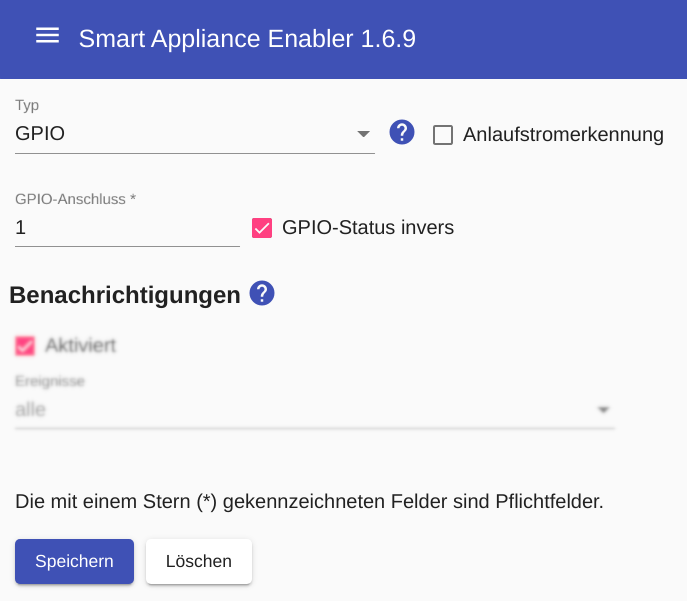

# GPIO switches

The Raspberry Pi has **GPIO ports** that can be turned on and off.
The [Notes on the Raspberry Pi and the numbering of the GPIO connections](Raspberry_DE.md) should be observed!

Configuring a GPIO-based switch involves specifying the GPIO port number and whether to invert the switch state.

Optionally, the [Starting current detection](StartingCurrentDetection_DE.md) can be activated.



## Log
If a device (here `F-00000001-000000000013-00`) is switched using a GPIO-based switch, you can display the switching command in [Log](Logging_DE.md) with the following command:

```console
sae@raspi2:~ $ grep "c.Switch" /tmp/rolling-2020-12-30.log | grep F-00000001-000000000013-00
2020-12-30 11:02:24,686 INFO [pi4j-gpio-event-executor-39] d.a.s.c.Switch [Switch.java:101] F-00000001-000000000013-00: Switching off GPIO 3
2020-12-30 11:05:59,820 INFO [http-nio-8080-exec-6] d.a.s.c.Switch [Switch.java:101] F-00000001-000000000013-00: Switching on GPIO 3
```

*Webmin*: In [View Logfile](Logging_DE.md#user-content-webmin-logs) enter `c.Switch` after `Only show lines with text` and press refresh.

## Solid state relais

[**Solid State Relays**](https://de.wikipedia.org/wiki/Relais#Solid State Relays) are suitable for switching 240V devices.

Originally I had bought several SSRs from Fotek, type SSR-40 DA, two of them (dishwasher and washing machine) I had to replace after 3 years after they had burned out. These SSRs have a metal plate on the back that allows you to mount them on a heatsink, which I didn't do. Some of the SSRs I bought were defective from the start and after the two SSRs recently burned through, I did some research. [There seem to be counterfeits in circulation](https://www.mikrocontroller.net/topic/444199) of the Fotek SSRs, which can only cope with lower currents than specified.

For this reason I have several [XSSR-DA2420 from the German electronics retailer Pollin](https://www.pollin.de/p/solid-state-relais-xssr-da2420-3-32-v-20-a-240 -v-340470) who has them produced and labeled for himself. Accordingly, I hope that it is a product whose quality corresponds to the specified specification.

To minimize the risk of overheating, I immediately [ordered suitable heat sinks from Pollin](https://www.pollin.de/p/strangkuehlkoerper-kab-60-125-50-430152). Regarding the assembly, I started to ponder how to attach the heatsink to the **Bopla TSH 35** type DIN rail mount mentioned above. In the end I did it as shown in the photos, although I had to shorten three cooling fins a bit.


<br>SSR with heatsink


<br>SSR with heatsink on DIN rail holder from the side


<br>SSR with heatsink on DIN rail holder from rear

[Pohltechnik](https://www.pohltechnik.com/de/ssr-relais) also has suitable SSRs and suitable heat sinks.

#### Wiring example: Switching a 240V device using a solid-state relay
The structure for switching a 240V device (e.g. pump) using a solid-state relay could look like this:


