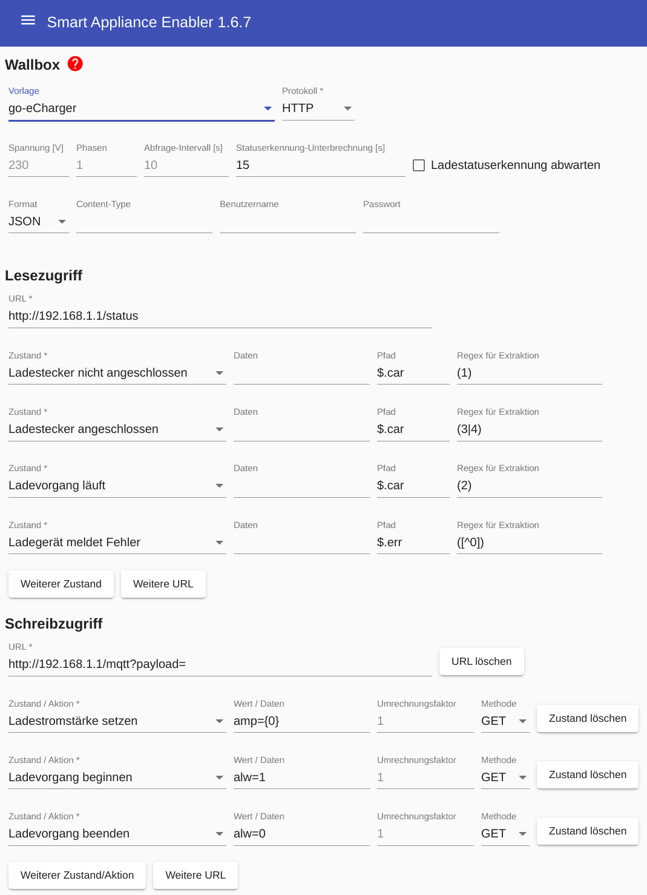
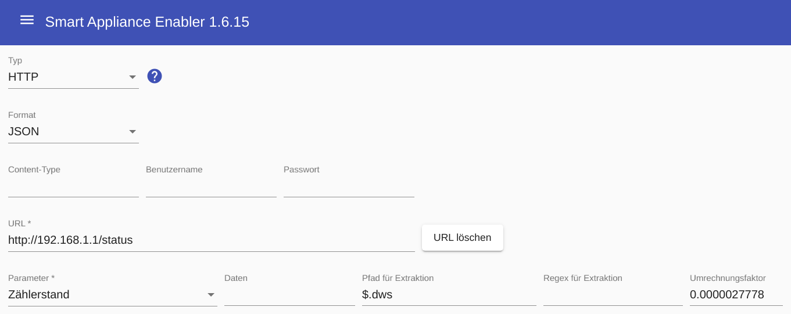

# go-eCharger
Ein sehr vielseitiges, kompaktes Ladegerät, das auch für den mobilen Einsatz geeignet ist, ist der [go-eCharger](https://go-e.co/go-echarger-home/).
Bei Verwendung des go-eCharger ist kein separater Stromzähler erforderlich, weil der Zählerwert vom go-eCharger mit hoher Genauigkeit bereitgestellt wird und der *Smart Appliance Enabler* daraus die aktuelle Leistungsaufnahme berechnet.

## Geräte-Konfiguration
Der go-eCharger muss mit WLAN verbunden sein, in dem sich auch der *Smart Appliance Enabler* befindet oder das zumindest für ihn erreichbar ist.
Die HTTP-Schnittstelle des go-eCharger muss aktiviert werden, damit der *Smart Appliance Enabler* mit ihm darüber kommunizieren kann.

## Konfiguration im Smart Appliance Enabler

### Schalter
Für die Konfiguration sollte die Vorlage `go-eCharger` verwendet werden.
Die IP-Adresse bzw. der Hostname in den URL-Feldern muss auf die des go-eChargers angepasst werden. 

### Zähler
Wie oben geschrieben muss der go-eCharger selbst als Zähler angegeben werden, d.h.
die IP-Adresse bzw. der Hostname in den URL-Feldern muss auf die des go-eChargers angepasst werden. 

Der Wert von `0.0000027778` als Umrechnungsfaktor in kWh für den Zustand _Energiemenge_ liegt darin begründet, dass der go-eCharger die Energiemenge im Feld `dws` in 10 Deka-Watt-Sekunden liefert.

Der Zustand _Leistung_ darf für den go-eCharger nicht konfiguriert werden, weil der *Smart Appliance Enabler* die aktuelle Leistung aus Energiemengendifferenz bezogen auf die Zeitdifferenz berechnet.

