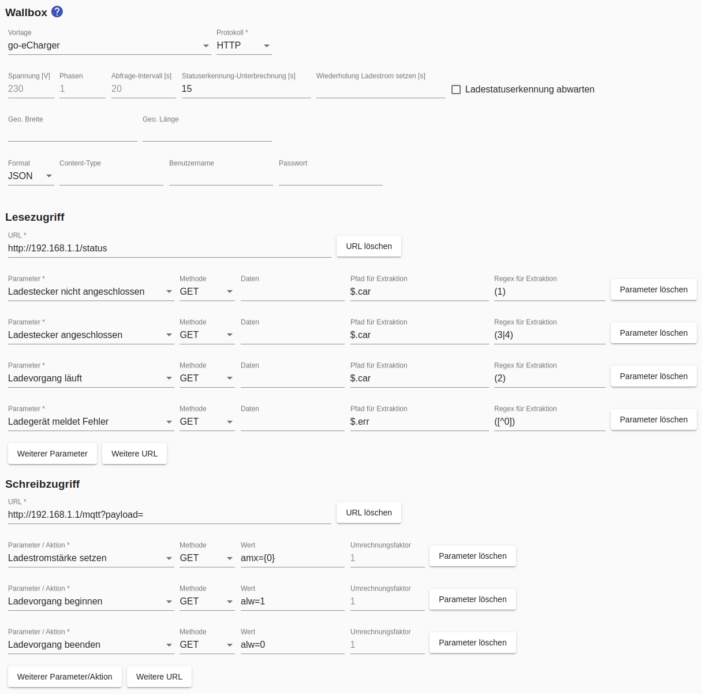
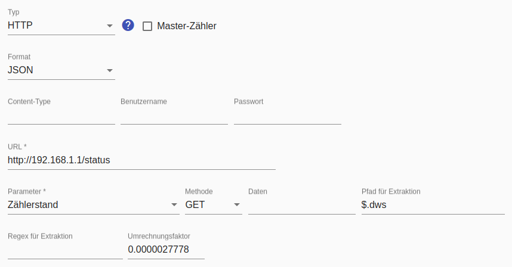

# go-eCharger
Ein sehr vielseitiges, kompaktes Ladegerät, das auch für den mobilen Einsatz geeignet ist, ist der [go-eCharger](https://go-e.co/go-echarger-home/).

Bei Verwendung dieser Wallbox ist kein separater Stromzähler erforderlich, weil der Zählerwert von der Wallbox selbst mit hoher Genauigkeit bereitgestellt wird und der *Smart Appliance Enabler* daraus die aktuelle Leistungsaufnahme berechnet.

Den go-eCharger gibt es mittlerweile in mehreren Versionen. Die aktuellste Version ist die V3, welche mehr Features als die Vorgängerversion bietet.

## Geräte-Konfiguration
Der go-eCharger muss mit einem WLAN verbunden sein, in dem sich auch der *Smart Appliance Enabler* befindet oder welches zumindest für ihn erreichbar ist.

Die lokale HTTP API v1 des go-eCharger muss in der App des go-eCharger aktiviert werden unter: `Internet -> erweiterte Einstellungen -> Aktiviere lokale HTTP API v1`, damit der *Smart Appliance Enabler* mit ihm darüber kommunizieren kann.

## Konfiguration im Smart Appliance Enabler
### Wallbox
Für die Konfiguration sollte die Vorlage `go-eCharger` verwendet werden - dadurch werden alle Felder korrekt ausgefüllt. Lediglich die IP-Adresse bzw. der Hostname in den URL-Feldern muss auf die des go-eChargers angepasst werden. 

### Zähler
Wie oben geschrieben muss der go-eCharger selbst als Zähler angegeben werden, d.h. die IP-Adresse bzw. der Hostname in den URL-Feldern muss auf die des go-eChargers angepasst werden. 

Als `Format` muss `JSON` ausgewählt werden, damit die Antworten des go-eCharger korrekt interpretiert werden können.

Das Feld `Pfad für Extraktion` muss den Wert `$.dws` enthalten, damit der *Smart Appliance Enabler* weiss, an welcher Stelle in der Antwort des go-eChargers der Wert für die Energie enthalten ist. 

Im Feld `Umrechnungsfaktor` muss die Zahl `0.0000027778` eingegeben werden, weil der go-eCharger die Energie in 10 Deka-Watt-Sekunden liefert.

Es wird empfohlen, den Parameter `Zählerstand` zu wählen. Dadurch wird der go-eCharger weniger oft (alle 60 Sekunden) abgfragt und die Leistung wird aus der Zählerstandsdifferenz berechnet.

Alternativ kann als Parameter `Leistung` konfiguriert werden, um direkt die vom go-eCharger gemeldete Leistung zu übernehmen anstatt sie aus Zählerstandsdifferenzen zu berechnen. Dazu muss im Feld `Pfad für Extraktion` der Wert `$.nrg[11]` eingetragen werden. Im Feld `Umrechnungsfaktor` muss die Zahl `10` eingegeben werden, weil der go-eCharger die Leistung in 0.01kW liefert.
