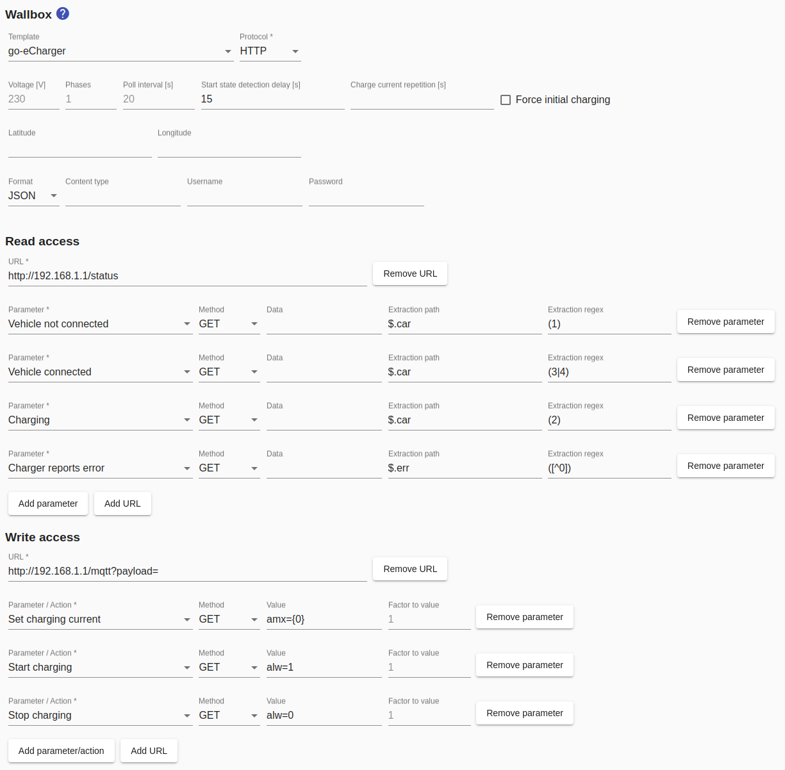
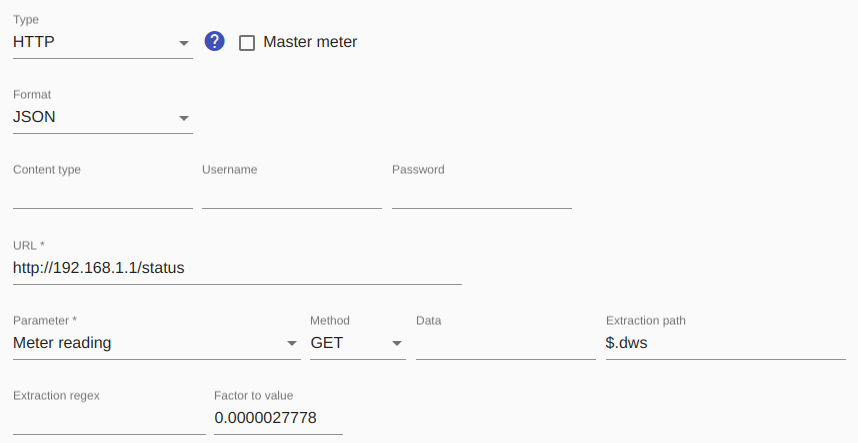

# go-eCharger

The [go-eCharger](https://go-e.co/go-echarger-home/) is a very versatile, compact charger that is also suitable for mobile use.

When using this wallbox, no separate electricity meter is required because the meter value is provided by the wallbox itself with high accuracy and the *Smart Appliance Enabler* calculates the current power consumption from it.

The go-eCharger is now available in several versions. The latest version is the V3, which supports more features than the previous version.

## Device configuration
The go-eCharger must be connected to a WLAN that also contains the *Smart Appliance Enabler* or that is at least accessible to it.

The go-eCharger's local HTTP API v1 must be activated in the go-eCharger app under: `Internet -> advanced settings -> Activate local HTTP API v1` so that the *Smart Appliance Enabler* can communicate with it.

## Configuration in Smart Appliance Enabler
### Wallbox
The template `go-eCharger` should be used for the configuration - this will ensure that all fields are filled out correctly. Only the IP address or the host name in the URL fields has to be adjusted to that of the go-eCharger.

### Meter
As written above, the go-eCharger itself must be specified as a meter, i.e.
the IP address or the host name in the URL fields must be adjusted to that of the go-eCharger.

`JSON` must be selected as `Format` so that the responses of the go-eCharger can be interpreted correctly.

The `Extraction path` field must contain the value `$.dws` so that the *Smart Appliance Enabler* knows where the response from the go-eCharger contains the value for the energy.

The number `0.0000027778` must be entered in the `Factor to value` field because the go-eCharger delivers the energy in 10 deca-watt seconds.

It is recommended to select the parameter `Meter reading`. As a result, the go-eCharger is queried less often (every 60 seconds) and the power is calculated from the meter reading difference.

Alternatively, `Power` can be configured as a parameter in order to directly accept the power reported by the go-eCharger instead of calculating it from meter reading differences. To do this, the value `$.nrg[11]` must be entered in the `Extraction path` field. The number `10` must be entered in the `Factor to value` field because the go-eCharger delivers the power in 0.01kW.
