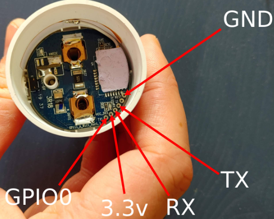
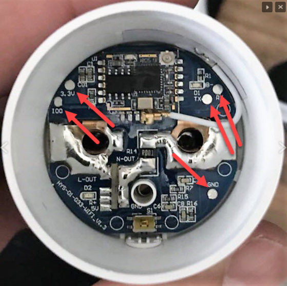

# Gosund SP111
Der *Gosund SP111* ist ein formschöner und kompakter Steckdosenadapter, der via WLAN geschaltet und auch den aktuellen Stromverbrauch des geschalteten Gerätes messen kann.

Die Nutzung mit dem *Smart Appliance Enabler* ist nur möglich, wenn der Adapter mit der [Tasmota-Firmware geflasht und im *Smart Appliance Enabler* entsprechend konfiguriert wird](doc/Tasmota_DE.md).

**Zu beachten ist, dass nach dem Flashen der Gosund SP111 vom FT232RL-Adapter getrennt und in eine 240V-Steckdose gesteckt wird. Erst danach kann das WLAN konfiguriert werden, mit dem sich der Gosund SP111 verbinden soll.**

Es gibt verschiedene Versionen des Gosund SP111:

## Version 1.1
Bei der neueren Version 1.1 ist in der Steckdose die maximale Leistungsaufnahme mit 3450 W angegeben.

Auf der Platine sind sämtliche Kontakte direkt nebeneinander:

[Quelle](https://www.malachisoord.com/2019/11/24/flashing-custom-firmware-on-a-gosund-sp111)

Für die Version 1.1 existiert derzeit keine Konfiguration in Tasmota, die direkt verwendet werden kann. Stattdessen muss ein [Template importiert](https://github.com/arendst/Tasmota/wiki/Templates#importing-templates) werden, das zu dieser Version passt:
```
{"NAME":"Gosund SP111 V1.1","GPIO":[57,255,56,255,132,134,0,0,131,17,0,21,0],"FLAG":0,"BASE":45}
```
Bei Adaptern der Version 1.1 ist mir aufgefallen, dass Messwerte offensichtlich falsch sind - in meinem Fall wurde als Spannung 278V angezeigt. Auf der Tasmota-Homepage ist das [Kalibrieren des Adapters](https://tasmota.github.io/docs/#/Power-Monitoring-Calibration) beschrieben.

Als Referenz für die Leistung habe ich meinen 30W-Lötkolben genommen. Zur Kontrolle hatte ich diesen auch an einen Modbus-Stomzähler angeschlossen, über den ich ebenfalls die Leistung abfragen konnte: 30.9W.

Den Referenzwert für die Spannung konnte ich mit meinem Multimeter direkt messen: 233.5V.

Das Kalibrieren der Werte erfolgt über die Konsole:
```
14:53:33 CMD: PowerSet 30.0
14:53:33 RSL: RESULT = {"PowerSetCal":10525}
14:54:37 CMD: VoltageSet 233.5
14:54:37 RSL: RESULT = {"VoltageSetCal":1636}
```

## Version 1.0
Bei der älteren Version 1.0 ist in der Steckdose die maximale Leistungsaufnahme mit 2300 W angegeben.

Auf der Platine sind die Kontakte verteilt zu finden:


Als Konfiguration muss `45 BlitzWolf SHP2` ausgewählt werden.
 
Ich habe mehrere Gosund SP111 erfolgreich nach [dieser Anleitung](https://www.bastelbunker.de/gosund-sp111-mit-tasmota/) geflasht.

Zuvor hatte ich erfolglos versucht, die Tasmota-Firmware mittels [Tuya Convert](https://forum.creationx.de/forum/index.php?thread/1525-smartlife-hack-tuya-convert-ota-flash-ohne-%C3%B6ffnen-und-l%C3%B6ten-von-gosund-swa1-tuya/) zu flashen.

