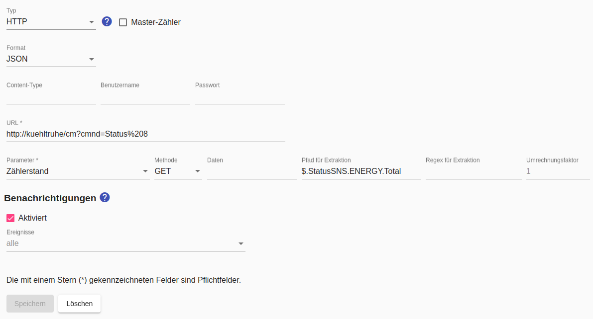

# HTTP-basierte Stromzähler

Für [HTTP-basierte Geräte sind diese allgemeinen Hinweise](Http_DE.md) zu beachten!

Der `Parameter` bezeichnet die Messgrösse, welche der Zähler dem *Smart Appliance Enabler* zur Leistungsbestimmung liefert.

Nach Möglichkeit sollte als Parameter `Zählerstand` eingestellt werden, weil der *Smart Appliance Enabler* dann diesen Wert **nur einmal pro Minute abfragen** muss und aus der Differenz zur vorangegangenen Abfrage die Leistung sehr genau berechnen kann. Dazu muss aber der Zählerstand in kWh mit mindestens **4 Nachkommstellen** (besser 5) geliefert werden. Bei manchen Adaptern muss diese Genauigkeit erst eingestellt werden (siehe [Tasmota](Tasmota_DE.md)).

Wird als Parameter `Leistung` eingestellt, erfolgt die Abfrage dieses Wertes mehrmals pro Minute, um aus diesen Werten den Durschnitt zu berechnen. Der zeitliche Abstand zwischen diesen Abfragen kann mit dem `Abfrage-Intervall` festgelegt werden - der Standardwert sind 20 Sekunden. 

Wenn die HTTP-Antwort im **JSON-Format** geliefert wird, sollte das als `Format` eingestellt werden, weil sich dann durch die Angabe des `Pfad für Extraktion` der Zahlenwert sehr leicht [aus der HTTP-Anwort extrahieren](ValueExtraction_DE.md) lässt.

Alternativ (oder auch nachgelagert zur JSON-Interpretation) kann ein [regulärer Ausdruck zum Extrahieren](ValueExtraction_DE.md) angegeben werden, falls der Zahlenwert aus einem Text (XML, ...) extrahiert werden muss. Dies gilt auch, wenn die HTTP-Antwort scheinbar nur die Zahl enthält, diese aber auch einen Zeilenumbruch (CR/LF) beinhaltet.

Durch die Konfiguration der zuvor beschriebenen Parameter muss sichergestellt sein, dass der *Smart Appliance Enabler* aus der HTTP-Antwort die richtige Zahl extrahieren kann.

Für den Parameter `Zählerstand` wird der Wert in kWh und für den Parameter `Leistung` in W benötigt. Falls die Werte in anderen Einheiten geliefert werden, muss ein `Umrechnungsfaktor` angegeben werden, der mit dem gelieferten Wert multipliziert wird, um ihn in die benötigte Einheit umzurechnen. Wird beispielsweise der Parameter `Leistung` in mW geliefert, muss als `Umrechnungsfaktor` der Wert `0.001` angegeben werden.



## Log
Wird ein HTTP-Zähler für das Gerät `F-00000001-000000000005-00` verwendet, kann man die ermittelte Leistungsaufnahme im [Log](Logging_DE.md) mit folgendem Befehl anzeigen:

```bash
$ grep 'Http' /tmp/rolling-2021-01-01.log | grep F-00000001-000000000005-00
2021-01-01 09:42:50,472 DEBUG [Timer-0] d.a.s.h.HttpTransactionExecutor [HttpTransactionExecutor.java:107] F-00000001-000000000005-00: Sending GET request url=http://espressomaschine/cm?cmnd=Status%208
2021-01-01 09:42:50,516 DEBUG [Timer-0] d.a.s.h.HttpTransactionExecutor [HttpTransactionExecutor.java:168] F-00000001-000000000005-00: Response code is 200
2021-01-01 09:42:50,531 DEBUG [Timer-0] d.a.s.h.HttpHandler [HttpHandler.java:86] F-00000001-000000000005-00: url=http://espressomaschine/cm?cmnd=Status%208 httpMethod=GET data=null path=null
2021-01-01 09:42:50,532 DEBUG [Timer-0] d.a.s.h.HttpHandler [HttpHandler.java:89] F-00000001-000000000005-00: Response: {"StatusSNS":{"Time":"2021-01-01T09:42:50","ENERGY":{"TotalStartTime":"2019-08-18T10:55:03","Total":164.950,"Yesterday":0.482,"Today":0.124,"Power":1279,"ApparentPower":1481,"ReactivePower":747,"Factor":0.86,"Voltage":233,"Current":6.370}}}
2021-01-01 09:42:50,533 DEBUG [Timer-0] d.a.s.h.HttpHandler [HttpHandler.java:58] F-00000001-000000000005-00: value=1279.0 protocolHandlerValue={"StatusSNS":{"Time":"2021-01-01T09:42:50","ENERGY":{"TotalStartTime":"2019-08-18T10:55:03","Total":164.950,"Yesterday":0.482,"Today":0.124,"Power":1279,"ApparentPower":1481,"ReactivePower":747,"Factor":0.86,"Voltage":233,"Current":6.370}}} valueExtractionRegex=,.Power.:(\d+) extractedValue=1279
2021-01-01 09:42:55,632 DEBUG [http-nio-8080-exec-9] d.a.s.m.HttpElectricityMeter [HttpElectricityMeter.java:154] F-00000001-000000000005-00: average power = 1280W
2021-01-01 09:42:55,636 DEBUG [http-nio-8080-exec-9] d.a.s.m.HttpElectricityMeter [HttpElectricityMeter.java:154] F-00000001-000000000005-00: average power = 1280W
```

*Webmin*: In [View Logfile](Logging_DE.md#user-content-webmin-logs) gibt man hinter `Only show lines with text` ein `F-00000001-000000000005-00` und drückt Refresh.
