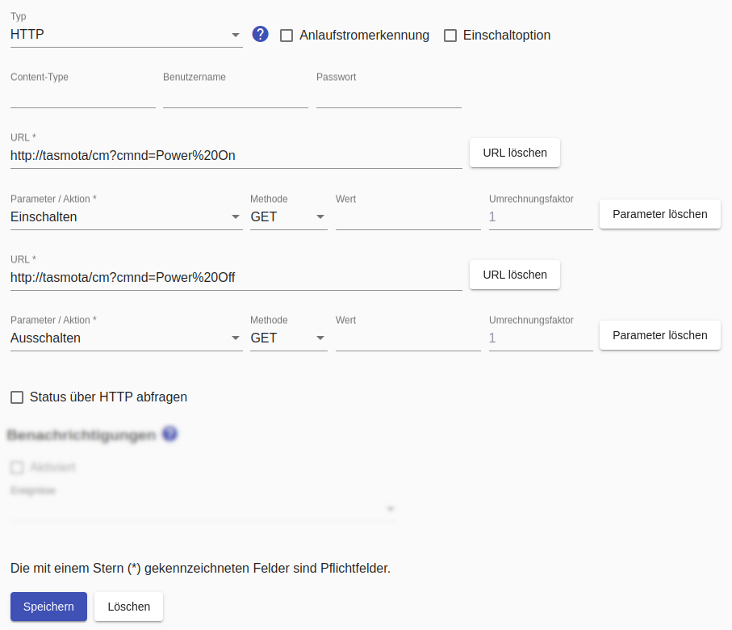

# HTTP-basierte Schalter
Für [HTTP-basierte Geräte sind diese allgemeinen Hinweise](Http_DE.md) zu beachten!

Für HTTP-basierte Schalter müssen die Aktionen `Einschalten` und `Auschalten` konfiguriert werden. Das kann wahlweise durch zwei unterschiedliche URLs oder eine URL mit unterschiedlicher Konfiguration erreicht werden.

Normalerweise kennt der *Smart Appliance Enabler* den Zustand des Gerätes, weil er die Befehle zum Ein- und Ausschalten sendet und sich den Zustand merkt. Das funktioniert allerdings nicht, wenn das Gerät auch auf anderem Weg geschaltet wird. In diesem Fall muss `Status über HTTP abfragen` aktiviert und eine weitere URL zur Bestimmung des Schaltzustandes angegeben werden. Dabei muss ein [regulärer Ausdruck](ValueExtraction_DE.md) angegeben werden, der "matchen" muss, wenn der Schaltzustand "eingeschaltet" ist. Liefert dieser beispielsweise "true" (ohne Anführungszeichen), so muss als regulärer Ausdruck "(true)" (ohne Anführungszeichen) eingetragen werden.

Für alle URLs lässt sich der `Wert` angeben, der mit der Anfrage gesendet werden soll.

Bei Bedarf kann auch der `Content-Type` angegeben werden.



## Log
Wird ein Gerät (hier `F-00000001-000000000013-00`) mittels HTTP-Schalter geschaltet, kann man den Schaltbefehl im [Log](Logging_DE.md) mit folgendem Befehl anzeigen:

```bash
$ grep Http rolling-2020-06-09.log | grep F-00000001-000000000013-00
2020-06-09 17:35:04,364 INFO [http-nio-8080-exec-5] d.a.s.c.HttpSwitch [HttpSwitch.java:127] F-00000001-000000000013-00: Switching on
2020-06-09 17:35:04,364 DEBUG [http-nio-8080-exec-5] d.a.s.h.HttpTransactionExecutor [HttpTransactionExecutor.java:105] F-00000001-000000000013-00: Sending GET request url=http://localhost:8082/set/hm-rpc.0.PEQxxxxxxx.1.STATE?value=true
2020-06-09 17:35:04,372 DEBUG [http-nio-8080-exec-5] d.a.s.h.HttpTransactionExecutor [HttpTransactionExecutor.java:160] F-00000001-000000000013-00: Response code is 200
```

*Webmin*: In [View Logfile](Logging_DE.md#user-content-webmin-logs) gibt man hinter `Only show lines with text` ein `F-00000001-000000000013-00` und drückt Refresh.
