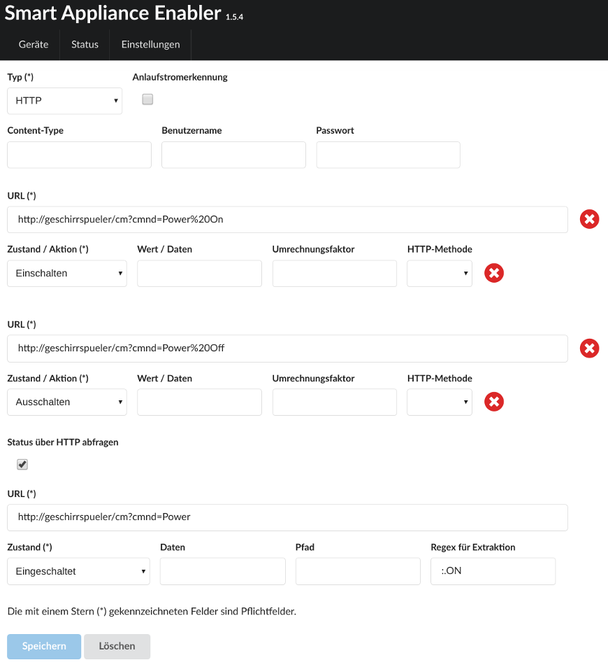

# HTTP-basierte Schalter

Für [HTTP-basierte Geräte sind diese allgemeinen Hinweise](Http_DE.md) zu beachten!

Für HTTP-basierte Schalter müssen die Aktionen `Einschalten` und `Auschalten` konfiguriert werden. Das kann wahlweise durch zwei unterschiedlicher URLs oder eine URL mit unterschiedlicher Konfiguration erreicht werden.

Optional kann eine weitere URL angegeben werden, die zur Bestimmung des Schaltzustandes abgefragt wird. Das kann notwendig sein, wenn das Gerät nicht nur über den *Smart Appliance Enabler* gesteuert wird. Dabei muss ein [Regulärer Ausdruck](WertExtraktion_DE.md) angegeben werden, der "matchen" muss, wenn der Schaltzustand "eingeschaltet" ist. Liefert dieser besipielsweise "true" (ohne Anführungszeichen), so muss als Regulärer Ausdruck "(true)" (ohne Anführungszeichen) eingetragen werden.

Für alle URLs lassen sich `Daten` angeben, die mit der Anfrage gesendet werden. Wenn Daten angegeben werden, sollte auch der `Content-Type` dieser Daten in dem entsprechenden Eingabefeld angegeben werden.



## Log

Wird ein Gerät (hier `F-00000001-000000000013-00`) mittels HTTP-Schalter geschaltet, kann man den Schaltbefehl im [Log](Logging_DE.md) mit folgendem Befehl anzeigen:

```console
sae@raspi:~ $ grep Http rolling-2020-06-09.log | grep F-00000001-000000000013-00
2020-06-09 17:35:04,364 INFO [http-nio-8080-exec-5] d.a.s.c.HttpSwitch [HttpSwitch.java:127] F-00000001-000000000013-00: Switching on
2020-06-09 17:35:04,364 DEBUG [http-nio-8080-exec-5] d.a.s.h.HttpTransactionExecutor [HttpTransactionExecutor.java:105] F-00000001-000000000013-00: Sending GET request url=http://localhost:8082/set/hm-rpc.0.PEQxxxxxxx.1.STATE?value=true
2020-06-09 17:35:04,372 DEBUG [http-nio-8080-exec-5] d.a.s.h.HttpTransactionExecutor [HttpTransactionExecutor.java:160] F-00000001-000000000013-00: Response code is 200
```

*Webmin*: In [View Logfile](Logging_DE.md#user-content-webmin-logs) gibt man hinter `Only show lines with text` ein `F-00000001-000000000013-00` und drückt Refresh.
