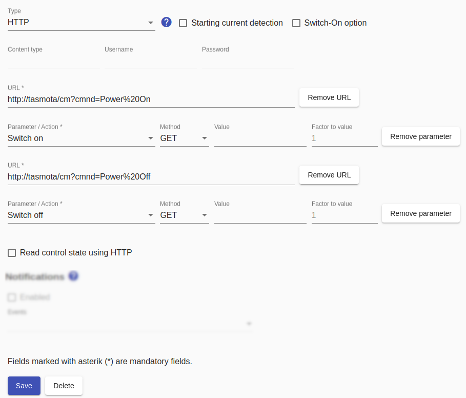

# HTTP switches
For [HTTP-based devices, these general instructions](Http_EN.md) must be observed!

For HTTP-based switches, the actions `Switch on` and `Switch off` must be configured. This can be achieved either with two different URLs or one URL with a different configuration.

Normally, the *Smart Appliance Enabler* knows the state of the device because it sends the commands to turn it on and off and remembers the state. However, this does apply if the device is also switched by other means. In this case, 'Read control state using HTTP' must be activated and another URL can be specified to determine the switching status. A [Regular expression](ValueExtraction_EN.md) must be specified, which must "match" if the switching state is "switched on". For example, if this returns "true" (without quotation marks), then "(true)" (without quotation marks) must be entered as the regular expression.

Für alle URLs lässt sich der `Wert` angeben, der mit der Anfrage gesendet werden soll.

If required, the `Content-Type` can also be specified.



## Log
If a device (here `F-00000001-000000000013-00`) is switched using a HTTP switch, the control request can be displayed in [Log](Logging_EN.md) with the following command:

```console
sae@raspi:~ $ grep Http rolling-2020-06-09.log | grep F-00000001-000000000013-00
2020-06-09 17:35:04,364 INFO [http-nio-8080-exec-5] d.a.s.c.HttpSwitch [HttpSwitch.java:127] F-00000001-000000000013-00: Switching on
2020-06-09 17:35:04,364 DEBUG [http-nio-8080-exec-5] d.a.s.h.HttpTransactionExecutor [HttpTransactionExecutor.java:105] F-00000001-000000000013-00: Sending GET request url=http://localhost:8082/set/hm-rpc.0.PEQxxxxxxx.1.STATE?value=true
2020-06-09 17:35:04,372 DEBUG [http-nio-8080-exec-5] d.a.s.h.HttpTransactionExecutor [HttpTransactionExecutor.java:160] F-00000001-000000000013-00: Response code is 200
```

*Webmin*: In [View Logfile](Logging_EN.md#user-content-webmin-logs) enter `F-00000001-000000000013-00` after `Only show lines with text` and press refresh.
