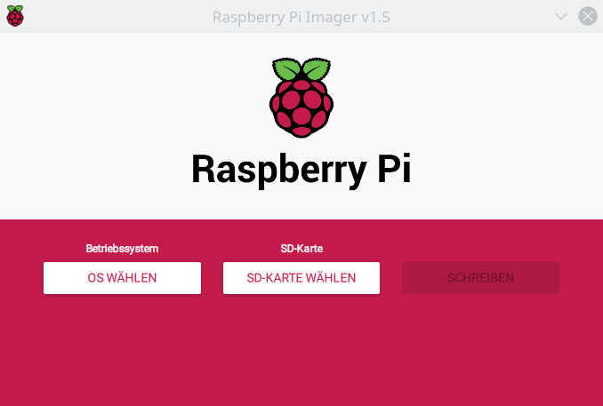
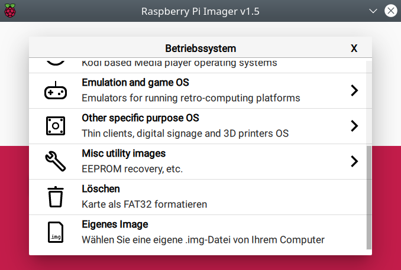
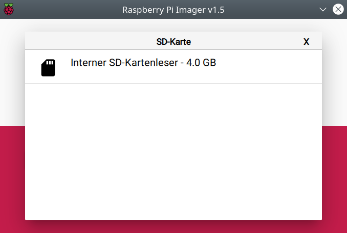
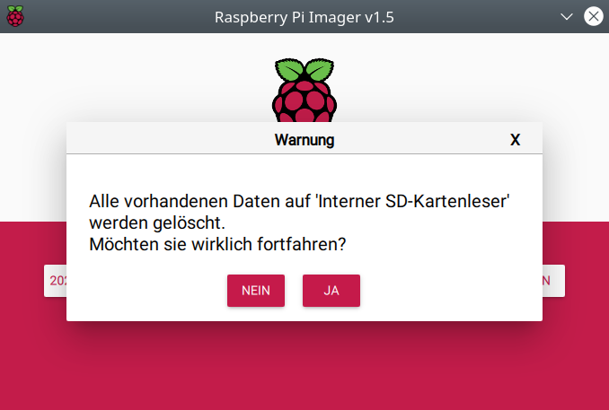
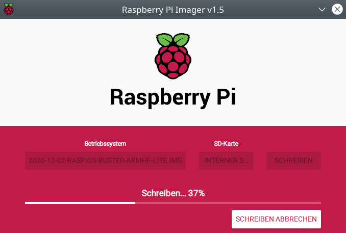
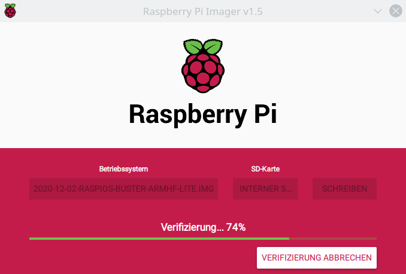
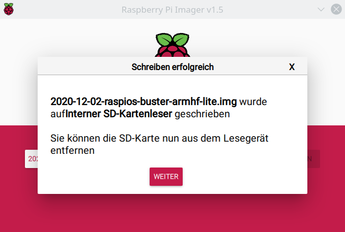

# Standard-Installation

Die hier beschriebene Standard-Installation läuft automatisch ab und erfordert keine Linux-Kenntnisse. Falls notwendig, kann alternativ auch die [manuelle Installation](ManualInstallation_DE.md) gewählt werden, bei der sämtliche Befehle der Dokumentation manuell auszuführen sind.

## Schreiben des Raspberry Pi OS Images auf die SD-Karte  
Jeder Raspberry Pi hat einen Slot für eine SD-Karte die (analog zur Festplatte bei normalen PCs) als Speichermedium dient. Die SD-Karte sollte eine Grösse von mindestens **4 GB** haben.

Die Installation des Betriebssystems für den Raspberry Pi besteht im **Schreiben eines Images auf eine SD-Karte**. Dazu benötigt man neben der SD-Karte entweder einen Laptop oder PC mit fest eingebautem **SD-Kartenleser** oder einen Kartenleser als USB-Stick. Das Image kann nicht einfach auf die SD-Karte kopiert werden, sondern muss mittels eines Programmes wie [Raspberry PI Imager](https://www.raspberrypi.org/software/) auf die SD-Karte geschrieben werden. Die nachfolgende Beschreibung bezieht sich auf dieses Programm, das entsprechend heruntergeladen und installiert werden muss.

Für die vollautomatische Installation des *Smart Appliance Enabler*  muss ein [modifziertes Raspberry Pi OS Image heruntergeladen](https://github.com/camueller/RaspiOSImageAutorunUSBShellScript/releases) werden.

Die ZIP-Datei muss an eine beliebige Stelle entpackt werden - sie enthält lediglich eine Datei mit dem modifizierten Raspberry Pi OS Image.

Jetzt kann der zuvor installierte *Raspberry PI Imager* gestartet werden, der sich nach dem Start so präsentiert:

Nach Klick auf `OS wählen` muss `Eigenes Image` ausgewählt werden, um dann die entpackte Image-Datei auszuwählen:

Als Nächstes muss die SD-Karte in den SD-Kartenleser eingelegt werden.

Im *Raspberry Pi Imager* wird auf `SD-Karte auswählen` geklickt, woraufhin der SD-Kartenleser mit der Grösse der eingelegten SD-Karte angezeigt wird.     

Nach dem Klick auf `Schreiben` erfolgt eine Lösch-Warnung, die man unbedingt ernst nehmen sollte:

Nach Bestätigung der Lösch-Warnung wird das Image auf die SD-Karte geschrieben:

Nach Beendigung des Schreibvorganges wird geprüft, ob es beim Schreiben zu Fehlergekommen ist:

Wenn keine Fehler gefunden wurden, kann die SD-Karte aus dem Kartenleser entnommen werden:

## Vorbereitung der Installation

Zur Vorbereitung der Installation muss die Konfigurationsdatei für das Installationsprogramm [install.config](https://raw.githubusercontent.com/camueller/SmartApplianceEnabler/master/install/install.config) heruntergeladen und für die nachfolgenden Änderungen lokal gespeichert werden.

Hinweise und Beispiele zu den wenigen Konfigurationsparametern finden sich in der Datei selbst. 

Standardmässig wird [webmin](https://www.webmin.com) installiert, wodurch der Raspberry Pi mittels Web-Browser administriert werden kann. Das ist sehr hilfreich, wenn man sich nicht mit Linux auskennt.

Für die Installation muss ein USB-Stick mit folgenden Dateien (und nur diesen!) vorbereitet werden:
- `install.config` mit den vorgenannten Anpassungen
- [install.sh](https://raw.githubusercontent.com/camueller/SmartApplianceEnabler/master/install/install.sh)
- [install2.sh](https://raw.githubusercontent.com/camueller/SmartApplianceEnabler/master/install/install2.sh)

Die Dateinamen dürfen nicht verändert werden (Gross-Kleinschreibung, Dateiendungen). Darauf ist insbesondere unter Windows zu achten, wenn dieses so eingestellt ist, dass sie nicht angezeigt werden!  

## Durchführung der Installation

Der Raspberry Pi muss **von der Stromversorgung getrennt** sein, während die **SD-Karte** mit dem Image in den Schacht für die SD-Karte eingeführt wird.

Falls kein WLAN konfiguriert wurde (in dem für `WIFI_SSID` ein Wert angegeben wurde in der Datei der `install.config`), muss der Raspberry Pi für die Installation mit einem **Netzwerkkabel** verbunden werden.

Jetzt muss der Raspberry Pi **mit der Stromversorgung verbunden** werden. Dabei sollte die rote LED dauerhaft leuchten (zeigt den "eingeschaltet"-Zustand an), während die grüne LED Zugriffe auf die SD-Karte signalisiert. Nach ca. 1 Minute sollte der **Boot-Vorgang** beendet sein, d.h. die grüne LED sollte für mindestens 10 Sekunden nicht mehr leuchten.

Als Nächstes muss der **USB-Stick** in den Raspberry Pi gesteckt werden (egal, welche USB-Buchse). Sobald der Raspberry Pi (dank des modifizieren Images) den USB-Stick erkennt, wird er die **erste Phase der Installation** ausführen. Diese dauert nur einige Sekunden, wobei des Ende durch das **Erlöschen der roten LED** signalisiert wird. 

Jetzt muss der **USB-Stick entfernt** werden. Dadurch wird der Raspberry Pi (dank des modifizieren Images) **automatisch neu gestartet**, die rote LED geht wieder an und die **zweite Phase der Installation** beginnt. Dabei wird die Software des Raspberry Pi auf den aktuellen Stand gebracht, der *Smart Appliance Enabler* und ggf. *webmin* installiert. In Abhängikeit vom Raspberry Pi Modell, der Geschwindkeit der SD-Karte und der Internetanbindung kann diese Phase einige Zeit dauern (auf meinem Raspberry Pi 4 Model B dauert es 22 Minuten). Wenn die Installation beendet ist, wird die **rote LED für eine Stunde ausgeschaltet**.

Der *Smart Appliance Enabler* läuft jetzt und es kann mit der [Konfiguration](Configuration_DE.md) fortgefahren werden werden.

Auch die Software zur Administration via Web-Browser (*webmin*) soll jetzt laufen - siehe [Hinweise zur Nutzung von webmin für *Smart Appliance Enabler*](Webmin_DE.md).

# Update

## Vorbereitung des Updates

Zur Vorbereitung der Installation muss die Konfigurationsdatei für das Update [update.config](https://raw.githubusercontent.com/camueller/SmartApplianceEnabler/master/install/update.config) heruntergeladen und für die nachfolgenden Änderungen lokal gespeichert werden.

Hinweise und Beispiele zu den wenigen Konfigurationsparametern finden sich in der Datei selbst.

Für das Update muss ein USB-Stick mit folgenden Dateien (und nur diesen!) vorbereitet werden:
- `update.config` mit den anpassten Konfigurationsparametern
- [update.sh](https://raw.githubusercontent.com/camueller/SmartApplianceEnabler/master/install/update.sh)
- [update2.sh](https://raw.githubusercontent.com/camueller/SmartApplianceEnabler/master/install/update2.sh)

Die Dateinamen dürfen nicht verändert werden (Gross-Kleinschreibung, Dateiendungen). Darauf ist insbesondere unter Windows zu achten, wenn dieses so eingestellt ist, dass sie nicht angezeigt werden!  

## Durchführung des Updates

Das Update kann nur durchgeführt werden, wenn der Raspberry Pi mit dem WLAN oder Ethernet verbunden ist.

Zur Starten des Updates muss der **USB-Stick** in den Raspberry Pi gesteckt werden (egal, welche USB-Buchse). Sobald der Raspberry Pi (dank des modifizieren Images) den USB-Stick erkennt, wird er die **erste Phase des Updates** ausführen. Diese dauert nur einige Sekunden, wobei des Ende durch das **Erlöschen der roten LED** signalisiert wird.

Jetzt muss der **USB-Stick entfernt** werden. Dadurch wird der Raspberry Pi (dank des modifizieren Images) **automatisch neu gestartet**, die rote LED geht wieder an und die **zweite Phase des Updates**  beginnt. Dabei wird die neueste Version des *Smart Appliance Enabler* heruntergeladen und installiert. Anschliessend wird der *Smart Appliance Enabler* neu gestartet. Diese Phase sollte nur wenige Minuten dauern. Wenn das Update beendet ist, wird die **rote LED für eine Stunde ausgeschaltet**.
