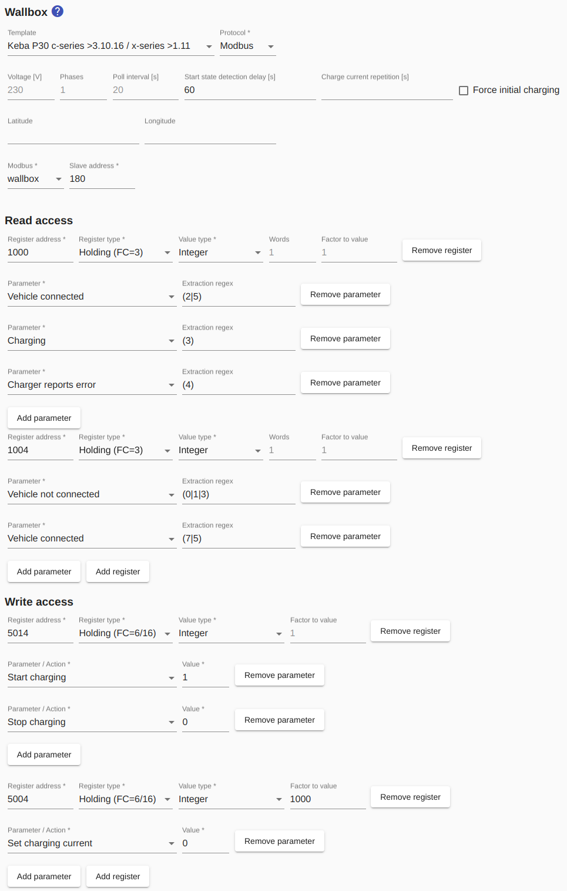
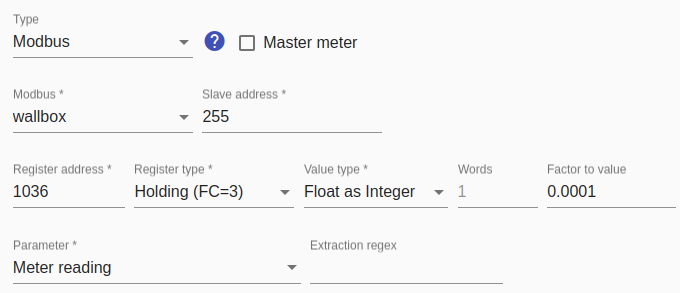

# Keba KeContact P30 c-series / x-series

[Keba](https://www.keba.com/de/emobility/elektromobilitaet) has its wall boxes *KeContact P30 c-series* (firmware version >3.10.16) and *KeContact P30 x-series* (software Version >1.11) has been upgraded to support the Modbus protocol, after previously only supporting a proprietary UDP protocol.

When using this wallbox, no separate electricity meter is required because the meter value is provided by the wallbox itself with high accuracy and the *Smart Appliance Enabler* calculates the current power consumption from it.

## Device configuration
The firmware version must have at least the above status.

## Configuration in Smart Appliance Enabler

### Wallbox

The template `Keba P30 c-series >3.10.16 / x-series >1.11` should be used for the configuration - this means that all fields are filled out correctly. Only the Modbus instance still has to be selected

### Meter

As written above, the wallbox itself provides the meter values, i.e. the same Modbus instance must be used for the meter configuration as for the wallbox itself.

The 'slave address' must be set to 255, as with the wallbox.

The meter reading is provided in `Register 1036`.

The `Register type` is `Holding (FC=3)`.

The `value type` must be set to `Float as Integer`.

Nothing needs to be entered for `words`.

The `factor to value` must be set to `0.0001`.

`Meter reading` is to be selected as the `parameter`.

