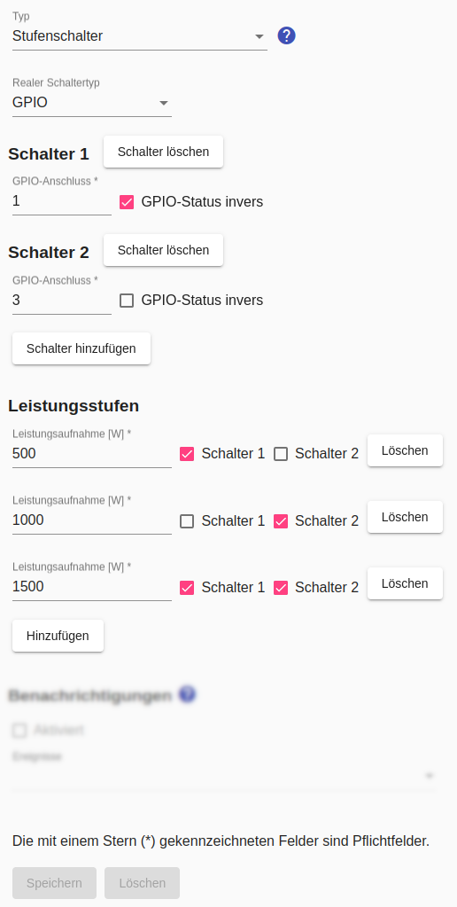

# Stufenschalter
Ein Stufenschalter ermöglicht die Steuerung von Verbrauchern mit **variabler Leistungsaufnahme**, sofern sich Leistungsstufen durch eine Kombination mehrerer Schalter steuern lassen. Diese können GPIO-, HTTP- oder Modbus-Schalter sein.

In den [Einstellungen für das Gerät](Appliance_DE.md) muss ein Wert für die *Min. Leistungsaufnahme* eingegeben werden. Ausserdem muss ein [Zeitplan für Überschussenergie](Schedules_DE.md) konfiguriert sein.

Die nachfolgende Abbildung zeigt die Konfiguration einens Stufenschalters für einen [Heizstab, dessen Leistungsaufnahme zwischen 0,5 kW und 3,5 kW in Schritten von 0,5 kW](https://www.killus-technik.de/de/heizungszubehoer/elektro-heizstaebe/photovoltaik-vario-heizer-0-5-3-5-kw.html) gesteuert werden kann:



## Log
Wird ein Gerät (hier `F-00000001-000000000001-00`) mit konfiguriertem Stufenschalter gesteuert, kann man die Steuerbefehle im [Log](Logging_DE.md) mit folgendem Befehl anzeigen:

```bash
$ grep "c.LevelSwitch" /tmp/rolling-2022-04-09.log | grep F-00000001-000000000001-00
2022-04-09 06:40:09,762 INFO [MQTT Call: F-00000001-000000000001-00-LevelSwitch] d.a.s.c.LevelSwitch [LevelSwitch.java:199] F-00000001-000000000001-00: Setting power to 2500W
2022-04-09 06:40:09,763 DEBUG [MQTT Call: F-00000001-000000000001-00-LevelSwitch] d.a.s.c.LevelSwitch [LevelSwitch.java:191] F-00000001-000000000001-00: Setting wrapped control switch 1 to on
2022-04-09 06:40:09,763 DEBUG [MQTT Call: F-00000001-000000000001-00-LevelSwitch] d.a.s.c.LevelSwitch [LevelSwitch.java:191] F-00000001-000000000001-00: Setting wrapped control switch 2 to off
2022-04-09 06:40:09,764 DEBUG [MQTT Call: F-00000001-000000000001-00-LevelSwitch] d.a.s.c.LevelSwitch [LevelSwitch.java:191] F-00000001-000000000001-00: Setting wrapped control switch 3 to on
```

*Webmin*: In [View Logfile](Logging_DE.md#user-content-webmin-logs) gibt man hinter `Only show lines with text` ein `c.LevelSwitch` und drückt Refresh.