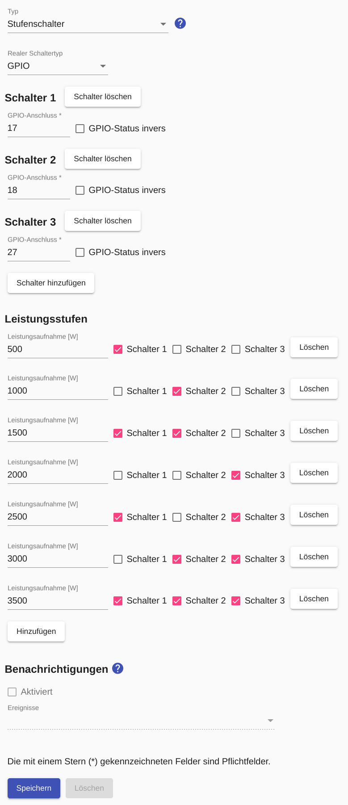

# Level switch

A level switch enables consumers with **variable power consumption** to be controlled if power levels can be controlled by a combination of several switches. These can be GPIO, HTTP or Modbus switches.

In the [Appliance Settings](Appliance_EN.md) a value for the *Min. Power consumption* can be entered. In addition, an [Excess Energy Schedule](Schedules_EN.md) must be configured.

The figure below shows the configuration of a step switch for a [heating rod whose power consumption is between 0.5 kW and 3.5 kW in steps of 0.5 kW](https://www.killus-technik.de/de/heizungszubehoer/ electric-heating rods/photovoltaic-vario-heater-0-5-3-5-kw.html) can be controlled:



## Log
If a device (here `F-00000001-000000000001-00`) is controlled with a configured step switch, the control commands can be displayed in [Log](Logging_EN.md) with the following command:

```console
sae@raspi2:~ $ grep "c.LevelSwitch" /tmp/rolling-2022-04-09.log | grep F-00000001-000000000001-00
2022-04-09 06:40:09,762 INFO [MQTT Call: F-00000001-000000000001-00-LevelSwitch] d.a.s.c.LevelSwitch [LevelSwitch.java:199] F-00000001-000000000001-00: Setting power to 2500W
2022-04-09 06:40:09,763 DEBUG [MQTT Call: F-00000001-000000000001-00-LevelSwitch] d.a.s.c.LevelSwitch [LevelSwitch.java:191] F-00000001-000000000001-00: Setting wrapped control switch 1 to on
2022-04-09 06:40:09,763 DEBUG [MQTT Call: F-00000001-000000000001-00-LevelSwitch] d.a.s.c.LevelSwitch [LevelSwitch.java:191] F-00000001-000000000001-00: Setting wrapped control switch 2 to off
2022-04-09 06:40:09,764 DEBUG [MQTT Call: F-00000001-000000000001-00-LevelSwitch] d.a.s.c.LevelSwitch [LevelSwitch.java:191] F-00000001-000000000001-00: Setting wrapped control switch 3 to on
```

*Webmin*: In [View Logfile](Logging_EN.md#user-content-webmin-logs) enter `c.LevelSwitch` after `Only show lines with text` and press refresh.