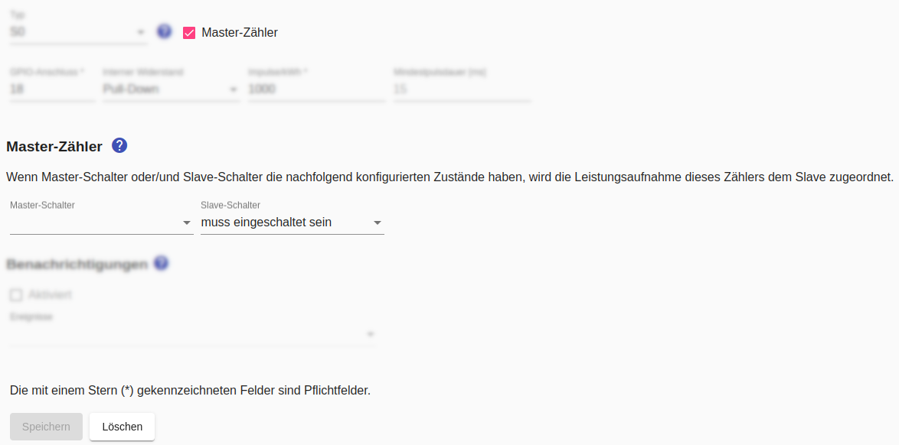
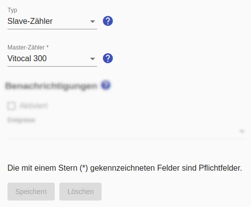

# Master/Slave-Zähler

Der **Master-Zähler** dient zusammen mit dem **Slave-Zähler** dazu, dass sich zwei Appliances im *Smart Appliance Enabler* einen physischen Zähler teilen können. Einer Appliance wird dabei der **Master-Zähler** zugewiesen, der anderen Appliance der **Slave-Zähler**.

## Master-Zähler
Wenn man einen Zähler als Master-Zähler markiert, werden zwei zusätzliche Felder eingeblendet, mit denen man den Schalterzustand konfigurieren kann, bei dem der Zähler zu diesem Zeitpunkt dem Appliance mit dem Slave-Zähler zugeordnet wird. Ist der konfigurierte Schalterzustand nicht gegeben wird der Zähler zu diesem Zeitpunkt dem Appliance mit dem Master-Zähler zugeordnet.

Mindestens für einen der beiden Schalter muss eine nicht-leere Auswahl getroffen werden.

## Slave-Zähler
Nachdem man der Zähler eines Appliance als **Master-Zähler** markiert wurde, kann man beim Slave-Appliance den Typ des Zählers auf `Slave-Zähler` setzen. Daraufhin wird ein Feld zur Auswahl des Master-Zählers eingeblendet.

