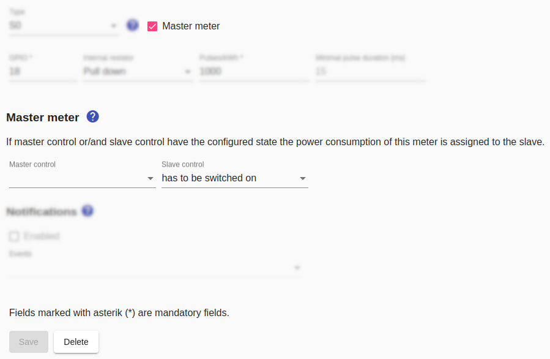
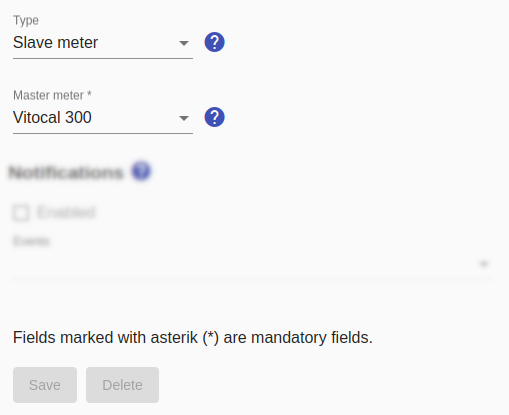

# Master/Slave meter
The **master meter** is used together with the **slave meter** so that two appliances can share a physical electricity meter in the *Smart Appliance Enabler*. The **master meter** is assigned to one appliance and the **slave meter** to the other appliance.

## Master meter
Marking a meter as the master meter will bring up two additional fields that allow you to configure the switch state at which the meter is currently associated with the appliance with the slave meter. If the configured switch state is not given, the meter is assigned to the appliance with the master meter at this point in time.

A non-empty selection must be made for at least one of the two switches.

## Slave meter
After marking the meter of an appliance as **master meter**, you can set the meter type to `slave meter` on the slave appliance. A box for selecting the master meter will appear.

