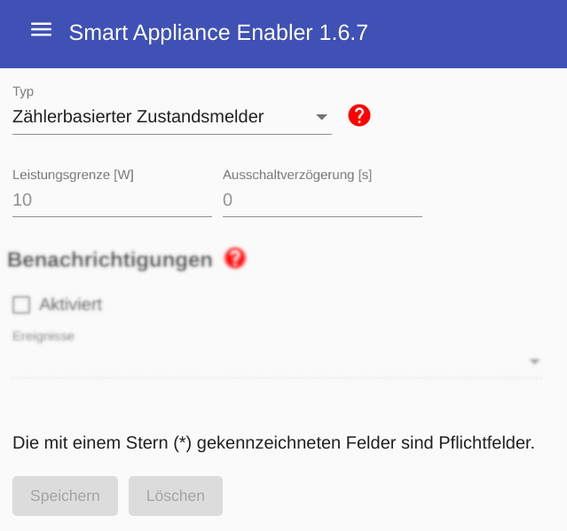

# Zählerbasierter Zustandsmelder
Wie der Name bereits vermuten läßt, wird dieser Schalter nicht aktiv geschaltet, sondern es wird lediglich der Schaltzustand auf Basis der aktuellen Leistungsaufnahme bestimmt.

Dementsprechend gibt es einen Parameter zur Festlegung der Leistungsaufnahme, oberhalb derer der Status als "eingeschaltet" gewertet wird. Standardwert sind 10W.

Außerdem gibt es einen Parameter `Ausschaltverzögerung`. Innerhalb der angegebenen Dauer darf die Leistungsaufnahme nie oberhalb der Leistungsgrenze liegen. Für Geräte mit schwankender Leistungsaufnahme kann hier ein Wert größer 0 eingetragen werden um zu verhindern, dass der gemeldete Gerätezustand immer zwischen "eingeschaltet" und "ausgeschaltet" wechselt.  

