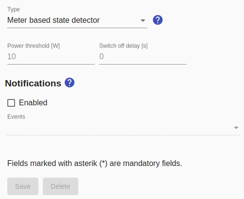

# Meter reporting switch

As the name already suggests, this switch is not switched actively, but only the switching status based on the current power consumption is reported.

Accordingly, there is a parameter to specify the power above which the status is considered "on". Default is 10W.

There is also a parameter `switch off delay`. Within the specified period, the power consumption must never be above the power limit. A value greater than 0 can be entered here for devices with fluctuating power consumption in order to prevent the reported device status from always changing between "switched on" and "switched off".

