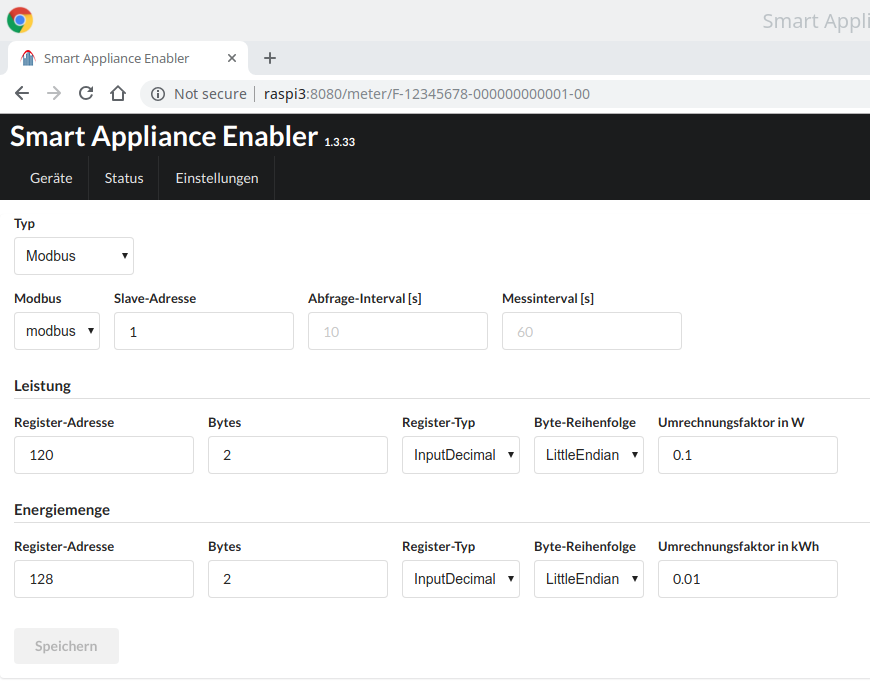

# Modbus-Stromzähler

Für Modbus-Schalter gelten die allgemeinen Hinweise zur Verwendung von [Modbus im SmartApplianceEnabler](Modbus_DE.md).

Stromzähler mit [Modbus](https://de.wikipedia.org/wiki/Modbus)-Protokoll erlauben die Abfrage diverser Werte, wobei jeder Wert aus einem bestimmten Register gelesen werden muss. Für den *Smart Appliance Enabler* ist lediglich der Wert *aktuelle Leistung* bzw. *active power* interessant.



Wird ein Zähler über Modbus abgefragt, finden sich in der [Log-Datei](Support.md#Log) für jede Abfrage folgende Zeilen:
```
2019-03-21 00:02:55,700 DEBUG [http-nio-8080-exec-5] d.a.s.m.ModbusSlave [ModbusSlave.java:76] F-00000001-000000000006-00: Connecting to modbus modbus@127.0.0.1:502
2019-03-21 00:02:55,744 DEBUG [http-nio-8080-exec-5] d.a.s.m.e.ReadFloatInputRegisterExecutorImpl [ReadInputRegisterExecutor.java:57] F-00000001-000000000006-00: Input register=72 value=[17975, 11024]
2019-03-21 00:02:55,748 DEBUG [http-nio-8080-exec-5] d.a.s.m.ModbusElectricityMeter [ModbusElectricityMeter.java:180] F-00000001-000000000006-00: Float value=11722.766
2019-03-21 00:02:55,750 DEBUG [http-nio-8080-exec-5] d.a.s.m.PollEnergyMeter [PollEnergyMeter.java:62] F-00000001-000000000006-00: energy=0.0kWh totalEnergy=null startEnergyCounter=null currentEnergyCounter=11722.766 started=false
2019-03-21 00:02:55,751 DEBUG [http-nio-8080-exec-5] d.a.s.a.Appliance [Appliance.java:625] F-00000001-000000000006-00: energy metered: 0.0 kWh
```

## Schaltbeispiel 1: 240V-Gerät mit Stromverbrauchsmessung
Der Aufbau zum Messen des Stromverbrauchs eines 240V-Gerätes (z.B. Pumpe) könnte wie folgt aussehen, wobei diese Schaltung natürlich um einen [Schalter](https://github.com/camueller/SmartApplianceEnabler/blob/master/README.md#schalter) erweitert werden kann, wenn neben dem Messen auch geschaltet werden soll.


