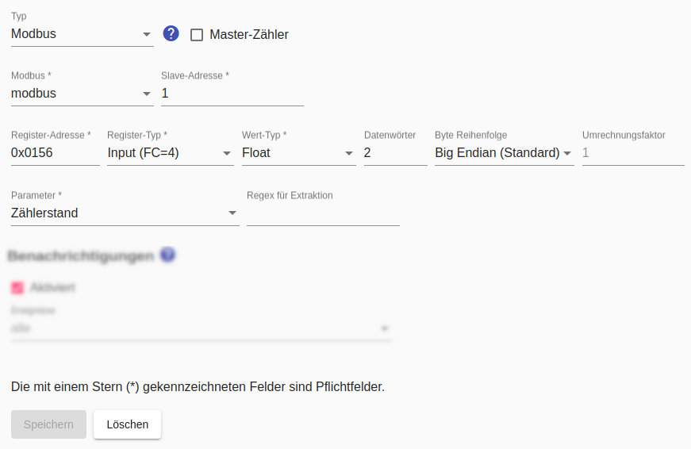
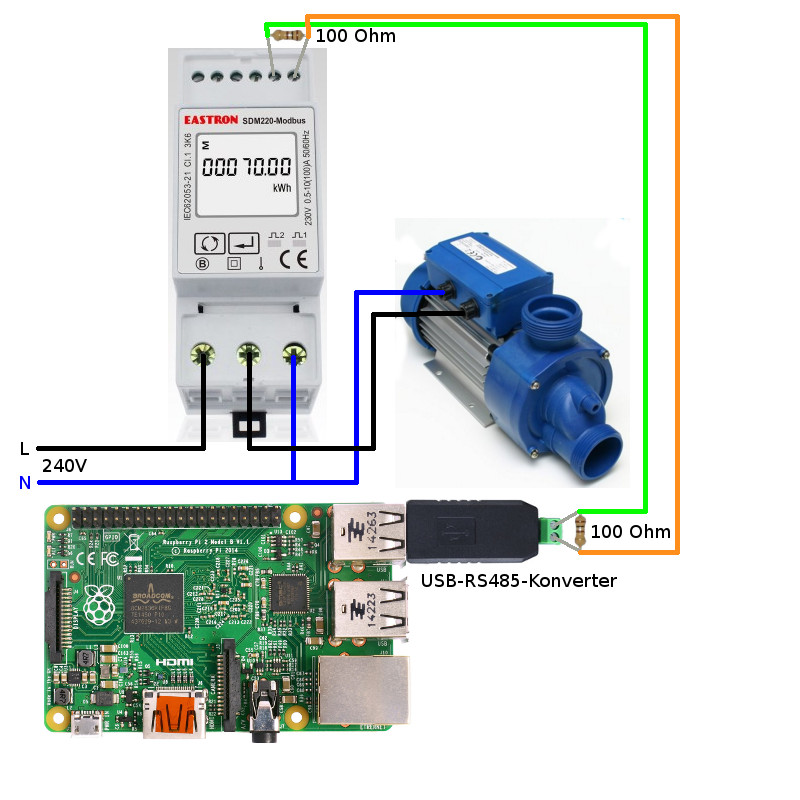

# Modbus-Stromzähler
Für Modbus-Schalter gelten die allgemeinen Hinweise zur Verwendung von [Modbus im SmartApplianceEnabler](Modbus_DE.md).

Nach Möglichkeit sollte als Parameter `Zählerstand` eingstellt werden, weil der *Smart Appliance Enabler* dann diesen Wert **nur einmal pro Minute abfragen** muss und aus der Differenz zur vorangegangen Anfrage die Leistung sehr genau berechnet kann.

Wird als Parameter `Leistung` eingestellt, erfolgt die Abfrage dieses Wertes mehrmals pro Minute, um aus diesen Werten den Durschnitt zu berechnen. Der zeitliche Abstand zwischen diesen Abfragen kann mit dem `Abfrage-Intervall` festgelegt werden - der Standardwert sind 20 Sekunden.

Für den Parameter `Zählerstand` wird der Wert in kWh und für den Parameter `Leistung` in W benötigt. Falls die Werte in anderen Einheiten geliefert werden, muss ein muss ein `Umrechnungsfaktor` angegeben werden, der mit dem gelieferten Wert multipliziert wird, um ihn in die benötigte Einheit umzurechnen. Wird beispielsweise der Parameter `Leistung` in mW geliefert, muss als `Umrechnungsfaktor` der Wert `0.001` angegeben werden.



## Log
Wird ein Modbus-Zähler für das Gerät `F-00000001-000000000005-00` verwendet, kann man die ermittelte Leistungsaufnahme im [Log](Logging_DE.md) mit folgendem Befehl anzeigen:

```console
sae@raspi:~ $ grep 'Modbus\|Register' /tmp/rolling-2020-12-30.log | grep F-00000001-000000000019-00
2020-12-30 14:33:51,483 DEBUG [http-nio-8080-exec-7] d.a.s.m.ModbusSlave [ModbusSlave.java:76] F-00000001-000000000019-00: Connecting to modbus modbus@127.0.0.1:502
2020-12-30 14:33:51,546 DEBUG [http-nio-8080-exec-7] d.a.s.m.e.ReadFloatInputRegisterExecutorImpl [ReadInputRegisterExecutor.java:57] F-00000001-000000000019-00: Input register=342 value=[17668, 65470, 0, 0]
2020-12-30 14:33:51,550 DEBUG [http-nio-8080-exec-7] d.a.s.m.ModbusElectricityMeter [ModbusElectricityMeter.java:219] F-00000001-000000000019-00: Float value=2127.984
2020-12-30 14:33:51,551 DEBUG [http-nio-8080-exec-7] d.a.s.m.ModbusElectricityMeter [ModbusElectricityMeter.java:88] F-00000001-000000000019-00: average power = 6895W
```

*Webmin*: In [View Logfile](Logging_DE.md#user-content-webmin-logs) gibt man hinter `Only show lines with text` ein `Modbus` und drückt Refresh.

## Schaltbeispiel: 240V-Gerät mit Stromverbrauchsmessung
Das Schaltbeispiel zeigt den Anschluss eines 240V-Gerätes an einen Modbus-Stromzähler. Bei einem 400V-Gerät (z.B. Wallbox) werden statt dem Leiter L die drei Leiter L1, L2, L3 angeschlossen. In beiden Fällen besteht ein Modbus aus einem zweiadrigen Kabel (optional 3-adrig, falls GND verbunden wird), das bis zu 1200m lang sein darf. Bei dem Kabel kann es sich z.B. Klingeldraht, Telefon-Kabel oder Ethernet-Kabel handeln. Der Modbus verbindet die Anschlüsse A und B (und optional GND) des USB-RS485-Konverters mit den Anschlüssen A und B (und optional GND) des Modbus-Stromzählers. Von dort kann das Kabel bei Bedarf zu weiteren Modbus-Geräten verlegt werden. Wichtig ist, dass am USB-RS485-Konverters und am letzten Modbus-Gerät jeweils zwischen A und B ein 100-Ohm-Widerstand angeschlossen wird.


