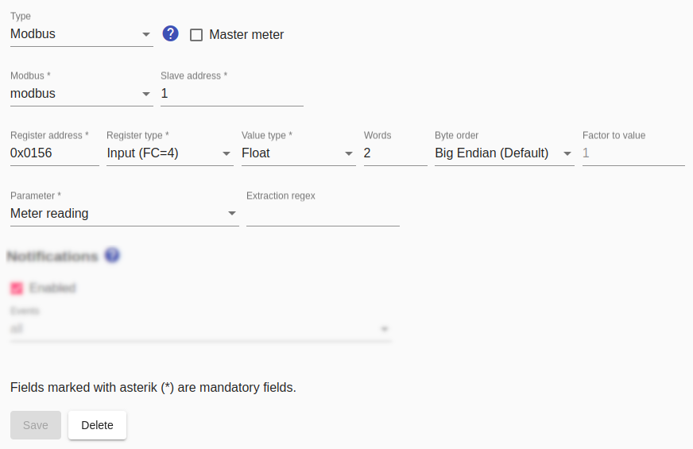

# Modbus meter
The general notes on using [Modbus in the SmartApplianceEnabler](Modbus_EN.md) apply to Modbus switches.

If possible, `Meter reading` should be set as the parameter, because the *Smart Appliance Enabler* then only has to query this value **once per minute** and can calculate the power very precisely from the difference to the previous query.

If `Power` is set as the parameter, this value is queried several times per minute in order to calculate the average from these values. The interval between these queries can be specified with the `poll Interval` - the default value is 20 seconds.

For parameter `Meter reading` the value has to be provided in kWh and for parameter `Power` the value has to be provided in W. If the values are supplied in other units, a `factor to value` must be specified, which is multiplied by the supplied value to convert it into the required unit. For example, if the parameter `Power` is supplied in mW, the value `0.001` must be specified as the `factor to value`.



## Log
If a Modbus meter is used for the device `F-00000001-000000000005-00`, the determined power consumption can be displayed in [Log](Logging_EN.md) with the following command:

```console
sae@raspi:~ $ grep 'Modbus\|Register' /tmp/rolling-2020-12-30.log | grep F-00000001-000000000019-00
2020-12-30 14:33:51,483 DEBUG [http-nio-8080-exec-7] d.a.s.m.ModbusSlave [ModbusSlave.java:76] F-00000001-000000000019-00: Connecting to modbus modbus@127.0.0.1:502
2020-12-30 14:33:51,546 DEBUG [http-nio-8080-exec-7] d.a.s.m.e.ReadFloatInputRegisterExecutorImpl [ReadInputRegisterExecutor.java:57] F-00000001-000000000019-00: Input register=342 value=[17668, 65470, 0, 0]
2020-12-30 14:33:51,550 DEBUG [http-nio-8080-exec-7] d.a.s.m.ModbusElectricityMeter [ModbusElectricityMeter.java:219] F-00000001-000000000019-00: Float value=2127.984
2020-12-30 14:33:51,551 DEBUG [http-nio-8080-exec-7] d.a.s.m.ModbusElectricityMeter [ModbusElectricityMeter.java:88] F-00000001-000000000019-00: average power = 6895W
```

*Webmin*: In [View Logfile](Logging_EN.md#user-content-webmin-logs) enter `Modbus` after `Only show lines with text` and press Refresh.

## Wiring example: 240V device with power consumption measurement
The wiring example shows the connection of a 240V device to a Modbus electricity meter. With a 400V device (e.g. wall box), the three conductors L1, L2, L3 are connected instead of the L conductor. In both cases, a Modbus consists of a two-wire cable (optionally three-wire if GND is connected), which can be up to 1200m long. The cable can be, for example, ring wire, telephone cable or Ethernet cable. The Modbus connects the A and B (and optional GND) terminals of the USB-RS485 converter to the A and B (and optional GND) terminals of the Modbus electricity meter. From there, the cable can be routed to other Modbus devices if required. It is important that a 100 ohm resistor is connected between A and B on the USB-RS485 converter and on the last Modbus device.


