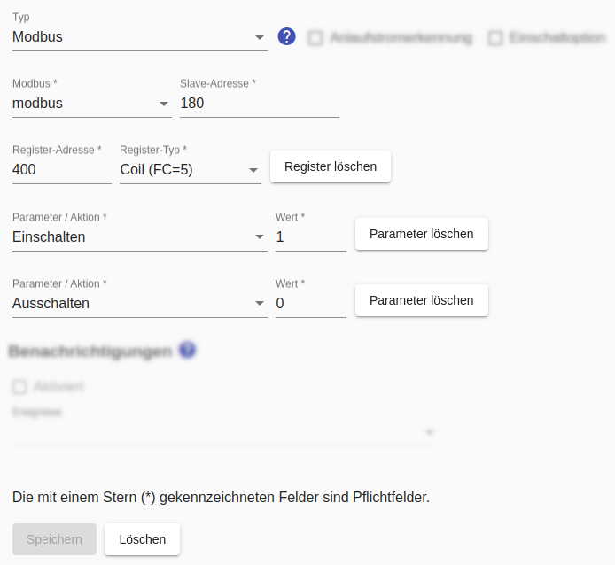

# Modbus-Schalter
Für Modbus-Schalter gelten die allgemeinen Hinweise zur Verwendung von [Modbus im SmartApplianceEnabler](Modbus_DE.md).

Für einen Modbus-Schalter müssen 
* `Register-Adresse` und `Register-Typ` eingegeben werden und
* die Aktionen `Einschalten` und `Auschalten` konfiguriert werden. Das kann wahlweise über ein Register mit unterschiedlichen Werten oder über zwei Register erreicht werden.



## Log
Wird ein Gerät (hier `F-00000001-000000000019-00`) mittels Modbus-Schalter geschaltet, kann man den Schaltbefehl im [Log](Logging_DE.md) mit folgendem Befehl anzeigen:

```bash
$ grep 'Modbus\|Register' /tmp/rolling-2020-12-30.log | grep F-00000001-000000000019-00
2020-12-30 14:30:09,982 DEBUG [http-nio-8080-exec-9] d.a.s.c.ModbusSwitch [ModbusSwitch.java:100] F-00000001-000000000019-00: Switching on
2020-12-30 14:30:09,983 DEBUG [http-nio-8080-exec-9] d.a.s.m.ModbusSlave [ModbusSlave.java:76] F-00000001-000000000019-00: Connecting to modbus wallbox@modbus:502
2020-12-30 14:30:09,991 DEBUG [http-nio-8080-exec-9] d.a.s.m.e.ReadInputRegisterExecutor [WriteHoldingRegisterExecutorImpl.java:67] F-00000001-000000000019-00: Write holding register=300 value=1 confirmedValue=1
```

*Webmin*: In [View Logfile](Logging_DE.md#user-content-webmin-logs) gibt man hinter `Only show lines with text` den Text `Modbus` ein und drückt Refresh.
