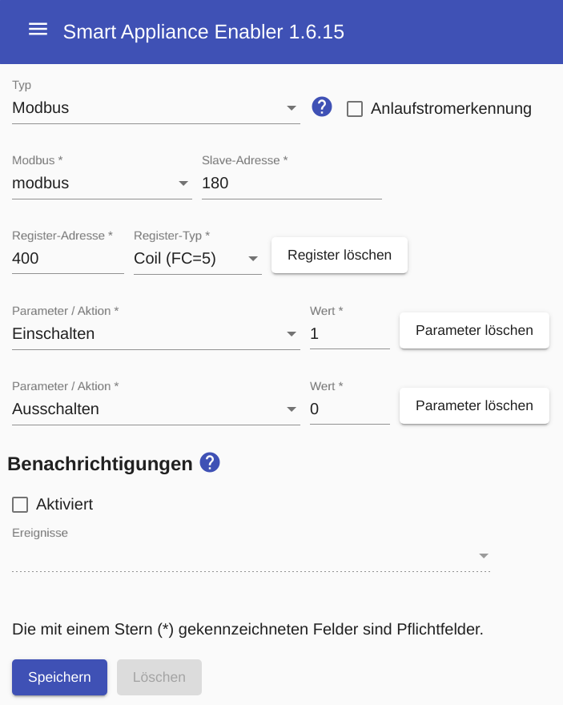

# Modbus-basierte Schalter

Für Modbus-Schalter gelten die allgemeinen Hinweise zur Verwendung von [Modbus im SmartApplianceEnabler](Modbus_DE.md).

Bevor ein Modbus-basierter Schalter konfiguriert werden kann, muss ein [Modbus/TCP](Settings_DE.md#Modbus) konfiguriert werden, der dann in der Konfiguration des Modbus-basierten Schalters ausgewählt wird.
Außerdem müssen Slave-Adresse, sowie  Register-Adresse und -Typ eingegeben werden. Auch die Werte zum Ein- bzw. Ausschalten müssen angegeben werden.



## Log

Wird ein Gerät (hier `F-00000001-000000000019-00`) mittels HTTP-Schalter geschaltet, kann man den Schaltbefehl im [Log](Logging_DE.md) mit folgendem Befehl anzeigen:

```console
sae@raspi:~ $ grep 'Modbus\|Register' /tmp/rolling-2020-12-30.log | grep F-00000001-000000000019-00
2020-12-30 14:30:09,982 DEBUG [http-nio-8080-exec-9] d.a.s.c.ModbusSwitch [ModbusSwitch.java:100] F-00000001-000000000019-00: Switching on
2020-12-30 14:30:09,983 DEBUG [http-nio-8080-exec-9] d.a.s.m.ModbusSlave [ModbusSlave.java:76] F-00000001-000000000019-00: Connecting to modbus wallbox@modbus:502
2020-12-30 14:30:09,991 DEBUG [http-nio-8080-exec-9] d.a.s.m.e.ReadInputRegisterExecutor [WriteHoldingRegisterExecutorImpl.java:67] F-00000001-000000000019-00: Write holding register=300 value=1 confirmedValue=1
```
