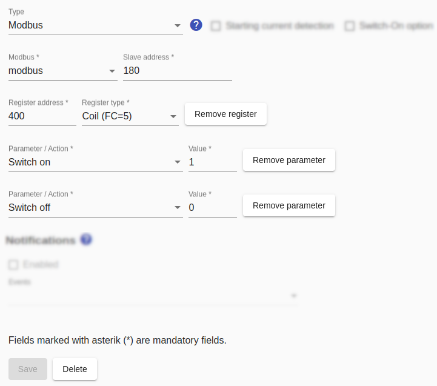

# Modbus switches
The general notes on using [Modbus in the SmartApplianceEnabler](Modbus_EN.md) apply to Modbus switches.

For a Modbus switch, register address and type must be entered.

For Modbus switches, the actions `switch on` and `switch off` must be configured. This can be achieved either via a register with different values ​​or via two registers.



## Log
If a device (here `F-00000001-000000000019-00`) is switched using an HTTP switch, the switching command can be displayed in [Log](Logging_EN.md) with the following command:

```console
sae@raspi:~ $ grep 'Modbus\|Register' /tmp/rolling-2020-12-30.log | grep F-00000001-000000000019-00
2020-12-30 14:30:09,982 DEBUG [http-nio-8080-exec-9] d.a.s.c.ModbusSwitch [ModbusSwitch.java:100] F-00000001-000000000019-00: Switching on
2020-12-30 14:30:09,983 DEBUG [http-nio-8080-exec-9] d.a.s.m.ModbusSlave [ModbusSlave.java:76] F-00000001-000000000019-00: Connecting to modbus wallbox@modbus:502
2020-12-30 14:30:09,991 DEBUG [http-nio-8080-exec-9] d.a.s.m.e.ReadInputRegisterExecutor [WriteHoldingRegisterExecutorImpl.java:67] F-00000001-000000000019-00: Write holding register=300 value=1 confirmedValue=1
```

*Webmin*: In [View Logfile](Logging_EN.md#user-content-webmin-logs) enter `Modbus` after `Only show lines with text` and press Refresh.
