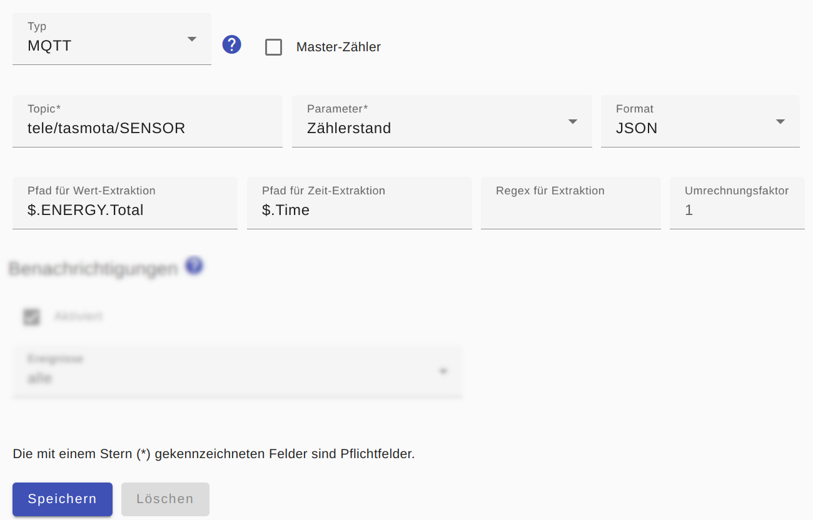

# MQTT-basierte Zähler

Damit MQTT-Nachrichten als Datenquelle verwendet werden können, sollte eine aktuelle MQTT-Nachricht idealerweise alle 60s (aber nicht häufiger als alle 20s) verschickt werden.

Für einen MQTT-Zähler muss dessen `Topic` angegeben werden sowie der `Parameter`, welcher `Zählerstand` oder `Leistung` sein kann in Abhängikeit von den in der MQTT-Nachricht vorhandenen Werten.

Wenn die MQTT-Nachticht im **JSON-Format** geliefert wird, sollte das als `Format` eingestellt werden. Damit lässt sich durch die Angabe des `Pfad für Extraktion` der Zahlenwert sehr leicht [aus der MQTT-Nachricht extrahieren](ValueExtraction_DE.md). Wird der optionale `Pfad für die Zeit-Extraktion` angegeben, wird die aus der MQTT-Nachricht extrahierte Zeit anstelle der aktuellen Zeit für die weitere Verarbeitung verwendet.

Alternativ (oder auch nachgelagert zur JSON-Interpretation) kann ein [regulärer Ausdruck zum Extrahieren](ValueExtraction_DE.md) angegeben werden, falls der Zahlenwert aus einem Text (XML, ...) extrahiert werden muss. Dies gilt auch, wenn die MQTT-Nachricht scheinbar nur die Zahl enthält, diese aber auch einen Zeilenumbruch (CR/LF) beinhaltet.

Für den Parameter `Zählerstand` wird der Wert in kWh und für den Parameter `Leistung` in W benötigt. Falls die Werte in anderen Einheiten geliefert werden, muss ein `Umrechnungsfaktor` angegeben werden, der mit dem gelieferten Wert multipliziert wird. Wird beispielsweise der Parameter `Leistung` in mW geliefert, muss als `Umrechnungsfaktor` der Wert `0.001` angegeben werden.



## Log
Wird ein MQTT-Zähler für das Gerät `F-00000001-000000000005-00` verwendet, kann man die ermittelte Leistungsaufnahme im [Log](Logging_DE.md) mit folgendem Befehl anzeigen:

```bash
$ grep 'MQTT' /tmp/rolling-2020-12-30.log | grep F-00000001-000000000005-00
2023-04-04 18:01:33,964 TRACE [MQTT Call: F-00000001-000000000005-00-MqttElectricityMeter-0] d.a.s.m.MqttElectricityMeter [MqttElectricityMeter.java:147] F-00000001-000000000005-00: MQTT message received: {"Time":"2023-04-04T17:01:33","Switch1":"ON","ENERGY":{"TotalStartTime":"2020-01-05T12:41:22","Total":14.68792,"Yesterday":0.00001,"Today":0.00869,"Period":1,"Power":32,"ApparentPower":35,"ReactivePower":16,"Factor":0.89,"Voltage":238,"Current":0.148}}
2023-04-04 18:01:33,965 DEBUG [MQTT Call: F-00000001-000000000005-00-MqttElectricityMeter-0] d.a.s.u.ValueExtractor [ValueExtractor.java:58] F-00000001-000000000005-00: value=14.68792 inputValue=14.68792 valueExtractionRegex=null extractedValue=null factorToValue=null
2023-04-04 18:01:33,967 DEBUG [MQTT Call: F-00000001-000000000005-00-MqttElectricityMeter-0] d.a.s.m.PollEnergyMeter [PollEnergyMeter.java:108] F-00000001-000000000005-00: Calculating power from energy: power=32 currentEnergyCounter=14.68792 previousEnergyCounter=14.68738 diffEnergy=0.00054 diffTime=60000
2023-04-04 18:01:33,967 TRACE [MQTT Call: F-00000001-000000000005-00-MqttElectricityMeter-0] d.a.s.m.PollEnergyMeter [PollEnergyMeter.java:130] F-00000001-000000000005-00: energy=14.68792kWh totalEnergy=null startEnergyCounter=0.0 currentEnergyCounter=14.68792 started=true
```

*Webmin*: In [View Logfile](Logging_DE.md#user-content-webmin-logs) gibt man hinter `Only show lines with text` den Text `F-00000001-000000000005-00` ein und drückt Refresh.
