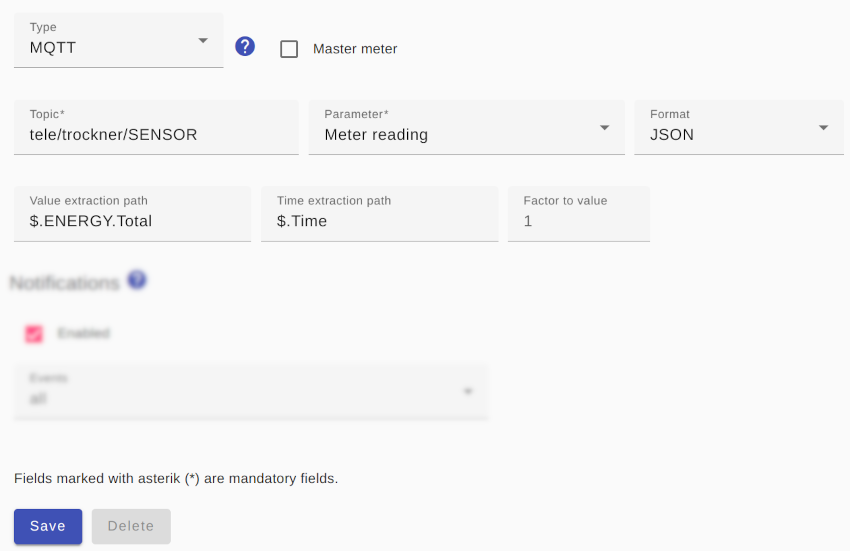

# MQTT meter

In order for MQTT messages to be used as a data source, a current MQTT message should ideally be sent every 60 (but no more frequently than every 20) seconds.

For an MQTT meter, its `Topic` must be specified as well as the `Parameter`, which can be `Meter reading` or `Power` depending on the values present in the MQTT message.

If the MQTT message is delivered in **JSON format**, this should be set as `Format` because then by specifying the `Extraction path` the numerical value can be [extracted from the MQTT message](ValueExtraction_EN.md) very easily. If the optional `time extraction path` is specified, the time extracted from the MQTT message is used instead of the current time for further processing.

Alternatively (or also downstream of the JSON interpretation), a [regular expression for extraction](ValueExtraction_EN.md) can be specified if the numerical value has to be extracted from a text (XML, ...). This also applies if the MQTT message appears to only contain the number, but it also contains a line break (CR/LF) or will be received as key-value-pair.

I. e. if you configure the topic `metering/total/kWh/waermepumpe` as `Meter reading` and receive the value as text like `234.567`, the value needs to be extracted from `waermepumpe=234.567`. The corresponding regular expression would be in that case `(\d+.?\d*)`. The regular expression could be tested on [RegEx101](https://regex101.com/). Just insert the regular expression and the test string `waermepumpe=234.567` and the match of the given regular expression will be highlighted and also explained in detail.

For parameter `Meter reading` the value has to be provided in kWh and for parameter `Power` the value has to be provided in W. If the values are supplied in other units, a `factor to value` must be specified, which is multiplied by the supplied value to convert it into the required unit. For example, if the parameter `Power` is supplied in mW, the value `0.001` must be specified as the `factor to value`.



## Log
If an MQTT meter is used for the device `F-00000001-000000000005-00`, the determined power consumption can be displayed in [Log](Logging_EN.md) with the following command:

```console
2023-04-04 18:01:33,964 TRACE [MQTT Call: F-00000001-000000000005-00-MqttElectricityMeter-0] d.a.s.m.MqttElectricityMeter [MqttElectricityMeter.java:147] F-00000001-000000000005-00: MQTT message received: {"Time":"2023-04-04T17:01:33","Switch1":"ON","ENERGY":{"TotalStartTime":"2020-01-05T12:41:22","Total":14.68792,"Yesterday":0.00001,"Today":0.00869,"Period":1,"Power":32,"ApparentPower":35,"ReactivePower":16,"Factor":0.89,"Voltage":238,"Current":0.148}}
2023-04-04 18:01:33,965 DEBUG [MQTT Call: F-00000001-000000000005-00-MqttElectricityMeter-0] d.a.s.u.ValueExtractor [ValueExtractor.java:58] F-00000001-000000000005-00: value=14.68792 inputValue=14.68792 valueExtractionRegex=null extractedValue=null factorToValue=null
2023-04-04 18:01:33,967 DEBUG [MQTT Call: F-00000001-000000000005-00-MqttElectricityMeter-0] d.a.s.m.PollEnergyMeter [PollEnergyMeter.java:108] F-00000001-000000000005-00: Calculating power from energy: power=32 currentEnergyCounter=14.68792 previousEnergyCounter=14.68738 diffEnergy=0.00054 diffTime=60000
2023-04-04 18:01:33,967 TRACE [MQTT Call: F-00000001-000000000005-00-MqttElectricityMeter-0] d.a.s.m.PollEnergyMeter [PollEnergyMeter.java:130] F-00000001-000000000005-00: energy=14.68792kWh totalEnergy=null startEnergyCounter=0.0 currentEnergyCounter=14.68792 started=true
```

*Webmin*: In [View Logfile](Logging_EN.md#user-content-webmin-logs) enter `F-00000001-000000000005-00` after `Only show lines with text` and press refresh.
