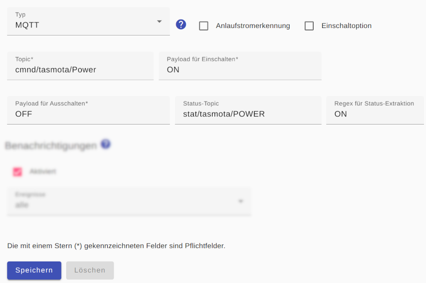

# MQTT-basierte Schalter

Für einen MQTT-Schalter muss dessen `Topic` angegeben werden sowie die `Payload für Einschalten` und die `Payload für Ausschalten`.

Normalerweise kennt der *Smart Appliance Enabler* den Zustand des Gerätes, weil er die Befehle zum Ein- und Ausschalten sendet und sich den Zustand merkt. Das funktioniert allerdings nicht, wenn das Gerät auch auf anderem Weg geschaltet wird. In diesem Fall muss ein `Status-Topic` angegeben werden, über welches der aktuelle Schaltzustand verfügbar ist. Für das `Status-Topic` muss als `Regex für Status-Extraktion` ein [regulärer Ausdruck](ValueExtraction_DE.md) angegeben werden der "matchen" muss, wenn der Schaltzustand "eingeschaltet" ist. Liefert dieser beispielsweise "ON" (ohne Anführungszeichen), so muss als regulärer Ausdruck "(ON)" (ohne Anführungszeichen) eingetragen werden.



## Log
Wird ein Gerät (hier `F-00000001-000000000013-00`) mittels HTTP-Schalter geschaltet, kann man den Schaltbefehl im [Log](Logging_DE.md) mit folgendem Befehl anzeigen:

```bash
$ grep Http rolling-2020-06-09.log | grep F-00000001-000000000013-00
2023-04-04 17:37:03,488 INFO [MQTT Call: F-00000001-000000000013-00-MqttSwitch-1] d.a.s.c.MqttSwitch [MqttSwitch.java:193] F-00000001-000000000013-00: Switching on
2023-04-04 17:37:03,504 TRACE [pool-3-thread-1] d.a.s.m.MqttClient [MqttClient.java:274] F-00000001-000000000013-00-MQTT-MqttSwitch: Publish message: topic=cmnd/tasmota/Power payload=ON retained=false
2023-04-04 17:37:03,505 TRACE [pool-3-thread-1] d.a.s.m.MqttClient [MqttClient.java:274] F-00000001-000000000013-00-MQTT-MqttSwitch: Publish message: topic=sae/F-00000001-000000000013-00/Control payload={"on":true,"time":"2023-04-04T17:37:03.477099","type":"ControlMessage"} retained=false
```

*Webmin*: In [View Logfile](Logging_DE.md#user-content-webmin-logs) gibt man hinter `Only show lines with text` den Text `F-00000001-000000000013-00` ein und drückt Refresh.
