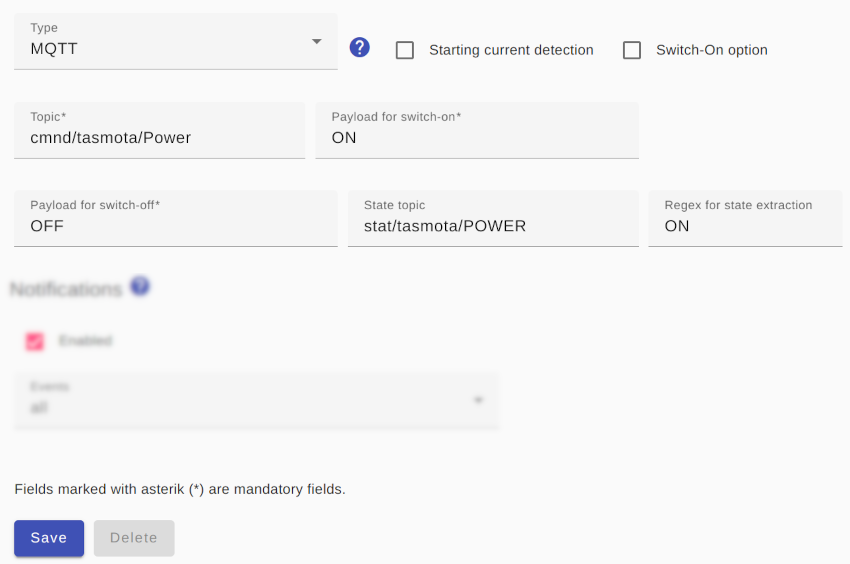

# MQTT switches

For an MQTT switch, its `Topic` must be specified, as well as the `Turn on payload` and the `Turn off payload`.

Normally, the *Smart Appliance Enabler* knows the state of the device because it sends the commands to turn it on and off and remembers the state. However, this does not work if the device is also switched in another way. In this case, a `Status Topic` must be specified via which the current switching status is available. For the `Status Topic` a [regular expression](ValueExtraction_DE.md) must be specified as `Regex for status extraction` which must "match" if the switching state is "switched on". For example, if this returns "ON" (without quotation marks), then "(ON)" (without quotation marks) must be entered as the regular expression.



## Log
If a device (here `F-00000001-000000000013-00`) is switched using a HTTP switch, the control request can be displayed in [Log](Logging_EN.md) with the following command:

```console
sae@raspi:~ $ grep Http rolling-2020-06-09.log | grep F-00000001-000000000013-00
2023-04-04 17:37:03,488 INFO [MQTT Call: F-00000001-000000000013-00-MqttSwitch-1] d.a.s.c.MqttSwitch [MqttSwitch.java:193] F-00000001-000000000013-00: Switching on
2023-04-04 17:37:03,504 TRACE [pool-3-thread-1] d.a.s.m.MqttClient [MqttClient.java:274] F-00000001-000000000013-00-MQTT-MqttSwitch: Publish message: topic=cmnd/tasmota/Power payload=ON retained=false
2023-04-04 17:37:03,505 TRACE [pool-3-thread-1] d.a.s.m.MqttClient [MqttClient.java:274] F-00000001-000000000013-00-MQTT-MqttSwitch: Publish message: topic=sae/F-00000001-000000000013-00/Control payload={"on":true,"time":"2023-04-04T17:37:03.477099","type":"ControlMessage"} retained=false
```

*Webmin*: In [View Logfile](Logging_EN.md#user-content-webmin-logs) enter `F-00000001-000000000013-00` after `Only show lines with text` and press refresh.
