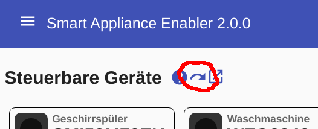
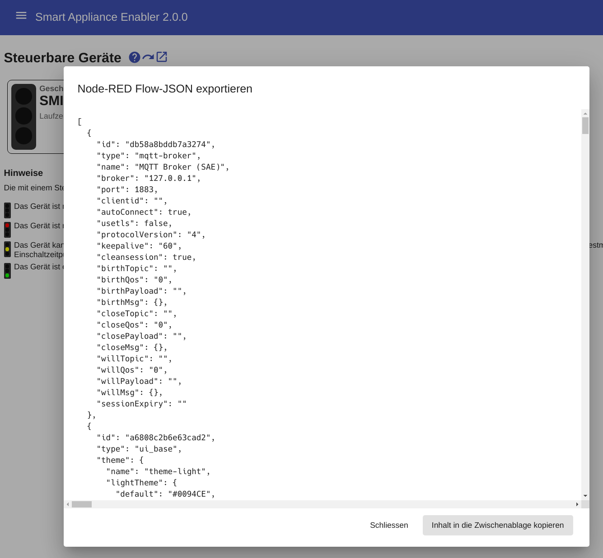
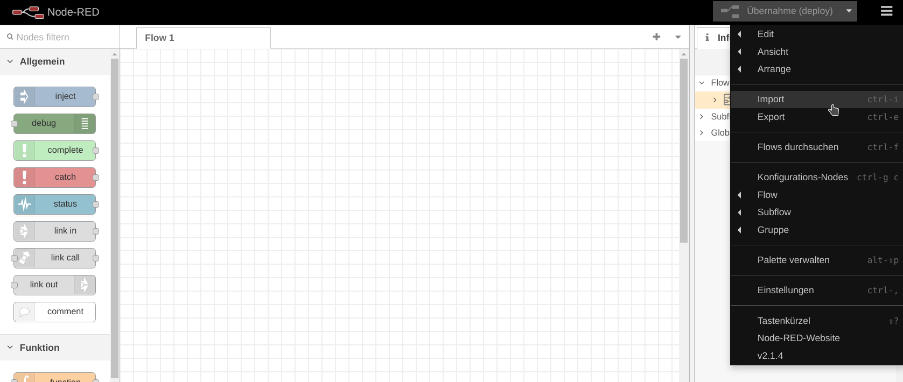
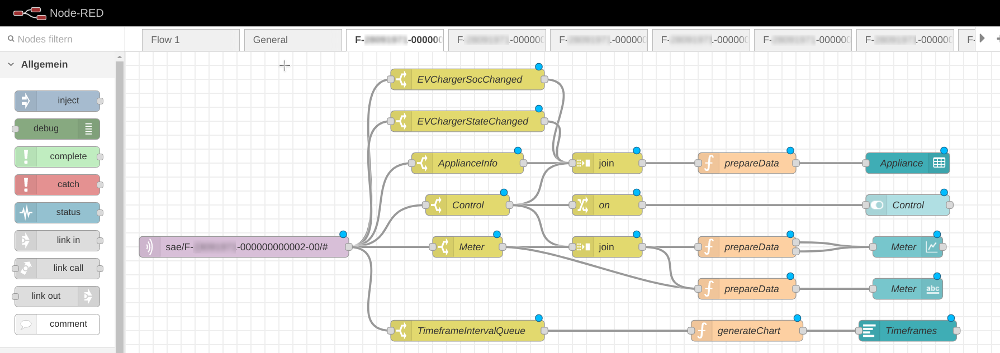
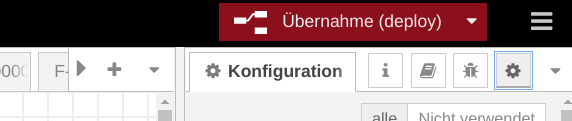
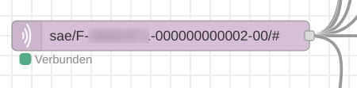
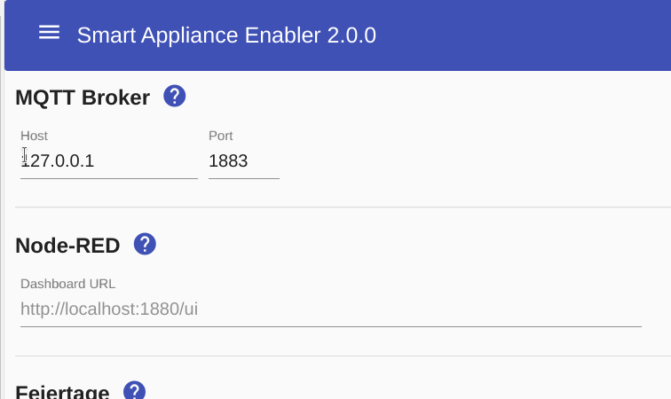
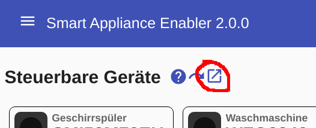
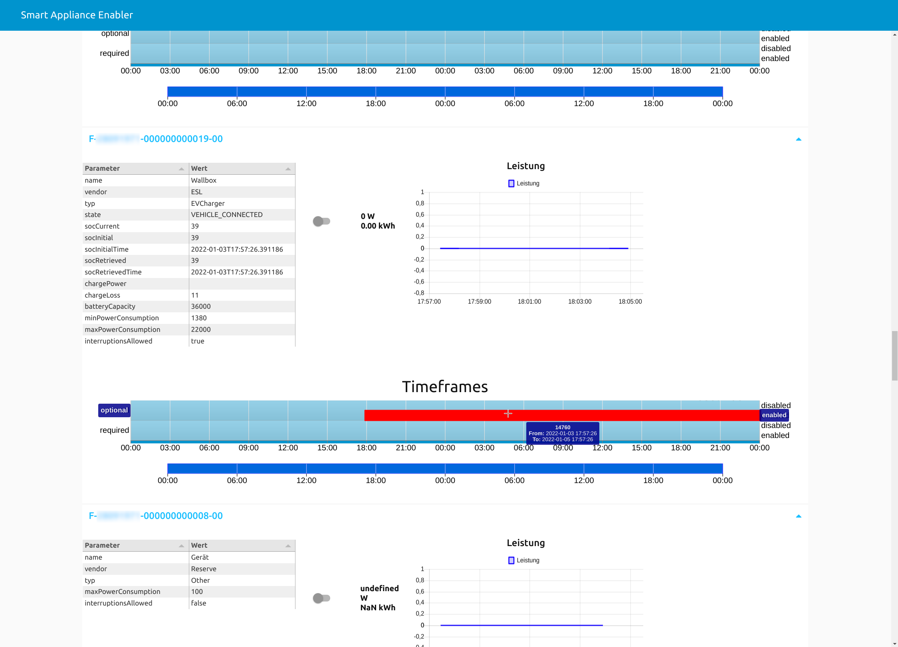

# Node-RED
[Node-RED](https://nodered.org/) kann verwendet werden, um die MQTT-Nachrichten des *Smart Appliance Enabler* im Node-RED-Dashboard zu visualisieren. Insbesondere die Leistungsdiagramme können dabei helfen, das Verhalten des *Smart Appliance Enabler* zu verstehen und zu optimieren.

## Installation ohne Docker
Für Node-RED sollte ein eigener User verwendet werden, der zur `sudo`-Gruppe hinzugefügt wird und dessen Passwort auch gesetzt ist:

```bash
$ sudo useradd -d /opt/nodered -m -s /bin/bash nodered
$ sudo usermod -a -G sudo nodered
$ sudo passwd nodered
```

Ab jetzt sollte mit diesem User gearbeitet werden.

Node-RED kann über das Raspbian-Repository mit `apt install ...` installiert werden, aber man erhält dann eine veraltete Version von Node-RED und Node.js, wobei letztere möglicherweise deshalb nicht in der lage dazu ist, Bibliotheken direkt von `github` zu installieren. Aus diesem Grund sollte die Installation von Node-RED und node.js entsprechend der [Anleitung auf der Node-RED-Homepage](https://nodered.org/docs/getting-started/raspberrypi) erfolgen:

```bash
nodered@raspberrypi ~ $ bash <(curl -sL https://raw.githubusercontent.com/node-red/linux-installers/master/deb/update-nodejs-and-nodered)
Running Node-RED update for user nodered at /opt/nodered on raspbian

[sudo] password for nodered: 

This can take 20-30 minutes on the slower Pi versions - please wait.

  Stop Node-RED                       ✔
  Remove old version of Node-RED      ✔
  Remove old version of Node.js       ✔   
  Install Node.js 14 LTS              ✔   v14.18.2   Npm 6.14.15
  Clean npm cache                     ✔
  Install Node-RED core               ✔   2.1.4 
  Move global nodes to local          -
  Npm rebuild existing nodes          ✔
  Install extra Pi nodes              -
  Add shortcut commands               ✔
  Update systemd script               ✔
                                      

Any errors will be logged to   /var/log/nodered-install.log
All done.
You can now start Node-RED with the command  node-red-start
  or using the icon under   Menu / Programming / Node-RED
Then point your browser to localhost:1880 or http://{your_pi_ip-address}:1880

Started :  Sat Jan  1 15:32:31 CET 2022 
Finished:  Sat Jan  1 15:35:15 CET 2022
 
You may want to run   node-red admin init
to configure your initial options and settings.
```

Zum Starten eignet sich folgender Befehl:

```bash
$ sudo systemctl start nodered
```

Damit Node-RED beim Systemstart ebenfalls gestartet wird (via Systemd), muss folgender Befehl ausgeführt werden:

```bash
$ sudo systemctl enable nodered
Created symlink /etc/systemd/system/multi-user.target.wants/nodered.service → /lib/systemd/system/nodered.service.
```

## Installation mit Docker
Alternativ kann Node-RED auch als Docker-Container installiert werden. Die Installation des entsprechenden Docker-Containers erfolgt mit:

```bash
$ docker pull nodered/node-red
```

Es ist ein Volume erforderlich zum Speichern der Daten:

```bash
$ docker volume create node_red_data
```

Zum Starten eignet sich folgender Befehl:

```bash
$ docker run \
    -it \
    --rm \
    -p 1880:1880 \
    -v node_red_data:/data \
    --name nodered \
    nodered/node-red
```

## Installation benötigter Bibliotheken
Folgende Module müssen über `Manage Palette -> Install` installiert werden:
- `node-red-node-ui-table`
- `node-red-dashboard`

Für die nachfolgende Installation von `camueller/node-red-contrib-ui-timelines-chart` muss `git` installiert sein, was sich durch den Befehl `sudo apt install git` erreichen lässt.

Einige weitere Bibliotheken müssen manuell in der Shell installiert werden, während man sich im Verzeichnis `~/.node-red` (Docker: `/data`) befindet:
- `camueller/node-red-contrib-ui-timelines-chart`
- `date-fns`

Dazu muss der nachfolgende Befehl für jeden Namen aus der vorangegangenen Liste einmal ausgeführt werden, wobei `<name>` jeweils durch den Listeneintrag ersetzt wird:

```bash
$ npm i <name>
```

Die Bibliothek `date-fns` muss noch in der Datei `~/.node-red/settings.js` (Docker: `/data/settings.js`) eingetragen werden. Dazu in der Datei nach `functionGlobalContext`) suchen und wie folgt ändern:

```javascript
functionGlobalContext: {                                                         
  datefns:require('date-fns')                                                  
},
```

## Export der Flows


Durch Klick auf den Export-Button wird der Export-Dialog geöffnet:



Im Export-Dialog kann direkt der Button `Inhalt in die Zwischenablage kopieren` gedrückt werden, um das angezeigte Node-RED Flow-JSON in die Zwischenablage zu kopieren. Damit ist der Export abgeschlossen.

## Import der Flows
### Löschen der vorhandenen Flows
Die vom *Smart Appliance Enabler* exportierte Flow-JSON ist vollständig, d.h. sie beinhaltet neben den Flows auch die globalen Configuration Nodes.

Um doppelte Nodes und damit verbundene Fehler oder Performance-Einbussen zu vermeiden, sollten die von einem vorherigen Import stammenden Nodes vor einem erneuten Import gelöscht werden.

Wenn Node-RED nur für den *Smart Appliance Enabler* verwendet wird, kann man sämtliche Flows einfach dadurch löschen, indem man die Datei `~/.node-red/flows.json` löscht und Node-RED neu startet - fertig!

Alternativ kann man selektiv die folgende Dinge löschen:
- Flows
  - `Allgemein`
  - alle Flows mit Namen entsprechend der Geräte-IDs `F-.....`
- Dashboard
  - `Allgemein`
  - alle Dashboard-Gruppen mit Namen entsprechend der Geräte-IDs `F-.....` 
- Globale Konfigurations-Nodes
  - mqtt-broker: `MQTT Broker (SAE)`
  - [falls das Node-RED Dashboard nur vom *Smart Appliance Enabler* verwendet wird] ui_base: `Node-RED Dashboard`
  - ui-tab: `Smart Appliance Enabler`
  - ui-group: alle Einträge mit `[Smart Appliance Enabler]`

### Import
Der Import der Flows in Node-RED erfolgt über das Menü `Import`:



Nach Klick in den zentralen, roten Bereich des Import-Dialoges kann dort das Node-RED Flow-JSON aus der Zwischenablage eingefügt werden. Durch Klicken des `Import`-Buttons werden die Flows in Node-RED importiert.

Für jedes Gerät im *Smart Appliance Enabler* wird ein Tab mit einem Flow angelegt:



Ausserdem wird ein `General`-Tab für Geräte-unabhängige Nodes angelegt.

### Anpassung des konfigurierten MQTT-Brokers
Nach dem Import gibt es einen globalen Konfiguration-Node mit dem Namen `MQTT-Broker (SAE)`. Dieser enthält Hostname und Port des MQTT-Brokers, wie in den Einstellungen des *Smart Appliance Enabler* angegeben. Normalerweise sollte es nicht notwendig sein, diese Werte in Node-RED anders zu konfigurieren.

Falls Node-RED und MQTT-Server als Docker-Container betrieben werden, muss beachtet werden, dass für die Container-zu-Container-Kommunikation dessen IP-Adresse im Docker-Bridge-Netzwerk verwendet wird. Diese kann wie folgt ermittelt werden ([siehe auch](https://www.tutorialworks.com/container-networking/)):

```bash
$ docker inspect mosquitto | grep IPAddress
            "SecondaryIPAddresses": null,
            "IPAddress": "172.17.0.2",
                    "IPAddress": "172.17.0.2",
```

### Übernahme der Flows
Normalerweise sollte es möglich sein, die importierten Flows ohne Anpassungen direkt zu übernehmen.

Zur Übernahme muss lediglich der `Übernahme`-Button gedrück werden:


Nach der Übernahme muss in allen Tabs unterhalb des `MQTT in`-Nodes `Verbunden` stehen:



Falls das nicht so ist, konnte Node-RED keine Verbindung mit dem MQTT-Broker herstellen.

## Dashboard
In den Einstellungen des *Smart Appliance Enabler* kann die `Dashboard URL` von Node-RED konfiguriert werden, welche beim Klick auf den Link-Button in der Status-Anzeige aufgerufen wird.



Fast immer wird man die als Platzhalter angezeigte Default-URL `http://localhost:1880/ui` so anpassen müssen, dass `localhost` durch den Hostnamen ersetzt wird, unter dem Node-RED erreichbar ist. 

Danach kann das Node-RED-Dashboard über den Link-Button in der Status-Anzeige des *Smart Appliance Enabler* aufgerufen werden:


Das Dashboad selbst zeigt auf einem Tab mit dem Namen `Smart Appliance Enabler` folgende Informationen an:
- Zeitpunkt der letzten Abfrage des *Smart Appliance Enabler* durch den *Sunny Home Manager*
- alle vom *Smart Appliance Enabler* verwalteten Geräte



Das Dashboard empfängt alle MQTT-Nachrichten des *Smart Appliance Enabler* und aktualisiert sich selbständig. Dadurch bietet es eine Echtzeit-Anzeige auf den Zustand des *Smart Appliance Enabler*. 