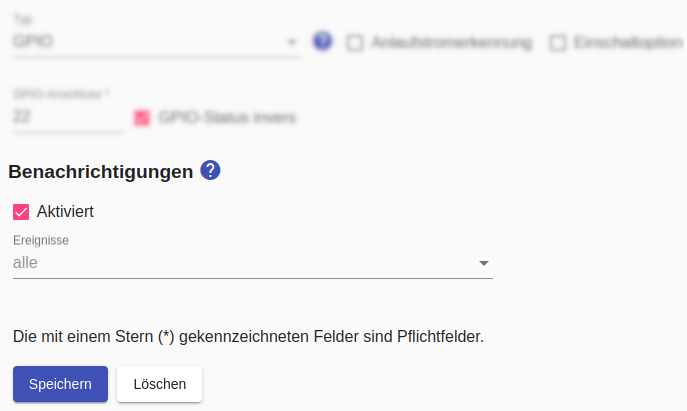
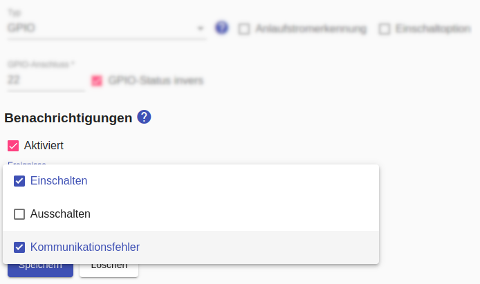
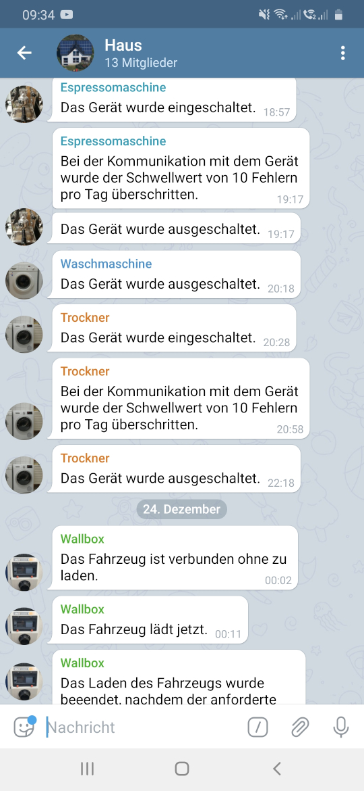

# Benachrichtigungen
Durch Benachrichtigungen informiert der *Smart Appliance Enabler* über Ereignisse ("Gerät wurde eingeschaltet", "Kommunikationsfehler"), sobald diese auftreten.

Ein Hauptanwendungsfall für mich ist die Benachrichtigung, wenn Geräte nicht erreichbar sind. Bei mir kommt es immer wieder vor, dass Geräte mit Tasmota irgendwann nicht mehr im WLAN sind und ich das nicht gleich bemerke. Dann fehlen natürlich die Verbräuche im *Sunny Home Manager*. Aber es ist auch ganz nett, wenn man eine Benachrichtigung bekommt, wenn die Waschmaschine fertig oder das Auto voll geladen ist.

Bevor Benachrichtigungen konfiguriert werden können, muss ein [Shell-Script in den Einstellungen konfiguriert](Settings_DE.md#user-content-notifications) sein, über das der *Smart Appliance Enabler* die Benachrichtigungen versendet.

Nachdem ein Shell-Script konfiguriert wurde, kann für Zähler und Schalter durch Aktivieren der Checkbox `Aktiviert` das Versenden von Benachrichtigungen gerätespezifisch aktiviert werden.

Ohne Auswahl einzelner Ereignisse erfolgt die Benachrichtiung für alle Ereignisse:



Alternativ kann die Benachrichtiung auf einzlene Ereignisse beschränkt werden:



## Messenger-Platformen
Für den *Smart Appliance Enabler* existieren Shell-Scripts zur Nutzung der nachfolgend beschriebenen Messenger-Platformen. Mit ein wenig Shell-Script-Know-How sollte es möglich sein, auf Basis der vorhanden Shell-Scripts solche für andere Benachrichtigungskanäle zu erstellen. Bitte diese Scripts als **Pull-Request** auch den anderen *Smart Appliance Enabler*-Usern zur Verfügung stellen!  

### Telegram (https://telegram.org)
Das Shell-Script für die Nutzung als Benachrichtigungskanal im *Smart Appliance Enabler* ist https://github.com/camueller/SmartApplianceEnabler/blob/master/run/notifyWithTelegram.sh.

Zunächst muss in Telegram eine [Gruppe erstellt](https://telegram.org/faq/de#f-wie-kann-ich-eine-gruppe-erstellen) werden, die man z.B. "Haus" nennen könnte.

Dieser Gruppe fügt man ganz normal die Personen hinzu, welche die Benachrichtigungen empfangen sollen. 

Für jedes Gerät, das Benachrichtigungen versenden soll, muss ein [Bot anlegt](https://core.telegram.org/bots#3-how-do-i-create-a-bot) werden. Dabei muss ein "Username" angegeben werden, der Telegramweit (!) eindeutig sein und auf `_bot` enden muss. Man kann davon ausgehen, dass `waschmaschine_bot` bereits vergeben ist. Wenn der Bot erfolgreich angelegt wurde, wird in der Bestätigungsnachricht ein `Token to access HTTP API` mitgeteilt. Diesen Token sollte man sichern und niemandem mitteilen. Im *Smart Appliance Enabler* muss dieser Token in der Geräte-Konfiguration in das Feld `Geräte-ID für Benachrichtigungen` eingetragen werden.

Im Dialog mit dem "BotFather" kann man den Bots auch Fotos zuweisen.

Diese [Bots müssen der zuvor angelegten Gruppe hinzugefügt](https://telegram.org/faq/de#f-wie-kann-ich-mehr-mitglieder-hinzufgen-und-was-ist-ein-einladu) werden.

Zum Versenden von Benachrichtigungen wird die Chat ID der Gruppe benötigt. Diese wird angezeigt, wenn man den Bot `@getidsbot` zur Gruppe hinzufügt. Wenn man die ID ermittelt hat, kann der `@getidsbot` wieder aus der Gruppe entfernt werden.

Für die Nutzung von [Benachrichtigungen via Telegram wird ein Shell-Script](InstallationManual_DE.md#user-content-notifications) bereitgestellt. In diesem Shell-Script muss die zuvor ermittelte Chat ID eingetragen werden (ggf. vorhandenes Minus-Zeichen muss übernommen werden):

```bash
chat=-123456789
```

Jetzt steht dem Empfang von Benachrichtigungen nichts mehr im Wege:



### Weitere Messenger-Scripte

* [Signal](https://signal.org/): https://github.com/camueller/SmartApplianceEnabler/blob/master/run/notifyWithSignal.sh.
* [Prowl](https://www.prowlapp.com): https://github.com/camueller/SmartApplianceEnabler/blob/master/run/notifyWithProwl.sh.
* [Home Assistant](https://www.home-assistant.io):
https://github.com/camueller/SmartApplianceEnabler/blob/master/run/notifyWithHA.sh.
