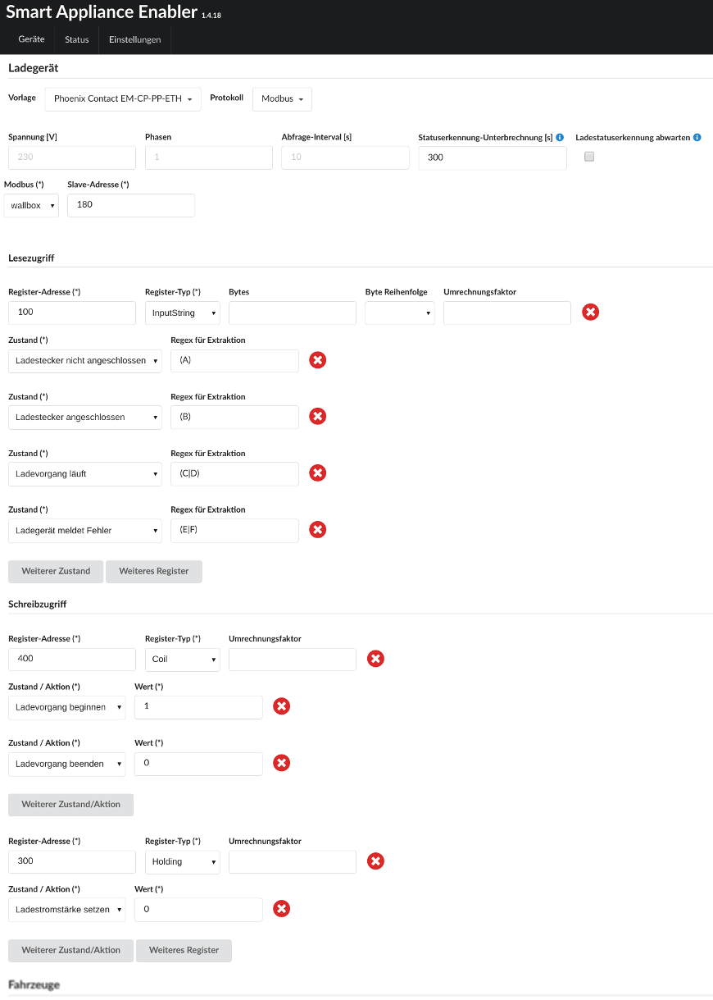

# Wallboxen mit Phoenix Contact EM-CP-PP-ETH-Controller
In vielen Wallboxen ist der [Phoenix Contact EM-CP-PP-ETH](https://www.phoenixcontact.com/online/portal/de?uri=pxc-oc-itemdetail:pid=2902802)-Controller verbaut, darunter:
* Wallboxen der [Walli-Serie](https://esl-emobility.com/de/wallbox-ladestation-elektroauto.html?brand=183) 
* Wallbe-Wallboxen

## Geräte-Konfiguration
Am Controller befinden sich *DIP-Schalter*, die wie folgt eingestellt sein müssen: DIP-Schalter 10 an, alle anderen DIP-Schalter aus

## Konfiguration im Smart Appliance Enabler
### Wallbox
Für neuere Wallbe-Wallboxen sollte die Vorlage `wallbe (neuer Controller)` verwendet werden.

Alle anderen, oben genannten Wallboxen werden durch die Vorlage `Phoenix Contact EM-CP-PP-ETH` konfiguriert. Dadurch werden alle Felder korrekt ausgefüllt. Lediglich die Modbus-Instanz muss noch gewählt werden.

 