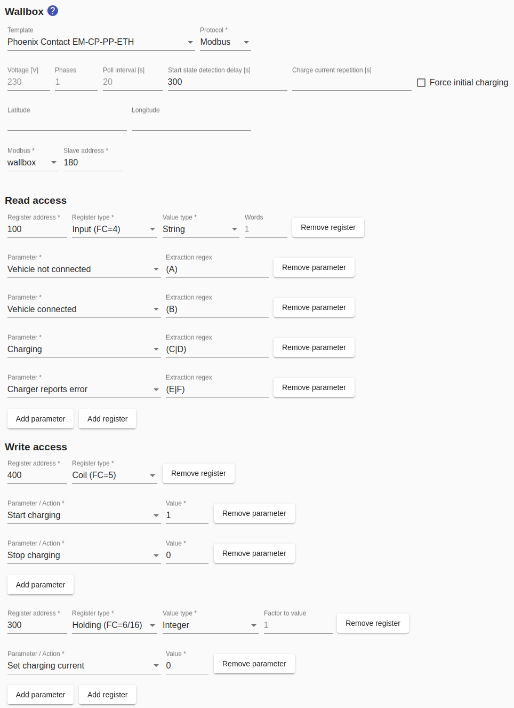

# Wallboxes feat. Phoenix Contact EM-CP-PP-ETH controller
The [Phoenix Contact EM-CP-PP-ETH](https://www.phoenixcontact.com/online/portal/de?uri=pxc-oc-itemdetail:pid=2902802) controller is installed in many wallboxes, including:
* Wallboxes from the [Walli series](https://esl-emobility.com/de/wallbox-ladestation-elektroauto.html?brand=183)
* Wallbe wallboxes

## Device configuration
There are *DIP switches* on the controller, which must be set as follows: DIP switch 10 on, all other DIP switches off

## Configuration in Smart Appliance Enabler
### Wallbox
For newer Wallbe wallboxes, the template `wallbe (new controller)` should be used.

All other wallboxes mentioned above are configured using the template `Phoenix Contact EM-CP-PP-ETH`. This will fill out all fields correctly. Only the Modbus instance still has to be selected.

 